# 2020年秋季活动

---

## E1-甲

### P1

- 当前使用配置
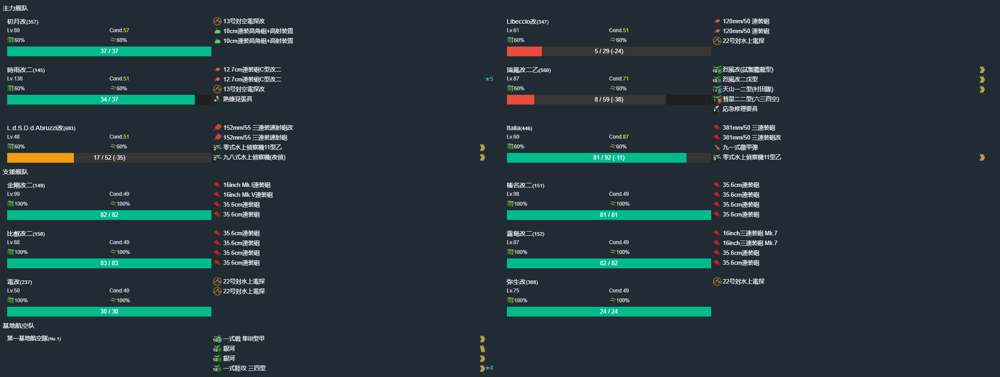

- 推图情况

1. C-S | F | H-S 千代田航大破撤退
2. C-S | F | H-S | J-S 敷波
3. C-S | F | H-SS 由良 | J-A
4. C-S 村雨 | F | H-SS | J-A
5. C-SS | F | H-S | J-S
6. C-S | F | H-S | J-A
7. C-S | F | H-S 天龙 皋月大破撤退
8. C-SS | F | H-S 皋月大破撤退
9. C-S | F | H-A | J-A 多摩
10. C-S | F | H-S 凤翔 | J-A
11. C-SS | F | H-S 黑潮 | J-A
12. C-A | F | H-S | J-A
13. C-A | F | H-S 不知火 | J-A
14. C-A 不知火 文月中破撤退
15. C-A 西北风大破撤退
16. C-S | F | H-S | J-A
17. C-S | F | H-A | J-A
18. C-SS | F | H-A | J-A
19. C-A 出月大破撤退
20. C-S | F | H-SS | J-A
21. C-A | F | H-S | J-A
22. C-S | F | H-A | J-A
23. C-A | F | H-A | J-A
24. C-SS | F | H-A | J-A
25. C-S | F | H-S | J-S 电

### P2 解谜开路（D点A胜）

- 当前使用配置

- 推图情况

1. B-SS | D-S

### P3 运输血条

- 当前使用配置
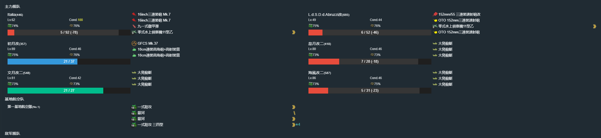

- 推图情况

1. C-A | F | G-SS | N | O- 沟了
2. C-A | F | G-A | N | O-A
3. C-A | F | G-A | N | O-A
4. C-A | F | G-SS | N | O-A
5. C-A | F | G-A | N | O-A
6. C-A | F | G-A | N | O-S 伊势
7. C-SS | F |  G-SS | N | O-A
8. C-A | F | G-SS | N | O-A
9. C-A | F | G-A | N | O-A
10. C-A | F | G-A | N | O-S 隼鹰
11. C-S | F | G-A | N | O-A

运输完成

---

## E2-乙

### P1 运输阶段

- 当前使用配置

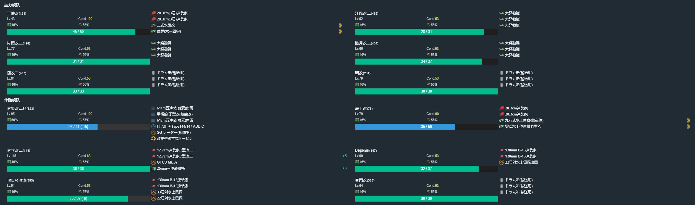

- 推图情况

1. B | C-A | F-A | H-S | I-S 塔什干大破撤退
2. B | C-SS | F-A | H-A | I-SS | J | K | N-S Bismarck
3. B | C-A | F-SS | H-A | I-A | J | K | N-S 文月
4. B | C-SS | F-SS | H-S | I-SS | J | K | N-S 空气

运输完成

### P2解谜 （N点S胜，L点S胜）

- 当前使用配置

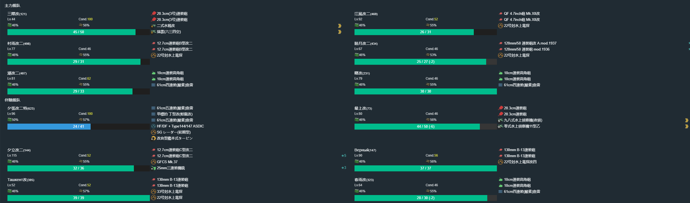

- 推图情况

1. B | C-S | F-A | H-S 塔什干大破撤退
2. B | C-SS | F-SS | H-B | I-SS | J | K | N-S 木曾
3. B | C-A | F-SS | H-SS | I-SS | J | L-S Luigi Torelli

### P3攻略血条

- 当前使用配置

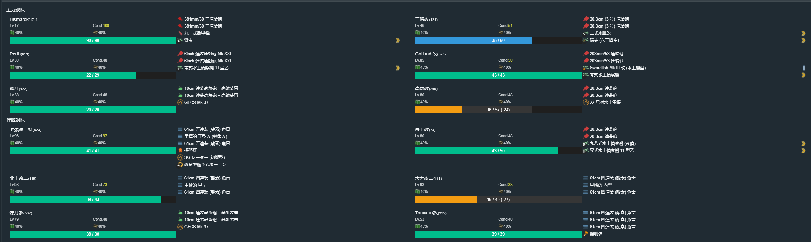

- 推图情况

1. B | A-SS | E-A | O-S | Q-S 羽黑
2. B | A-S | E-SS | O-SS | Q-S 那珂
3. B | A-S | E-S | O-SS | Q-S 那珂
4. B | A-S | E-SS | O-S | Q-S 羽黑
5. B | A-SS | E-SS | O-SS | Q-S 利根
6. B | A-SS | E-SS | O-S | Q-S 衣笠

斩杀完成

---

## E3-丙

### P1运输阶段

- 当前使用配置

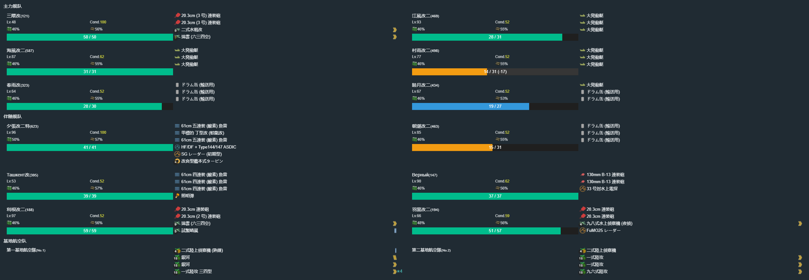

- 推图情况

1. A | C-SS | E | H-SS | J-SS | K-B | L | M | Q-S
2. A | C-SS | E | H-A | J-SS | K-SS | L | M | Q-S 初雪
3. A | C-A | E | H-SS | J-SS | K-S | L | M | Q-S 矶波

运输完成

### P2运输阶段

- 当前使用配置

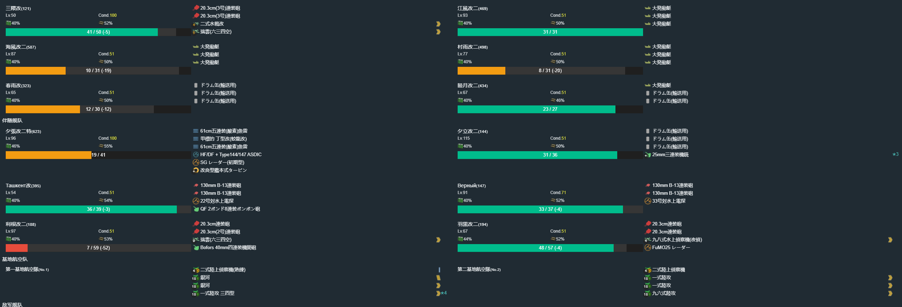

- 推图情况

1. A | C-SS | E | H-A | J-S | K-SS | L | P-A | X-S 名取
2. A | C-SS | E | H-A | J-SS | K-S | L | P-A | X-S
3. A | C-SS | E | H-A | J-SS | K-A | L | P-A | X-A
4. A | C-A | E | H-A | J-A | K-S | L | P-A | X-S

### P3解谜 Q点A胜

- 当前使用配置

- 推图情况

1. A | C-SS | E | H-SS | J-S | K-S | L | M | Q-S

### P4磨血

- 当前使用配置

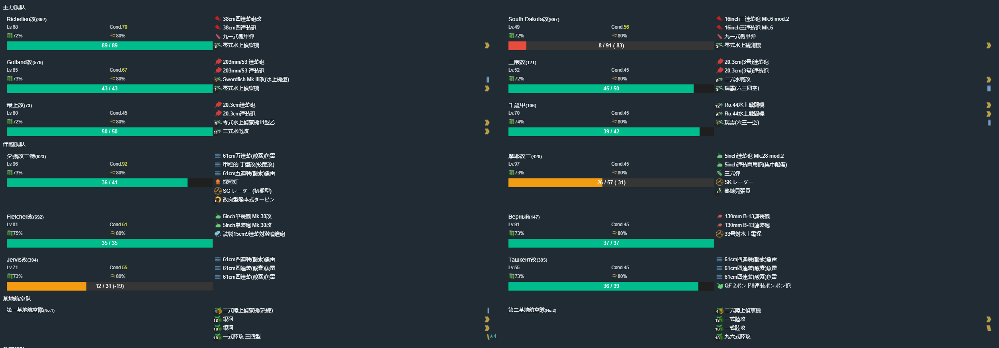

- 推图情况

1. R-SS | S | T-SS | Z-S 那智
2. R-S 响大破撤退
3. R-SS | S | T-S  | Z-S 凤翔
4. R-SS | S | T-S 千岁大破撤退
5. R-A  | S | T-SS | Z-S 鸟海
6. R-SS | S | T-SS | Z-S 雾岛
7. R-SS | S | T-S  | Z-S 铃谷
8. R-SS | S | T-A  | Z-S 鸟海

斩杀

---

## E4-丁

### P1运输

- 当前使用配置

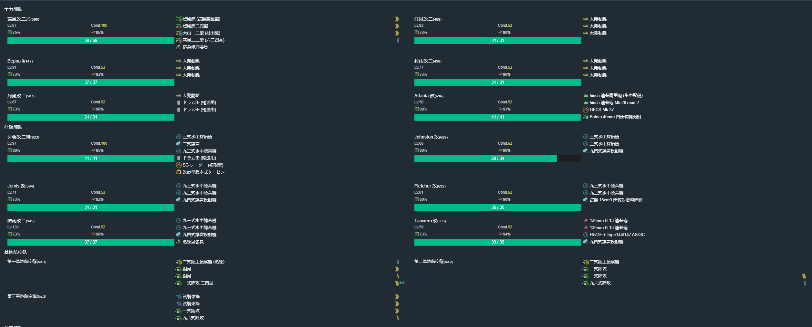

- 推图情况

1. D | E | F-SS | G-A | I-SS | K-SS | M | Q-SS
2. D | E | F-SS | G-SS | I-SS | K-A | M | Q-SS
3. D | E | F-SS | G-A | I-SS | K-A | M | Q-SS

运输完成

### P2运输

- 当前使用配置

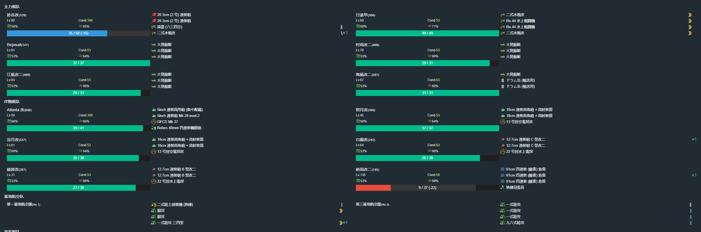

- 推图情况

1. D | C | B-SS | A-SS | R-SS | S-A  | U-SS | V | W-S 初春
2. D | C | B-SS | A-SS | R-SS | S-SS | U-SS | V | W-S 爱宕
3. D | C | B-SS | A-SS | R-SS | S-A  | U-B  | V | W-S 五十铃
4. D | C | B-SS | A-SS | R-SS | S-SS | U-A  | V | W-A 初霜

运输完成

### P3解谜开BOSS（X2S胜）

- 当前使用配置

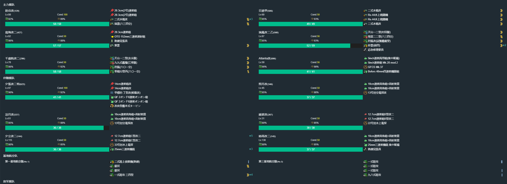

- 推图情况

1. D | C | B-A 亚特兰大大破撤退
2. D | C | B-A 千岁大破撤退
3. D | C | B-SS | A-A | R-A | X1 | X2-SS

### P3解谜开路（W点A胜）

- 当前使用配置

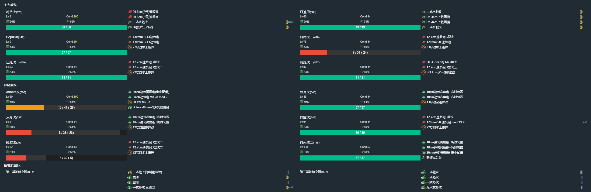

- 推图情况

1. D | C | B-SS | A-SS | R-SS | S-A  | U-A 白露大破撤退
2. D | C | B-SS | A-SS | R-SS | S-A 時雨大破撤退
3. D | C | B-A  | A-SS | R-SS | S-SS | U-S | V | W-A

### P3解谜开路（Y3点A胜）

- 当前使用配置

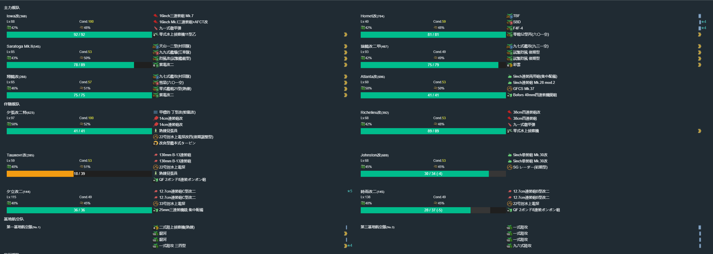

- 推图情况

1. D | C | A-A 亚特兰大大破撤退
2. D | C | A-A  | R-SS | X1 | X2-S 白露大破撤退
3. D | C | A-SS | R-SS | X1 | X2-S 白露大破撤退
4. D | C | A-SS | R-SS | X1 | X2-S 塔什干大破撤退
5. D | C | A-SS | R-A  | X1 | X2-SS | Y1-S | Y2-SS | Y3-S

---

### P3磨血

- 当前使用配置

- 推图情况

1. D | C | B-A | A-SS | R-SS | X1 | X2-S  | Y6 | Y3-SS | Z-S 大东
2. D | C | B-A | A-SS | R-SS | X1 | X2-S  | Y6 | Y3-S  | Z-S 初月
3. D | C | B-A | A-A  | R-SS | X1 | X2-SS | Y6 | Y3-SS | Z-S 占守
4. D | C | B-A | A-SS | R-A  | X1 | X2-S  | Y6 | Y3-SS | Z-S 妙高
5. D | C | B-A | A-A  | R-A  | X1 | X2-SS | Y6 | Y3-SS | Z-S 青叶
6. D | C | B-A | A-A  | R-A 北上大破撤退
7. D | C | B-A | A-A  | R-A  | X1 | X2-S  | Y6 | Y3-S  | Z-S 大鲸

斩杀完成

## 捞船

### E1 O点Scirocco

- 当前使用配置

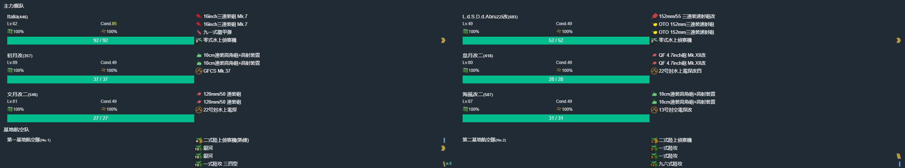

- 捞船情况

1. C-SS | F | G-SS | N | O-SS 飞鹰
2. C-A  | F | G-SS | N | O-SS 羽黑
3. C-A  | F | G-A  | N | O-S  爱宕
4. C-A  | F | G-SS | N | O-A  千岁
5. C-SS | F | G-SS | N | O-A  暁
6. C-A  | F | G-A 初月大破撤退
7. C-SS | F | G-SS | N | O-A 千代田
8. C-A  | F | G-SS | N | O-A Scirocco

### E2 Q点Sheffield

- 当前使用配置

- 捞船情况

1. B | A-SS | E-S  | O-S  | Q-S 神通
2. B | A-SS | E-A  | O-SS | Q-S 球磨
3. B | A-SS | E-SS | O-S  | Q-S 明石
4. B | A-S  | E-SS | O-SS | Q-S 伊势
5. B | A-S  | E-SS | O-SS | Q-S 木曾
6. B | A-SS | E-SS | O-S  | Q-S 木曾
7. B | A-SS | E-SS | O-S  | Q-S 木曾
8. B | A-S  | E-SS | O-SS | Q-S 明石
9. B | A-SS | E-SS | O-SS | Q-S 瑞穗
10. B | A-S | E-S  | O-SS | Q-S 爱宕
11. B | A-SS | E-S | O-SS | Q-S 明石
12. B | A-SS | E-SS | O-SS | Q-S 爱宕
13. B | A-S | E-SS | O-SS | Q-S 阿武隈
14. B | A-S | E-SS | O-S | Q-S 伊势
15. B | A-SS | E-SS | O-S 照月大破撤退
16. B | A-SS | E-SS | O-S | Q-S 利根
17. B | A-SS | E-SS | O-SS | Q-S 神通
18. B | A-SS | E-SS | O-S | Q-S Sheffield