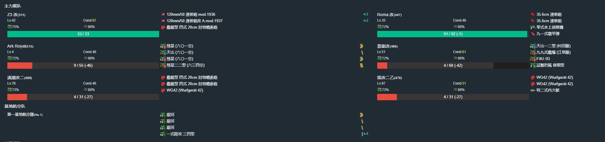

# 2021年夏季活动

---

## E1-乙

### 解谜开P1BOSS

#### F点S胜1次

- 当前使用配置

- 推图情况

1. A | B | C-B | E-S  | F-A
2. A | B | C-B | E-S  | F-A
3. A | B | C-A | E-SS | F-A
4. A | B | C-A | E-S  | F-S

#### C2点到达1次

- 当前使用配置

- 推图情况

1. A | B | C-SS | C2

### P1

- 推图情况

1. A | B | C-SS | E-S  | G-S
2. A | B | C-SS | E-SS | G-S
3. A | B | C-S  | E-SS | G-S 大淀
4. A | B | C-SS | E-SS | G-S
5. A | B | C-SS | E-S  | G-S

斩杀

### 解谜开第三游击队

#### O点A胜1次

- 推图情况

1. I-A 三日月大破撤退
2. I-A | N | Q | O-A

#### L点A胜1次

- 推图情况

1. I-S | J-SS | L-A

### P2

- 推图情况

1. I-A | N | Q | O-A
2. I-S | N | Q | O-S
3. I-A | N | Q | O-S
4. I-A | N | Q | O-S

运输完成

### P3

#### P3解密开BOSS P点S胜

- 推图情况

1. I-A  | J-A  | P-A
2. I-S  | J-B  | P-A
3. I-S  | J-A  | P-A
4. I-S  | J-A  | P-A
5. I-A  | J-A  | P-A
6. I-SS | J-A  | P-A
7. I-S  | J-SS | P-D
8. I-SS | J-SS | P-A
9. I-SS | J-A  | P-A
10. I-SS | J-A | P-A
11. I-A  | J-SS | P-A
12. I-SS | J-S  | P-C
13. I-S  | J-A  | P-C
14. I-S  | J-A  | P-A
15. I-S  | J-B  | P-A
16. I-S  | J-B  | P-S

#### P3斩杀

- 推图情况

1. I-SS | N | R | T-SS | V-S
2. I-S  | N | R | T-SS | V-S
3. I-S  | N | R | T-SS | V-S
4. I-SS | N | R | T-B  | V-S
5. I-S  | N | R | T-S 黎塞留大破撤退
6. I-SS | N | R | T-S  | V-S

斩杀

---

## E2-丙

### P1运输

- 当前使用配置

- 推图情况

1. B-A | C-SS | D-A  | F | I-A
2. B-B | C-A  | D-SS | F | I-A
3. B-A | C-B  | D-SS | F | I-A
4. B-A | C-A  | D-B  | F | I-A

运输完成

### P2

#### S点A胜2次

- 当前使用配置

- 推图情况

1. J | L-SS | O-S | P | R-A  | T-S | S-SS
2. J | L-SS | O-S | P | R-SS | T-S | S-A

#### P2-斩杀

- 当前使用配置

- 推图情况

1. J | K-SS | M-A  | V-SS | W-S
2. J | K-SS | M-SS | V-S  | W-S
3. J | K-SS | M-A  | V-SS | W-S
4. J | K-SS | M-A  | V-S  | W-S
5. J | K-A  | M-A  | V-S  | W-S

斩杀

### P3

#### P3-磨血

- 当前使用配置

- 推图情况

1. J | L-S  | N-S 哥特兰大破撤退
2. J | L-SS | N-S  | P | X-A | Z-A
3. J | L-S  | N-S  | P | X-A | Z-S
4. J | L-S  | N-SS | P | X-S | Z-S
5. J | L-SS | N-SS | P | X-A | Z-S
6. J | L-SS | N-SS | P | X-S | Z-A
7. J | L-SS | N-SS | P | X-A | Z-S

#### P3-削甲

##### P3-削甲-X点A胜

- 当前使用配置

- 推图情况

1. J | L-SS | N-S  | P | X-S | Z-A

##### P3-削甲-G点S胜

- 当前使用配置

- 推图情况

1. A-SS | D-SS | D1-SS | E | G-SS

##### P3-削甲-S点A胜

- 当前使用配置

- 推图情况

1. J | L-S | N-S | P | R-SS | T-S | S-A

##### P3-斩杀

- 当前使用配置

- 推图情况

1. J | L-S  | N-SS | P | X-A Libeccio大破撤退
2. J | L-S  | N-S  | P | X-A | Z-A
3. J | L-S  | N-S  | P | X-A 時雨大破撤退
4. J | L-A  | N-SS | P | X-A | Z-A
5. J | L-SS | N-SS | p | X-A 時雨大破撤退
6. J | L-SS | N-S  | P | X-A | Z-S

斩杀