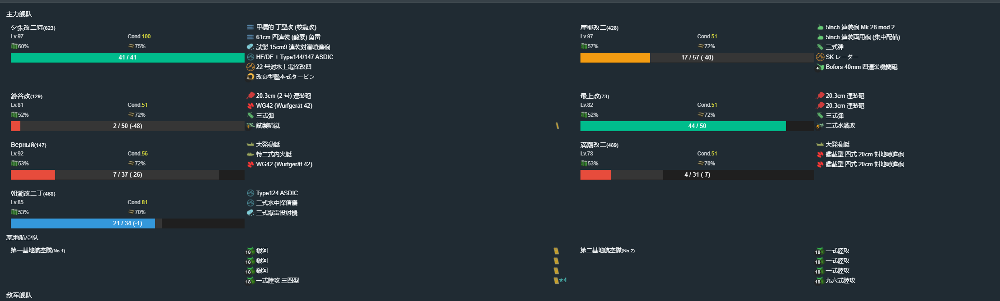

# 2021年春季活动

---

## E1-甲-切乙

### P1

- 当前使用配置

- 推图情况

1. E | D-S  | G | F-B 村雨大破撤退
2. E | D-A  | G | F-B  | J-S
3. E | D-SS | G | F-A 皋月大破撤退
4. E | D-S  | G | F-SS | J-S
5. E | D-SS | G | F-B  | J-S
6. E | D-SS | G | F-B  | J-S

斩杀完成

### 开路

到达K点

1. E | D-SS | G | I-A | K

### P2

- 当前使用配置

- 推图情况

1. L | M-B 弥生、村雨中破撤退
2. L | M-SS | N-SS | O-SS | P-SS | Q-D
3. L | M-B  | N-SS | O-B 照月大破撤退
4. L | M-A  | N-S 皋月大破撤退
5. L | M-SS | N-SS | O-B  | P-A 弥生大破撤退

- 切乙

1. L | M-A  | O-SS | P-A  | Q-A
2. L | M-A  | O-SS | P-A  | Q-S
3. L | M-SS | O-B 皋月大破撤退
4. L | M-A  | O-SS | P-A  | Q-A
5. L | M-A  | O-A  | P-A  | Q-SS
6. L | M-A  | O-SS | P-A 五十铃大破撤退
7. L | M-A  | O-B  | P-SS | Q-A
8. L | M-SS | O-SS | P-S  | Q-C
9. L | M-SS | O-B  | P-SS | Q-C
10. L | M-B 照月、皋月中破撤退
11. L | M-A  | O-B  | P-A  | Q-C
12. L | M-SS | O-SS | P-A  | Q-S

斩杀

### P3

- 当前使用配置

- 推图情况

1. E | H-SS | I-SS | S-B  | V-SS 伊势
2. E | H-SS | I-B  | S-A  | V-SS 迅鲸
3. E | H-SS | I-SS | S-A  | V-SS 第四号海防舰
4. E | H-SS | I-B 照月大破撤退
5. E | H-SS | I-SS | S-A  | V-SS 伊势
6. E | H-SS | I-SS | S-SS | V-SS 榛名

斩杀

---

## E2-乙

### E2-P1

- 当前使用配置

- 推图情况

1. A | B-A | D | H-S | J | Q-A
2. A | B-A | D | H-A | J | Q-A
3. A | B-B | D | H-S | J | Q-A
4. A | B-SS | D | H-S | J | Q-A
5. A | B-SS | D | H-S | J | Q-A
6. A | B-SS | D | H-SS | J | Q-A

运输完成

### 到达C点

1. A | B-SS | D | F-B | C

### P点S胜一次

1. G | K-SS | M-B | N-B 皇家方舟大破撤退
2. G | K-A  | N-SS | P-SS

### E2-P2

- 当前使用配置

- 推图情况

1. G | K-SS | N-A | P-SS | T-B 云龙大破撤退
2. G | K-A 照月中破撤退
3. G | K-A  | N-A | P-SS | T-B 摩耶大破撤退
4. G | K-SS | N-C pola、照月大破撤退
5. G | K-SS | N-SS | P-SS | T-SS | U-A
6. G | K-A  | M-SS | N-B  | P-A  | T-A  | U-S
7. G | K-SS | M-SS | N-A  | P-S  | T-A  | U-S
8. G | K-A  | M-SS | N-A  | P-S  | T-B  | U-S
9. G | K-A  | M-SS | N-A  | P-SS | T-SS | U-S
10. G | K-SS | M-S | N-SS | P-SS | T-A  | U-S

斩杀

### E2-P3

- 当前使用配置

- 推图情况

1. W-SS | Z-SS | Z1-SS | Z11-SS South Dakota
2. W-A  | Z-SS | Z1-SS | Z11-SS 雾岛
3. W-A  | Z-SS | Z1-SS | Z11-SS 羽黑
4. W-SS | Z-SS | Z1-S  | Z11-SS 青叶
5. W-SS | Z-SS | Z1-A  | Z11-A  浜波
6. W-S  | Z-SS | Z1-A  | Z11-SS 伊203

斩杀

---

## E3-乙

### E3-P1

- 当前使用配置

- 推图情况

1. A | C-SS | G-SS | F | I | J-S 阳炎大破撤退
2. A | C-S  | G-SS | F | I | J-SS | L-S | M | N-SS
3. A | C-SS | G-A  | F | I | J-A  | L-S | M | N-A
4. A | C-A  | G-SS | F | I | J-A  | L-S | M | N-A
5. A | C-A  | G-B 文月大破撤退
6. A | C-A  | G-SS | F | I | J-SS | L-S | M | N-A
7. A | C-SS | G-A  | F | I | J-S  | L-A | M | N-A
8. A | C-A  | G-A 三日月大破撤退
9. A | C-SS | G-SS | F | I | J-SS | L-S 文月大破撤退
10. A | C-SS | G-B | F | I | J-SS | L-A | M | N-A
11. A | C-SS | G-A | F | I | J-SS | L-S | M | N-S
12. A | C-S 文月大破撤退
13. A | C-SS | G-A | F | I | J-SS | L-SS | M | N-A

运输完成

### E3-开路

#### O2空优一次

- 当前使用配置

- 推图情况

1. A | B-SS | D | O2-A

空确

#### O1 O3 S胜

- 当前使用配置

- 推图情况

1. P | B-A | O1-SS | O3-SS

### E3-P2

- 当前使用配置

- 推图情况

1. A | C-SS | E-SS | G-SS | S-S 涟大破撤退
2. A | C-SS | E-SS | G-SS | S-SS | U-A  | W-S
3. A | C-S  | E-A  | G-SS | S-SS | U-SS | W-S
4. A | C-S  | E-A  | G-SS | S-SS | U-A  | W-S
5. A | C-SS | E-A  | G-SS | S-SS | U-SS | W-S
6. A | C-A  | E-A  | G-A  | S-SS | U-A  | W-S

斩杀

### E3-P3

- 当前使用配置

- 推图情况

1. A | C-S  | G-B 吹雪大破撤退
2. A | C-S  | G-SS | F | I | X-SS | M | Y
3. A | C-SS | G-SS | F | I | X-S  | M | Z-S 国后
4. A | C-SS | G-A  | F | I | X-SS | M | Z-S
5. A | C-SS | G-SS | F | I | X-SS | M | Z-S
6. A | C-SS | G-A  | F | I | X-SS | M | Z-S
7. A | C-S  | G-B  | F | I | X-S  | M | Z-S 卷波
8. A | C-S  | G-SS | F | I | X-SS | M | Z-A
9. A | C-A  | G-C 白露大破撤退
10. A | C-SS | G-A | F | I | X-SS | M | Z-S

斩杀

---

## E4-丙

### E4-P1

- 当前使用配置

- 推图情况

1. B-SS | D-SS | E-SS | G-A  | I-S  | J | L-S
2. B-S  | D-SS | E-A  | G-A 朝潮大破撤退
3. B-SS | D-SS | E-SS | G-SS | I-SS | J | L-S
4. B-SS | D-SS | E-SS | G-B 满朝大破撤退
5. B-S  | D-A  | E-SS | G-B  | I-B  | J | L-S
6. B-SS | D-SS | E-SS | G-A  | I-A  | J | L-S
7. B-S  | D-A  | E-SS | G-A  | I-A  | J | L-A

斩杀

### E4-P2

- 当前使用配置

- 推图情况

1. Q-A  | R-S 绫波大破撤退
2. Q-S  | R-S 朝潮、凉月大破撤退
3. Q-SS | R-B  | S-SS | T | U-A  | V1 | V-S
4. Q-SS | R-SS | S-SS | T | U-SS | V1 | V-S
5. Q-A  | R-B  | S-A  | T | U-A  | V1 | V-S

运输完成

### 解谜

#### W点A胜

- 当前使用配置

- 推图情况

1. Q-A 時雨大破撤退
2. Q-S 朝潮大破撤退
3. Q-SS | R-A | S-SS | T | V3-A | W-S

#### X点S胜

- 当前使用配置

- 推图情况

1. B-A | D-SS | E-SS | X2-A | X-SS

#### O点空优

- 当前使用配置

- 推图情况

1. M-SS | O-A 空优

### E4-P3

- 当前使用配置

- 推图情况

1. B-SS | C | F-A  | Y1-SS | Y2-S | Y-SS
2. B-S  | C | F-SS | Y1-SS | Y2-S | Y-S
3. B-SS | C | F-A  | Y1-SS | Y2-S | Y-S
4. B-SS | C | F-SS | Y1-SS | Y2-S | Y-S
5. B-SS | C | F-SS | Y1-SS | Y2-S 铃谷大破撤退
6. B-SS | C | F-A  | Y1-SS | Y2-S | Y-S

斩杀

### P4

- 当前使用配置

- 推图情况

1. M-SS | O-A  | Z1-S  | Z2-S | Z-S
2. M-SS | O-SS | Z1-SS | Z2-S | Z-S 齐柏林
3. M-S  | O-SS | Z1-S  | Z2-S | Z-S
4. M-SS | O-SS | Z1-S  | Z2-S | Z-S
5. M-SS | O-A  | Z1-SS | Z2-S | Z-S
6. M-SS | O-SS | Z1-SS | Z2-S | Z-S

斩杀

---

## E5-乙

### E5-P1

- 当前使用配置

- 推图情况

1. A-SS | D-S 足柄大破撤退
2. A-SS | D-S  | E | F-SS | G-A | I-B  | J1 | J-S
3. A-SS | D-S  | E | F-S  | G-A | I-SS | J1 | J-S
4. A-SS | D-S  | E | F-S  | G-A | I-S  | J1 | J-S
5. A-SS | D-S  | E | F-S  | G-A | I-S  | J1 | J-S
6. A-SS | D-S  | E | F-S 古鹰大破撤退
7. A-SS | D-SS | E | F-SS | G-A | I-S  | J1 | J-A

斩杀

### E5-P2

- 当前使用配置

磨血

斩杀

- 推图情况

1. L-SS | M-A  | Q | U1-S  | V2 | V-A
2. L-SS | M-SS | Q | U1-SS | V2 | V-A
3. L-SS | M-A  | Q | U1-S  | V2 | V-S
4. L-S  | M-A  | Q | U1-SS | V2 | V-S
5. L-SS | M-A  | Q | U1-S 陆奥大破撤退
6. L-SS | M-A  | Q | U1-SS | V2 | V-A
7. L-SS | M-A  | Q | U1-S  | V2 | V-S
8. L-B  | M-A  | Q | U1-A  | V2 | V-A
9. L-B  | M-A  | Q | U1-S  | V2 | V-A
10. L-B 夕张大破撤退
11. L-B  | M-SS | Q | U1-S  | V2 | V-A
12. L-B 撤退
13. L-SS | M-A  | Q | U1-SS | V2 | V-A
14. L-B  | M-A  | Q | U1-SS | V2 | V-A
15. L-B 北上、時雨大破撤退
16. L-B  | M-SS | Q | U1-S  | V2 | V-S

斩杀

### 解谜-开出日进姬

#### U点A胜两次

- 当前使用配置

- 推图情况

1. L-SS | M-SS | R-S  | T-A | U2-S | U-A
2. L-A  | M-A 亚特兰大大破撤退
3. L-SS | M-B 赤城大破撤退
4. L-SS | M-A  | R-SS | T-SS | U2-S | U-A

#### B点空优两次(好像不用)

- 当前使用配置

- 推图情况

1. A-SS | B-A 空优
2. A-SS | B-SS 空优

### 解谜-开出BOSS

#### U点A胜2次 基地防空空优2次U点A胜1次后有提示)

- 当前使用配置

- 推图情况

1. L-A  | M-A  | R-A 亚特兰大大破撤退
2. L-SS | M-A  | R-A | T-A 筑摩大破撤退
3. L-S 北上大破撤退
4. L-SS | M-SS | R-SS | T-A | U2-S (守家空确) | U-A

#### S点S胜2次 (S点S胜1次后有提示)

- 当前使用配置

- 推图情况

1. L-SS | M-A | N-A | O-A | S-S 妙高大破撤退

#### V点A胜2次(V点A胜1次后有提示)

- 当前使用配置

- 推图情况

1. L-SS | M-A | Q | U1-S | V2 | V-S

#### Y点A胜2次

- 当前使用配置

- 推图情况

1. B-B 夕立大破撤退
2. B-A | C-A | W | X-A | Y-D
3. B-A | C-A | W | X-A | Y-A
4. B-B 江风大破撤退
5. B-A | C-A | W | X-A | Y-A

### E5-P3

#### E5-P3-磨血 

- 当前使用配置

- 推图情况

1. B-A  | C-B | W | X-A  | Z1-S  | Z-S 摩耶
2. B-A  | C-A | W | X-A  | Z1-S  | Z-A 铃谷
3. B-A  | C-B | W | X-A  | Z1-A  | Z-A 阿贺野
4. B-B 夕立大破撤退
5. B-SS | C-A | W | X-SS | Z1-S  | Z-A 酒匂
6. B-SS | C-D 凉月、海风大破撤退
7. B-A  | C-B | W | X-A  | Z1-S  | Z-A 御藏
8. B-SS | C-C 白露大破撤退
9. B-A  | C-B | W | X-A  | Z1-SS | Z-A 羽黑
10. B-B | C-B | W | X-A  | Z1-S  | Z-A 比叡
11. B-A | C-B | W | X-S  | Z1-S  | Z-A 第四号海防舰
12. B-B 白露大破撤退
13. B-C 江风大破撤退
14. B-A | C-D | W | X-A  | Z1-SS | Z-A 摩耶
15. B-A | C-D | W | X-A  | Z1-A  | Z-A 矶波

#### 削甲-B点空优1次

- 当前使用配置

- 推图情况

1. A-SS | B-SS 空优

#### 削甲-H点S胜1次

- 当前使用配置

- 推图情况

1. A-B | D-S | E | F-A 约翰斯顿大破撤退
2. A-B | D-S 约翰斯顿大破撤退
3. A-B | D-S 约翰斯顿大破撤退
4. A-S | D-S | E | F-S | H-S

#### 削甲-P1BOSS点A胜

- 当前使用配置

- 推图情况

1. A-S  | D-A | E | F-A | G-B 夕张大破撤退
2. A-SS | D-S | E | F-A | G-A | I-S | J1 | J-S

#### 削甲-U点A胜1次

- 当前使用配置

- 推图情况

1. L-SS | M-A | R-A | T-A | U2-SS | U-A

#### 削甲- P2BOSS点A胜

- 当前使用配置

斩杀

- 推图情况

1. L-S | M-A | Q | U1-SS | V2 | V-S

#### 斩杀

- 当前使用配置

- 推图情况

1. B-SS | C-D | W | X-A | Z1-A | Z-A 扶桑

斩杀

## E6 捞船

### E5-宗谷

- 当前使用配置

- 推图情况

1. B-B  | C-B | W | X-S | Z1-A | Z-SS 长门
2. B-B 白露大破撤退
3. B-A  | C-C | W | X-A | Z1-A | Z-S 那智
4. B-SS | C-B | W | X-A | Z1-A | Z-S 金刚
5. B-A  | C-A | W | X-A | Z1-S | Z-S 金刚
6. B-A  | C-C | W | X-A | Z1-A | Z-S 金刚
7. B-B  | C-B | W | X-S | Z1-A | Z-S 扶桑
8. B-A  | C-D | W | X-B | Z1-A | Z-S 比叡
9. B-A  | C-D | W | X-A | Z1-S | Z-A 雾岛
10. B-A  | C-B | W | X-A  | Z1-A | Z-SS 第四号海防舰
11. B-A  | C-A | W | X-A  | Z1-S | Z-SS 比叡
12. B-A  | C-B | W | X-A  | Z1-S | Z-SS 御藏
13. B-SS | C-B | W | X-A  | Z1-A | Z-SS 瑞凤
14. B-A  | C-B | W | X-A  | Z1-S | Z-S 卯月
15. B-SS | C-B | W | X-S  | Z1-A | Z-S 比叡
16. B-SS | C-B | W | X-A  | Z1-S | Z-A 爱宕
17. B-B  | C-B | W | X-SS | Z1-S | Z-A 深雪
18. B-B  | C-B | W | X-A  | Z1-A | Z-A 铃谷
19. B-A  | C-B | W | X-A  | Z1-S | Z-S 卯月
20. B-A  | C-A | W | X-A  | Z1-A | Z-S 睦月
21. B-A  | C-B | W | X-A  | Z1-A | Z-S 雾岛
22. B-A  | C-B | W | X-A  | Z1-S | Z-A 初雪
23. B-SS | C-B | W | X-S  | Z1-S | Z-S 酒匂
24. B-B  | C-B | W | X-A  | Z1-A 神通大破撤退
25. B-SS | C-B | W | X-S  | Z1-S | Z-S 瑞鹤
26. B-A  | C-B | W | X-A  | Z1-S | Z-S 金刚
27. B-A  | C-B | W | X-A  | Z1-S | Z-S 长门
28. B-A  | C-C | W | X-S  | Z1-A | Z-S 卯月
29. B-SS | C-B | W | X-A  | Z1-A | Z-SS 鸟海
30. B-A  | C-C | W | X-SS | Z1-S | Z-SS 北上
31. B-B  | C-B | W | X-A  | Z1-A | Z-S 古鹰
32. B-A  | C-B | W | X-A  | Z1-A | Z-S 北上
33. B-A  | C-B | W | X-A  | Z1-S | Z-S 翔鹤
34. B-C 凉月、時雨大破撤退
35. B-A  | C-D | W | X-B  | Z1-A | Z-S 雾岛
36. B-A  | C-C | W | X-B  | Z1-A | Z-S 伊势
37. B-SS | C-B | W | X-A  | Z1-A | Z-SS 羽黑
38. B-A  | C-B | W | X-A  | Z1-S | Z-S 宗谷

### E4-凉波

- 推图情况

1. M-SS | O-A  | Z1-S  | Z2-S  | Z-S 平户
2. M-SS | O-SS | Z1-S  | Z2-S  | Z-S 天津风
3. M-SS | O-A  | Z1-S  | Z2-SS | Z-S 筑摩
4. M-A  | O-SS | Z1-S 瑞凤大破撤退
5. M-SS | O-A  | Z1-S  | Z2-S  | Z-S 青叶
6. M-A  | O-SS | Z1-SS | Z2-S  | Z-S 天津风
7. M-SS | O-SS | Z1-SS | Z2-S 纳尔逊大破撤退
8. M-SS | O-SS | Z1-SS | Z2-S | Z-S 吹雪