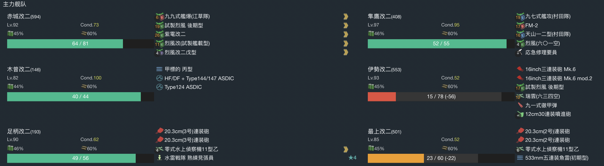
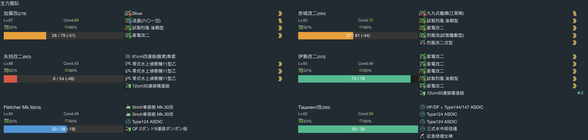
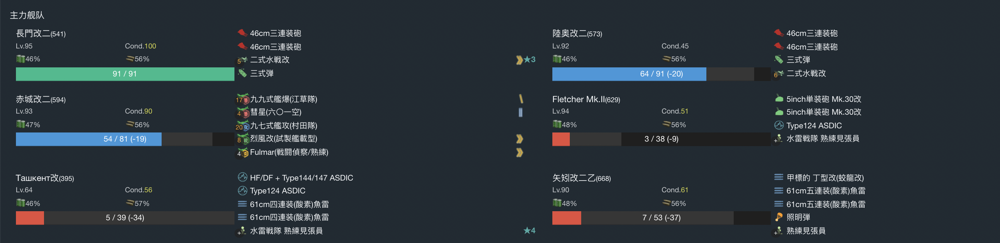

# 2021年秋季活动

---

## E1-甲

### P1

- 当前使用配置

- 推图情况

1. A | D-B  | E-A  | F-A | I-S | N-S
2. A | D-A  | E-S  | F-A | I-S | N-S
3. A | D-A  | E-S  | F-A | I-S | N-SS
4. A | D-A  | E-SS | F-B | I-S | N-S
5. A | D-SS | E-S  | F-A | I-S | N-S

### 开路-M点A胜

- 当前使用配置

- 推图情况

1. A | D-A | E-SS | G | J-B | M-A

### P2

- 当前使用配置

- 推图情况

1.  A | D-SS | E-A  | G | L-SS | P-A  | R-A
2.  A | D-SS | E-SS | G | L-A  | P-SS | R-A
3.  A | D-SS | E-SS | G | L-A  | P-S  | R-A
4.  A | D-SS | E-SS | G | L-A  | P-B  | R-A
5.  A | D-S  | E-S  | G | L-SS | P-A 矢矧大破撤退
6.  A | D-S  | E-S  | G | L-A  | P-A  | R-S
7.  A | D-SS | E-SS | G | L-A  | P-S  | R-S
8.  A | D-A  | E-SS | G | L-A  | P-A  | R-A
9.  A | D-SS | E-B  | G | L-SS | P-B  | R-A
10. A | D-SS | E-SS | G | L-A  | P-A  | R-A

斩杀

