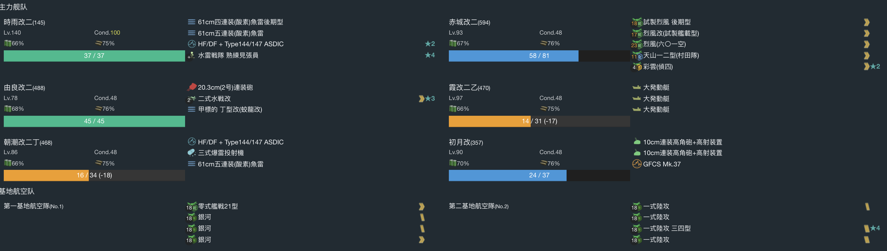
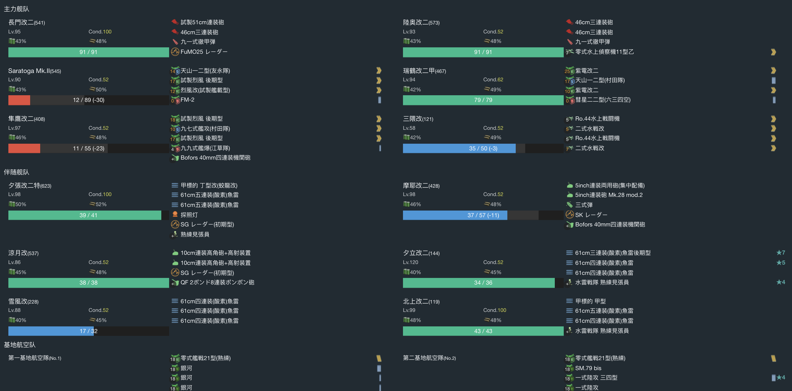

# 2021年秋季活动

---

## E1-甲

### P1

- 当前使用配置

- 推图情况

1. A | D-B  | E-A  | F-A | I-S | N-S
2. A | D-A  | E-S  | F-A | I-S | N-S
3. A | D-A  | E-S  | F-A | I-S | N-SS
4. A | D-A  | E-SS | F-B | I-S | N-S
5. A | D-SS | E-S  | F-A | I-S | N-S

### 开路-M点A胜

- 当前使用配置

- 推图情况

1. A | D-A | E-SS | G | J-B | M-A

### P2

- 当前使用配置

- 推图情况

1.  A | D-SS | E-A  | G | L-SS | P-A  | R-A
2.  A | D-SS | E-SS | G | L-A  | P-SS | R-A
3.  A | D-SS | E-SS | G | L-A  | P-S  | R-A
4.  A | D-SS | E-SS | G | L-A  | P-B  | R-A
5.  A | D-S  | E-S  | G | L-SS | P-A 矢矧大破撤退
6.  A | D-S  | E-S  | G | L-A  | P-A  | R-S
7.  A | D-SS | E-SS | G | L-A  | P-S  | R-S
8.  A | D-A  | E-SS | G | L-A  | P-A  | R-A
9.  A | D-SS | E-B  | G | L-SS | P-B  | R-A
10. A | D-SS | E-SS | G | L-A  | P-A  | R-A

斩杀

## E2-甲

### P1开路 GK点A胜

- 当前使用配置

- 推图情况

1. A-A | B-SS | D | F | G-S
2. A-A | B-SS | D | F | J | K-SS

### P1开路 L点A胜两次

- 当前使用配置

- 推图情况

1. A-SS | B-A | D | F | J | L-S
2. A-SS | B-A | D | F | J | L-S

### P1运输

- 当前使用配置

- 推图情况

1. A-SS | B-C | D | F | G-C | M-B | O | Q-A
2. A-SS | B-C | D | F | G-D 文月、村雨大破撤退
3. A-SS | B-B | D | F | G-D | M-A | O | Q-A
4. A-B 海风大破撤退
5. A-SS | B-B | D | F | G-D | M-A | O | Q-A
6. A-SS | B-C | D | F | G-C | M-A | O | Q-S
7. A-C 村雨大破撤退
8. A-A  | B-B | D | F | G-C | M-A | O | Q-S 天雾
9. A-A  | B-C | D | F | G-D | M-A | O | Q-S 

运输完成

### P2开路-P点A胜

- 当前使用配置

- 推图情况

1. A-A  | B-A | D | F | J | L-C 日进、江风大破撤退
2. A-B 弗莱彻大破撤退
3. A-SS | B-B | D | F | J | L-B 村雨大破撤退
4. A-SS | B-B | D | F | J | L-B | P-A 守家空优达成

### P2开路-C点空优

- 当前使用配置

- 推图情况

1. A-A | B-A | D | C 空优

### P2

- 当前使用配置

- 推图情况

1. A-A  | B-A | D | C-SS | R-SS | U-S
2. A-A  | B-B | D | C-A  | R-B 海风大破撤退
3. A-A  | B-B | D | C-A  | R-A  | U-S
4. A-SS | B-C 海风大破撤退
5. A-SS | B-A | D | C-A  | R-A  | U-S
6. A-B  | B-B | D | C-B 江风、海风大破撤退
7. A-SS | B-A | D | C-SS | R-A  | U-S
8. A-A  | B-B | D | C-A  | R-SS | U-S
9. A-SS | B-B | D | C-A 日进大破撤退
10. A-A | B-B | D | C-SS | R-A  | U-A

斩杀

## E3-甲

### P1运输

- 当前使用配置

- 推图情况

1. A-A  | B-A | C-A | H | I-A
2. A-SS | B-B | C-B | H 沟了
3. A-S  | B-A | C-S | H | I-S
4. A-SS | B-A 霞大破撤退
5. A-SS | B-B 由良大破撤退
6. A-SS | B-SS | C-B | H | I-A
7. A-B  | B-A  | C-S | H | I-A
8. A-C 初月大破撤退
9. A-B  | B-A  | C-A | H | I-A
10. A-B | B-A  | C-SS | H | I-A
11. A-B | B-A  | C-A  | H | I-A
12. A-B | B-B  | C-A  | H | I-A
13. A-B | B-A  | C-A  | H | I-A

运输完成

### P2

- 当前使用配置

- 推图情况

1. J | B-A  | E-SS | L | M-SS | N-SS | P-SS | R-A
2. J | B-A  | E-A  | L | M-A  | N-S  | P-S  | R-A
3. J | B-A  | E-A  | L | M-A  | N-S  | P-S  | R-S
4. J | B-SS | E-A  | L | M-A  | N-S  | P-S  | R-A
5. J | B-SS | E-A  | L | M-A 瑞鹤大破撤退
6. J | B-A  | E-A  | L | M-SS | N-S 凉月大破撤退
7. J | B-A  | E-A  | L | M-A  | N-S  | P-S  | R-A
8. J | B-A  | E-A  | L | M-A  | N-S  | P-S  | R-A
9. J | B-SS | E-A  | L | M-A  | N-S 雪风大破撤退
10. J | B-SS | E-SS | L | M-A | N-SS | P-S  | R-B
11. J | B-SS | E-SS | L | M-A | N-S 北上大破撤退
12. J | B-A  | E-A  | L | M-SS | N-S | P-S  | R-S

斩杀

