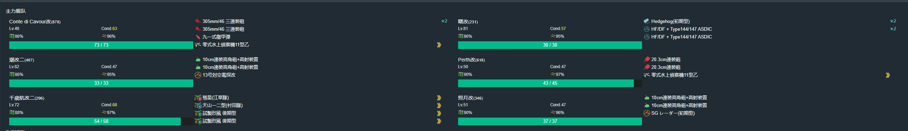
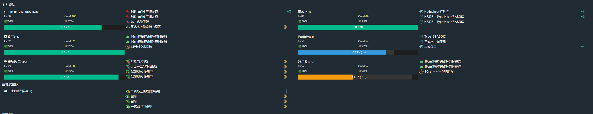
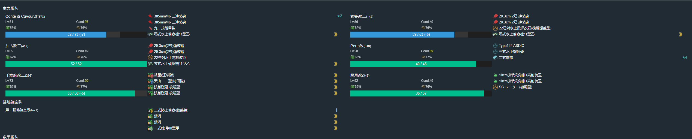
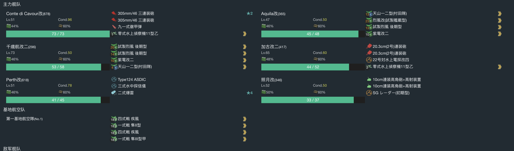
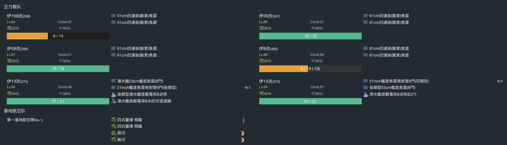

# 2022年冬季活动

---

## E1-甲

### 开路阶段1

#### 到达A、L点，M、N点A胜

- 当前使用配置(鼠标悬停可看到配置图对应阵容)

- 推图情况

1. B-S | F | J-A | N-SS
2. B-S | F | E-SS | H-S | D-SS | A
3. B-S | C-SS | G | K-SS | M-A
4. B-S | C-S  | G | I-S | L

### 开路阶段2

#### 到达O1，O3空优，O4、H2点A胜

- 当前使用配置(鼠标悬停可看到配置图对应阵容)

- 推图情况

1. B-S | F | J-A  | N-SS | O | O2-B | O1
2. B-S | F | J-SS | N-SS | O | O4-S
3. B-A | F | E-A  | H-A  | H1-A | H2-S
4. B-A | C-S | G | K-S | M-B | O3-A 空均
5. B-A | C-SS | G | K-S | M-B | O3-SS 空优

### 开路阶段3

#### 到达Q3、U、T点

- 当前使用配置(鼠标悬停可看到配置图对应阵容)

- 推图情况

1. B-D | C-SS | F | J-SS | N-S 伊19大破撤退
2. B-D | C-SS | F | J-SS | N-S | O | O4-D | P | Q1-S | Q2-SS | Q3
3. B-