# 2022年冬季活动

---

## E1-甲-斩杀时切乙

### 开路阶段1

#### 到达A、L点，M、N点A胜

- 当前使用配置(鼠标悬停可看到配置图对应阵容)

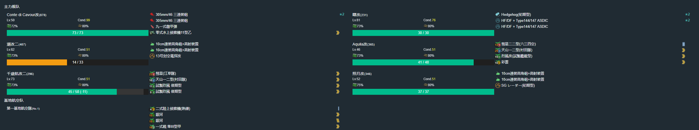

- 推图情况

1. B-S | F | J-A | N-SS
2. B-S | F | E-SS | H-S | D-SS | A
3. B-S | C-SS | G | K-SS | M-A
4. B-S | C-S  | G | I-S | L

### 开路阶段2

#### 到达O1，O3空优，O4、H2点A胜

- 当前使用配置(鼠标悬停可看到配置图对应阵容)

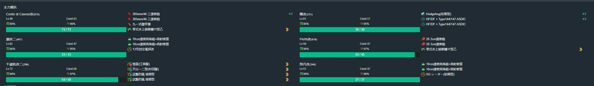
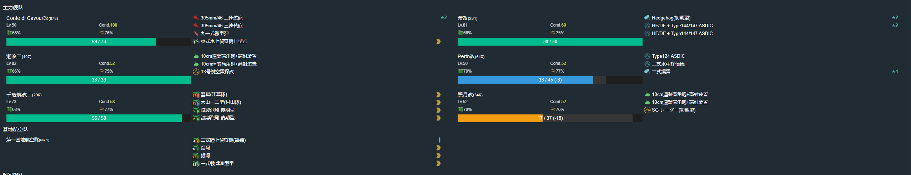
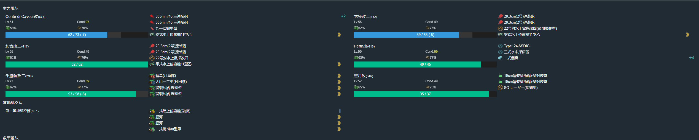
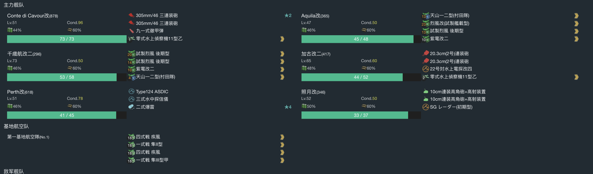

- 推图情况

1. B-S | F | J-A  | N-SS | O | O2-B | O1
2. B-S | F | J-SS | N-SS | O | O4-S
3. B-A | F | E-A  | H-A  | H1-A | H2-S
4. B-A | C-S | G | K-S | M-B | O3-A 空均
5. B-A | C-SS | G | K-S | M-B | O3-SS 空优

### 开路阶段3

#### 到达Q3、U、T点

- 攻略要点 6SS偷鸡，路航砸C-N

- 当前使用配置(鼠标悬停可看到配置图对应阵容)

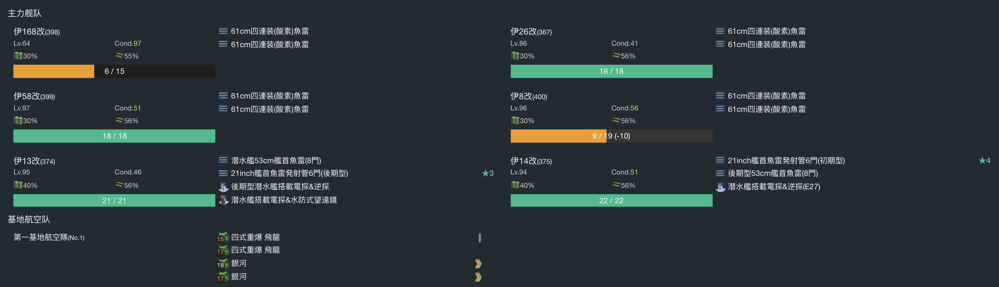

- 推图情况

1. B-D | C-SS | F | J-SS | N-S 伊19大破撤退
2. B-D | C-SS | F | J-SS | N-S | O | O4-D | P | Q1-S | Q2-SS | Q3
3. B-D | C-SS | F | J-SS | N-C 伊26大破撤退
4. B-D | C-S  | F | J-SS | N-S | O | O4-D | P | R-SS | U
5. B-D | C-SS | F | J-SS | N-C | O | O4-D | P | R-SS | T

### 攻略BOSS

- 当前使用配置(鼠标悬停可看到配置图对应阵容)

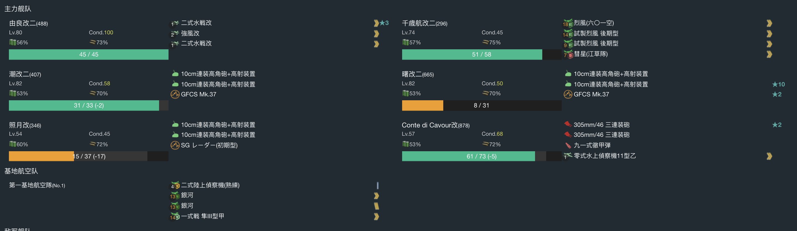

- 推图情况

1. B-A | F | J-SS | N-A | O | O4-B | P | R-SS | S | T | V3-A
2. B-B | F | J-SS | N-A | O | O4-B | P | R-SS | S | T | V3-A
3. B-B | F | J-SS | N-B | O | O4-C 由良大破撤退
4. B-B | F | J-A  | N-B | O | O4-B | P | R-A  | S | T | V3-S
5. B-B | F | J-A 潮大破撤退
6. B-B | F | J-SS | N-A | O | O4-B | P | R-B 潮大破撤退
7. B-B | F | J-SS | N-S 照月大破撤退
8. B-B | F | J-A  | N-A | O | O4-B | P | R-A  | S | T | V3-A
9. B-B | F | J-A  | N-A | O | O4-B | P | R-A  | S | T | V3-A
10. B-B | F | J-SS | N-B | O | O4-C 照月、曙大破撤退
11. B-B | F | J-B 曙大破撤退
12. B-B | F | J-A  | N-A | O | O4-B | P | R-A | S | T | V3-A

切乙

1. B-SS | F | J-SS | N-A | O | O4-A | P | R-SS | S | T | V3-S
2. B-A  | F | J-SS | N-A | O | O4-A | P | R-SS | S | T | V3-S

## E2-乙

### 运输

- 二队路航守家

- 当前使用配置(鼠标悬停可看到配置图对应阵容)

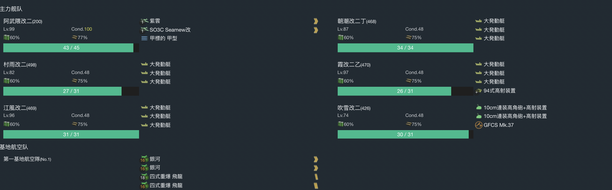

- 推图情况

1. D-B | G-B  | H-A | F-B | J | J2-S
2. D-B | G-A  | H-A | F-A | J | J2-S
3. D-B | G-B  | H-B | F-A | J | J2-A
4. D-B | G-A  | H-C | F-B | J | J2-S
5. D-B | G-SS | H-B | F-A 霞大破撤退
6. D-B | G-A  | H-B | F-B 朝潮大破撤退
7. D-A | G-A  | H-A | F-B | J | J2-A
8. D-B | G-A  | H-A | F-A | J | J2-A

### 开BOSS

#### I点A胜\守家空优

- 二队路航守家

- 当前使用配置(鼠标悬停可看到配置图对应阵容)

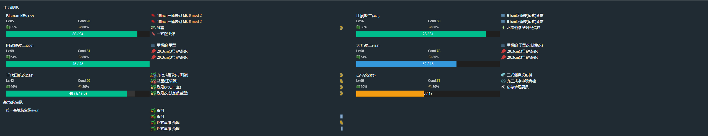

- 推图情况

1. D-B | E-S | H-A | I-SS 守家空优

#### B点空优

- 当前使用配置(鼠标悬停可看到配置图对应阵容)

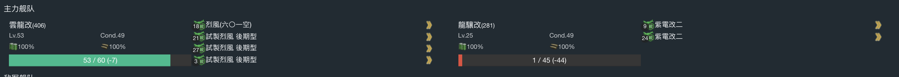

- 推图情况

1. B-C 空优

#### O点S胜、U点A胜、T点A胜、N点空优

- N点空优顺路做

- 当前使用配置(鼠标悬停可看到配置图对应阵容)

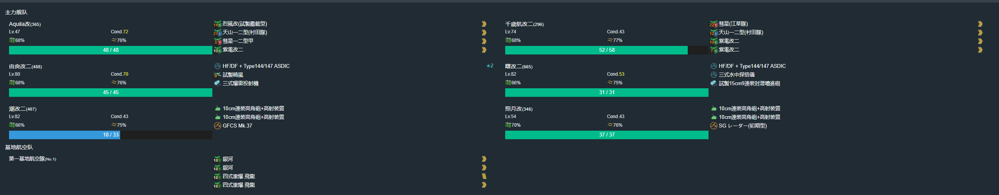
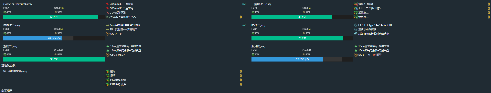
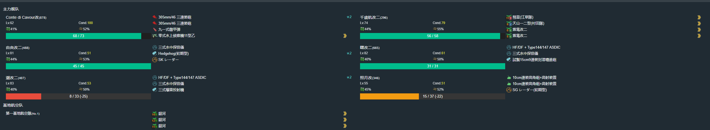

- 推图情况

1. K | M-SS | N-A  | Q | P-B  | O-SS
2. K | M-S  | N-A  | Q | C-B  | F-A | S | T-A
3. K | M-SS | N-SS | Q | C-A  | F-A | S | V-A 曙大破撤退
4. K | M-SS | N-SS | Q | C-SS | F-A | S | V-SS | U-A

### 攻略BOSS

#### 磨血

- 当前使用配置(鼠标悬停可看到配置图对应阵容)

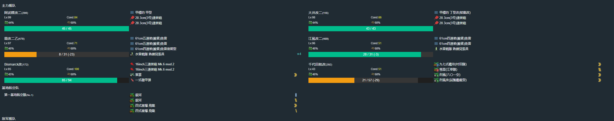

- 推图情况

1. D-A | E-SS | H-A | F-S  | X-A
2. D-S | E-SS | H-B | F-SS | X-D
3. D-B | E-SS | H-A | F-S  | X-A
4. D-A | E-SS | H-A | F-SS | X-A
5. D-A | E-SS | H-B | F-S  | X-S
6. D-B | E-S  | H-A | F-S  | X-S
7. D-B | E-S  | H-B | F-S  | X-S
8. D-A | E-S  | H-B | F-S  | X-A
9. D-B | E-SS | H-A | F-S  | X-A

#### 削甲 I点A胜、O点S胜、C点T点A胜

- 当前使用配置(鼠标悬停可看到配置图对应阵容)

- 推图情况

1. D-B | E-SS | H-S  | I-S
2. K   | M-SS | N-SS | Q | P-SS | O-S
3. K   | M-SS | N-SS | Q | C-B  | F-SS | S | T-S

#### 斩杀

- 当前使用配置(鼠标悬停可看到配置图对应阵容)

- 推图情况

1. D-A | E-S | H-A | F-SS | X-
