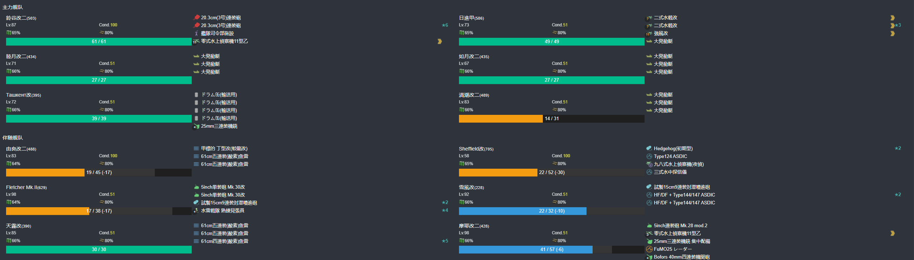

# 2022年夏秋活动

---

## E1-甲

### 开路阶段

#### J点S胜2次

- 当前使用配置(鼠标悬停可看到阵容对应的阶段)

- 推图情况

1. A | F-C | G-A | H | I-B | J-A
2. A | F-B | G-B | H | I-S | J-A
3. A | F-A | G-B 村雨大破撤退
4. A | F-A | G-B | H | I-A | J-A
5. A | F-A | G-B | H | I-A | J-A
6. A | F-B | G-B | H | I-A | J-A
7. A | F-A | G-B | H | I-A | J-A
8. A | F-B | G-B | H | I-A | J-S
9. A | F-B | G-B | H | I-A | J-S

#### 到达K点1次

- 当前使用配置(鼠标悬停可看到阵容对应的阶段)

- 推图情况

1. A | F-A | H | K

### 磨血

- 当前使用配置(鼠标悬停可看到阵容对应的阶段)

- 推图情况

1. A | F-SS | H | K | K1 | L-B | M-A  | P-A | Q 索敌不够沟了
2. A | F-B  | H | K | K1 | L-A | M-SS | P-S 照月大破撤退
3. A | F-C  | H | K | K1 | L-A | M-A  | P-A 照月大破撤退
4. A | F-SS | H | K | K1 | L-B | M-A  | P-S | R-S
5. A | F-S  | H | K | K1 | L-B 北上大破撤退
6. A | F-S  | H | K | K1 | L-B | M-A  | P-A | R-A
7. A | F-B  | H | K | K1 | L-S | M-SS | P-A | R-A
8. A | F-SS | H | K | K1 | L-C 北上大破撤退
9. A | F-A  | H | K | K1 | L-A | M-A  | P-A 北上大破撤退
10. A | F-A | H | K | K1 | L-B | M-A  | P-A | R-S
11. A | F-SS | H | K | K1 | L-C 江风大破撤退
12. A | F-A  | H | K | K1 | L-B | M-A | P-A | R-A
13. A | F-A  | H | K | K1 | L-C 照月大破撤退
14. A | F-B  | H | K | K1 | L-B | M-A | P-A | R-S
15. A | F-S  | H | K | K1 | L-C 江风大破撤退
16. A | F-S  | H | K | K1 | L-B | M-C | P-A | R-A
17. A | F-S  | H | k | K1 | L-D 照月大破撤退
18. A | F-SS | H | K | K2 | N-A 江风大破撤退
19. A | F-A  | H | K | K2 | N-A | P-B | R-A
20. A | F-A  | H | K | K1 | L-B | M-C | P-A 北上大破撤退

### 斩杀

- 当前使用配置(鼠标悬停可看到阵容对应的阶段)

- 推图情况

1. A | F-B  | H | K | K1 | P-A | R-A
2. A | F-A  | H | K | K1 | P-A | R-A
3. A | F-A  | H | K | K1 | P-A | R-S

---

## E2-甲

### P1-运输

- 当前使用配置(鼠标悬停可看到阵容对应的阶段)

- 推图情况

1. A-A | C | E | H | I-A | I1 | K-A
2. A-B | C | E | H | I-B | I1 | K-D
3. A-S | C | E | H | I-B | I1 | K-D
4. A-A | C | E | H | I-A | I1 | K-D
5. A-B | C | E | H | I-B | I1 | K-D
6. A-B | C | E | H | I-A | I1 | K-D
7. A-B | C | E | H | I-A | I1 | K-D
8. A-B | C | E | H | I-A | I1 | K-A
9. A-S | C | E | H | I-B 有明大破撤退
10. A-B  | C | E | H | I-S  | I1 | K-A
11. A-B  | C | E | H | I-A  | I1 | K-A
12. A-B  | C | E | H | I-SS | I1 | K-D
13. A-A  | C | E | H | I-SS | I1 | K-A
14. A-B  | C | E | H | I-B  | I1 | K-A
15. A-B  | C | E | H | I-A  | I1 | K-A
16. A-B  | C | E | H | I-A 千岁大破撤退
17. A-B  | C | E | H | I-A  | I1 | K-A
18. A-B  | C | E | H | I-A 有明大破撤退
19. A-A  | C | E | H | I-A  | I1 | K-A
20. A-A  | C | E | H | I-SS | I1 | K-A
21. A-A  | C | E | H | I-S  | I1 | K-D
22. A-B  | C | E | H | I-A  | I1 | K-C
23. A-SS | C | E | H | I-SS | I1 | K-A
24. A-B  | C | E | H | I-A  | I1 | K-A
25. A-A  | C | E | H | I-B  | I1 | K-A
26. A-B  | C | E | H | I-C  | I1 | K-A
27. A-B  | C | E | H | I-A  | I1 | K-A

### P2

#### 开启O点与路航-到达G点1次

- 当前使用配置(鼠标悬停可看到阵容对应的阶段)

- 推图情况

1. A-A | C | E | F-S | G

#### 开启BOSS-J点S胜1次

- 当前使用配置(鼠标悬停可看到阵容对应的阶段)

- 推图情况

1. A-A | C | E | H | J-S

#### 开启BOSS-O点A胜3次

- 当前使用配置(鼠标悬停可看到阵容对应的阶段)

- 推图情况

1. A-S  | C | D-B | O-B
2. A-S  | C | D-B | O-A
3. A-A  | C | D-B | O-D
4. A-S  | C | D-A | O-B
5. A-SS | C | D-C 霞大破撤退
6. A-S  | C | D-B 文月大破撤退
7. A-S  | C | D-B | O-D
8. A-S  | C | D-A 文月大破撤退
9. A-SS | C | D-B | O-A
10. A-SS | C | D-A | O-A

#### 磨血斩杀

- 当前使用配置(鼠标悬停可看到阵容对应的阶段)

- 推图情况

1. P | Q-S  | H | J-S  | R | S-B  | V-A
2. P | Q-S  | H | J-SS | R | S-A  | V-S
3. P | Q-S  | H | J-SS | R | S-A  | V-S
4. P | Q-S  | H | J-S  | R | S-S 霧島大破撤退
5. P | Q-A  | H | J-S  | R | S-A  | V-S
6. P | Q-S  | H | J-A  | R | S-B 冬月大破撤退
7. P | Q-A  | H | J-S  | R | S-B  鬼怒、海風大破撤退
8. P | Q-SS | H | J-A  | R | S-S  | V-S
9. P | Q-S  | H | J-S  | R | S-SS | V-A
10. P | Q-S | H | J-S  | R | S-A  | V-S
11. P | Q-S | H | J-S  | R | S-SS | V-A
12. P | Q-B | H | J-A  | R | S-A 千代田大破撤退
13. P | Q-S | H | J-S 千代田大破撤退
14. P | Q-A | H | J-S 榛名、冬月大破撤退
15. P | Q-S | H | J-S 雾岛、千代田、朝潮大破撤退
16. P | Q-A | H | J-S | R | S-SS | V-A
17. P | Q-S | H | J-S | R | S-B 千代田大破撤退
18. P | Q-A | H | J-S 瑞凤大破撤退
19. P | Q-S | H | J-B | R | S-A 千代田大破撤退
20. P | Q-A | H | J-S 瑞凤大破撤退
21. P | Q-A | H | J-B 三隈大破撤退
22. P | Q-B | H | J-SS | R | S-A 海风大破撤退
23. P | Q-A | H | J-S  | R | S-SS | V-A
24. P | Q-A | H | J-A 北上大破撤退
25. P | Q-S | H | J-S  | R | S-S 三隈大破撤退
26. P | Q-S | H | J-S  | R | S-A  榛名、瑞凤大破撤退
27. P | Q-S | H | J-SS | R | S-A | V-S

---

## E3-乙

### 解谜

#### C2点A胜1次

- 当前使用配置(鼠标悬停可看到阵容对应的阶段)

- 推图情况

1. A-S | B | C | C2-A

#### E点A胜2次

- 当前使用配置(鼠标悬停可看到阵容对应的阶段)

- 推图情况

1. A-S | B | C | C1-B | E-A
2. A-A | B | C | C1-S | E-A

### P1

- 当前使用配置(鼠标悬停可看到阵容对应的阶段)

- 推图情况

1. F-S  | F1-A  | F2-SS | H | I | L-S
2. F-S  | F1-A  | F2-SS | H | I | L-S
3. F-S  | F1-A  | F2-SS | H | I | L-S
4. F-SS | F1-A  | F2-SS | H | I | L-S
5. F-SS | F1-SS | F2-SS | H | I | L-S
6. F-SS | F1-A  | F2-SS | H | I | L-S

### 开启N点和P点-到达G点1次

- 当前使用配置(鼠标悬停可看到阵容对应的阶段)

- 推图情况

1. F-S | F1-SS | G

### 开启P2

#### N点S胜2次

- 当前使用配置(鼠标悬停可看到阵容对应的阶段)

- 推图情况

1. F-SS | F1-A | F2-SS | H | J | M-SS | N-S
2. F-SS | F1-A | F2-SS | H | J | M-S  | N-S

#### P点A胜2次

- 当前使用配置(鼠标悬停可看到阵容对应的阶段)

- 推图情况

1. F-SS | F1-A  | F2-SS | H | I | K-SS | P-S
2. F-A  | F1-SS | F2-SS | H | I | K-SS | P-S

### P2

- 当前使用配置(鼠标悬停可看到阵容对应的阶段)

- 推图情况

1. F-S  | F1-SS | F2-SS | H | J | O-SS | Q-A | U-S
2. F-SS | F1-SS | F2-SS | H | J | O-S  | Q-A | U-S
3. F-SS | F1-A  | F2-SS | H | J | O-S  | Q-A | U-S
4. F-SS | F1-SS | F2-SS | H | J | O-S  | Q-A | U-S
5. F-S  | F1-SS | F2-A  | H | J | O-SS | Q-A | U-S
6. F-S  | F1=A  | F2-S  | H | J | O-S  | Q-A | U-S
7. F-SS | F1-SS | F2-S  | H | J | O-S  | Q-A | U-A
8. F-SS | F1-SS | F2-A  | H | J | O-SS | Q-A | U-A
9. F-S  | F1-SS | F2-SS | H | J | O-S  | Q-A | U-S

---

## E4-乙

### P1

- 当前使用配置(鼠标悬停可看到阵容对应的阶段)

- 推图情况

1. B-SS | E-S | F | F1-SS | H-C | I-B | K-SS
2. B-SS | E-S | F | F1-SS | H-B | I-B | K-SS
3. B-SS | E-A | F | F1-SS | H-B | I-D 各种大破撤退
4. B-SS | E-S | F | F1-SS | H-A | I-A | K-SS
5. B-SS | E-B | F | F1-SS | H-B | I-B | K-SS
6. B-S  | E-A | F | F1-SS | H-B | I-C | K-SS

### 解谜

#### L1点S胜1次

- 当前使用配置(鼠标悬停可看到阵容对应的阶段)

- 推图情况

1. B-SS | E-A | F | F2-B | L | L1-SS

#### L2点A胜1次 

- 当前使用配置(鼠标悬停可看到阵容对应的阶段)

- 推图情况

1. B-SS | E-S | F | F2-B | L | L2-SS

#### G2点A胜1次 

- 当前使用配置(鼠标悬停可看到阵容对应的阶段)

- 推图情况

1. B-SS | C-SS | G | G1-C | G2-S

#### O2点A胜2次 

- 当前使用配置(鼠标悬停可看到阵容对应的阶段)

- 推图情况

1. M | N-SS | O | O1-A | Q 索敌不够沟了(系数2 合计 >= 76)
2. M | N-SS | O | O1-A | O2-A
3. M | N-SS | O | O1-A | O2-A

#### T点A胜2次 

- 当前使用配置(鼠标悬停可看到阵容对应的阶段)

- 推图情况

1. M | N-SS | O | P-SS | T-A
2. M | N-SS | O | P-SS | T-S

### P2

- 当前使用配置(鼠标悬停可看到阵容对应的阶段)

- 推图情况

1. M | N-SS | O | P-SS | T-B  | U | W-A
2. M | N-SS | O | P-SS | T-SS | U | W-A
3. M | N-SS | O | P-SS | T-B 睦月、摩耶大破撤退
4. M | N-SS | O | P-SS | T-A  | U | W-A
5. M | N-SS | O | P-SS | T-A  | U | W-A
6. M | N-SS | O | P-SS | T-B  | U | V 撤退沟了
7. M | N-SS | O | P-SS | T-A  | U | W-A
8. M | N-SS | O | P-SS | T-A  | U | W-A

## E5-丙

### P1

- 当前使用配置(鼠标悬停可看到阵容对应的阶段)

- 推图情况

1. A-SS | C-S | D | E-SS | G | H-S
2. A-SS | C-A 瑞鹤大破撤退
3. A-S  | C-A | D | E-A  | G | H-S
4. A-SS | C-B | D | E-A  | G | H-A
5. A-A  | C-B | D | E-A  | G | H-A

### 解谜1

#### F点空优1次

- 当前使用配置(鼠标悬停可看到阵容对应的阶段)

- 推图情况

1. A-SS | C-B | D | F-SS(空优) | G1-A | I-A

#### I点A胜3次

- 当前使用配置(鼠标悬停可看到阵容对应的阶段)

- 推图情况

1. A-SS | C-B | D | F-B  | G1-B | I-S
2. A-SS | C-S | D | F-A  | G1-A | U 休斯顿大破沟了
3. A-SS | C-A | D | F-SS | G1-S | I-S

### P2

- 当前使用配置(鼠标悬停可看到阵容对应的阶段)

- 推图情况

1. A-SS | C-S | D | F-SS | J-S  | K | L-SS | N | N1-S  | O-A
2. A-SS | C-A | D | F-SS | J-S  | K | L-A  | N | N1-S  | O-S
3. A-SS | C-S | D | F-SS | J-SS | K | L-A  | N | N1-SS | O-S
4. A-SS | C-A | D | F-A  | J-SS | K | L-A  | N | N1-S  | O-A
5. A-SS | C-A | D | F-A  | J-SS | K | L-A  | N | N1-S  | O-S

### P3

- 当前使用配置(鼠标悬停可看到阵容对应的阶段)

- 推图情况

1. A-S  | C-S  | D | F-SS | J-SS | K | M-S  | P-S
2. A-SS | C-S  | D | F-A  | J-SS | K | M-SS | P-S
3. A-SS | C-SS | D | F-SS | J-SS | K | M-S  | P-S
4. A-SS | C-S  | D | F-A  | J-SS | K | M-SS | P-S
5. A-SS | C-SS | D | F-A  | J-SS | L | M-S  | P-S

### P4

- 当前使用配置(鼠标悬停可看到阵容对应的阶段)

- 推图情况

1. A-SS | C-SS | D | F-SS | J-SS | Q | S | X-S
2. A-SS | C-SS | D | F-SS | J-SS | Q | S | X-S
3. A-SS | C-S  | D | F-SS | J-S  | Q | S | X-S
4. A-SS | C-S  | D | F-SS | J-SS | Q | S | X-S
5. A-SS | C-SS | D | F-A  | J-SS | Q | S | X-S
6. A-SS | C-SS | D | F-A  | J-SS | Q | S | X-A
7. A-SS | C-S  | D | F-A  | J-SS | Q | S | X-A
8. A-SS | C-S  | D | F-SS | J-SS | Q | S | X-A
9. A-SS | C-SS | D | F-SS | J-SS | Q | S | X-S

## E6-丙

### 解谜-C点S胜2次

- 当前使用配置(鼠标悬停可看到阵容对应的阶段)

- 推图情况

1. A | B-SS | C-SS 
2. A | B-SS | C-SS

### P1

- 当前使用配置(鼠标悬停可看到阵容对应的阶段)

- 推图情况

1. A | B-SS | C-SS | D | D2-S | F | G-S
2. A | B-SS | C-SS | D | D2-B | F | G-S
3. A | B-S  | C-S  | D | D2-S | F | G-S

### 解谜-D3到达1次

- 当前使用配置(鼠标悬停可看到阵容对应的阶段)

- 推图情况

1. A | B-SS | C-SS | D | D1-A | D3

### P2

- 当前使用配置(鼠标悬停可看到阵容对应的阶段)

- 推图情况

1. H | I-SS | L | N-SS | O-S  | Q | S-S
2. H | I-S  | L | N-SS | O-SS | Q | S-S
3. H | I-SS | L | N-SS | O-SS | Q | S-S

### 解谜-P点S胜1次

- 当前使用配置(鼠标悬停可看到阵容对应的阶段)

- 推图情况

1. H | I-SS | L | N-SS | O-A | P-SS

### P3

- 当前使用配置(鼠标悬停可看到阵容对应的阶段)

- 推图情况

1. H | I-SS | L | N-SS | O-S 熊野大破撤退
2. H | I-SS | L | N-SS | O-SS | P-S  | V | W-S
3. H | I-SS | L | N-SS | O-S  | P-SS | V | W-S
4. H | I-SS | L | N-SS | O-SS | P-SS | V | W-S
5. H | I-SS | L | N-SS | O-SS | P-SS | V | W-S
6. H | I-S  | L | N-SS | O-S  | P-SS | V | W-S
7. H | I-SS | L | N-A  | O-SS | P-A  | V | W-S

### P4

- 当前使用配置(鼠标悬停可看到阵容对应的阶段)

- 推图情况

1. H | I-SS | L | M-S  | X-SS | Y-S 亚特兰大大破撤退
2. H | I-S  | L | M-S  | X-A  | Y-A  | Z-S
3. H | I-S  | L | M-S  | X-SS | Y-A  | Z-A
4. H | I-SS | L | M-S  | X-SS | Y-S 塔什干大破撤退
5. H | I-SS | L | M-SS | X-SS | Y-A  | Z-S
6. H | I-SS | L | M-SS | X-A  | Y-A  | Z-S
7. H | I-SS | L | M-SS | X-A  | Y-A  | Z-S
8. H | I-S  | L | M-S  | X-SS | Y-SS | Z-S
9. H | I-SS | L | M-SS | X-A  | Y-S 铃谷大破撤退
10. H | I-SS | L | M-SS | X-A | Y-S 伊势大破撤退
11. H | I-SS | L | M-SS | X-A | Y-A | Z-A

#### 削甲-G点S胜1次

- 当前使用配置(鼠标悬停可看到阵容对应的阶段)

- 推图情况

1. A | B-SS | C-A | D | D2-B | F | G-S

#### 削甲-S点S胜1次

- 当前使用配置(鼠标悬停可看到阵容对应的阶段)

- 推图情况

1. H | I-SS | L | N-SS | O-A  | Q | S-S

#### 削甲-Y点S胜1次

- 上述推图时已完成

#### 削甲-守家空优（猜测-已验证需要）

- 当前使用配置(鼠标悬停可看到阵容对应的阶段)

- 推图情况

1. H | I-SS | L | M-SS | X-A 守家空确

#### 斩杀

- 当前使用配置(鼠标悬停可看到阵容对应的阶段)

- 推图情况

1. H | I-S  | L | M-SS | X-A  | Y-A | Z-C (削甲未成功，后续补充守家空优)
2. H | I-SS | L | M-SS | X-A  | Y-A 好多大破撤退
3. H | I-SS | L | M-S  | X-A  | Y-A | Z-A
4. H | I-SS | L | M-SS | X-A  | Y-S 妙高大破撤退
5. H | I-SS | L | M-SS | X-SS | Y-A | Z-A
6. H | I-SS | L | M-S  | X-SS | Y-A 陆奥大破撤退
7. H | I-A  | L | M-SS | X-A  | Y-A | Z-D
8. H | I-A  | L | M-S  | X-A  | Y-A 日进大破撤退
9. H | I-A  | L | M-SS | X-A  | Y-A | Z-A
10. H | I-A | L | M-SS | X-A  | Y-A | Z-A
11. H | I-B | L | M-SS | X-A  | Y-A 长门大破撤退
12. H | I-A | L | M-SS | X-SS | Y-A | Z-A
13. H | I-SS | L | M-SS | X-SS | Y-A | Z-S

## 捞船

### E5-P4-马萨诸塞

- 当前使用配置(鼠标悬停可看到阵容对应的阶段)

- 推图情况

1. A-SS | C-SS | D | F-A  | J-SS | Q | S | X-S 比叡
2. A-SS | C-SS | D | F-A  | J-SS | Q | S | X-S 凉波
3. A-SS | C-S  | D | F-SS | J-SS | Q | S | X-S 比叡
4. A-SS | C-SS | D | F-SS | J-SS | Q | S | X-S 扶桑
5. A-SS | C-SS | D | F-SS | J-SS | Q | S | X-S 摩耶
6. A-SS | C-SS | D | F-A  | J-SS | Q | S | X-S 鬼怒
7. A-SS | C-S  | D | F-SS | J-S  | Q | S | X-S 利根
8. A-SS | C-S  | D | F-A  | J-SS | Q | S | X-S 浜波
9. A-SS | C-S  | D | F-A  | J-S 贾维斯大破撤退
10. A-SS | C-S | D | F-A  | J-SS | Q | S | X-S 榛名
11. A-SS | C-S | D | F-A  | J-SS | Q | S | X-S 夕云
12. A-SS | C-S | D | F-A  | J-S  | Q | S | X-S 凤翔
13. A-SS | C-S | D | F-SS | J-SS | Q | S | X-S 金刚
14. A-S  | C-SS | D | F-SS | J-SS | Q | S | X-S 秋津丸
15. A-SS | C-SS | D | F-SS | J-SS | Q | S | X-S 衣笠
16. A-SS | C-SS | D | F-SS | J-SS | Q | S | X-S 扶桑
17. A-SS | C-S  | D | F-A  | J-SS | Q | S | X-S 马萨诸塞

### E4-P2-布鲁克林

- 当前使用配置(鼠标悬停可看到阵容对应的阶段)

- 推图情况

1. M | N-S  | O | P-S  | T-B  | U | W-A 长良
2. M | N-SS | O | P-SS | S-SS | T-S | U | W-A 绫波
3. 