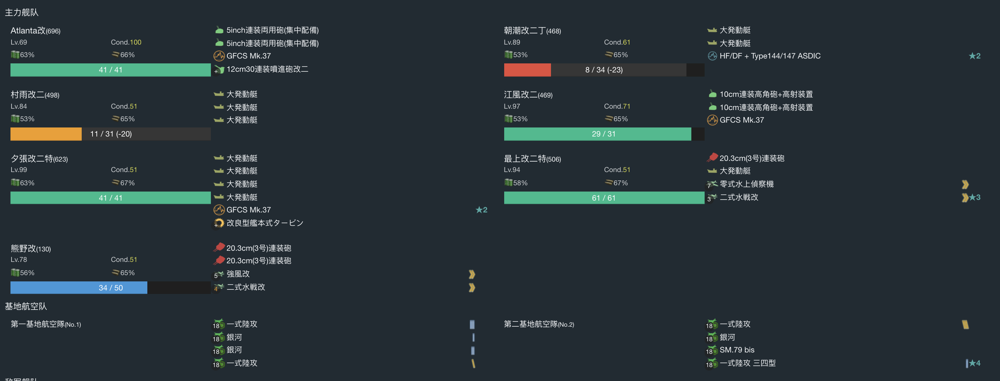

# 2022 年春季活动

---

## E1-甲-斩杀切乙

### 开路阶段 1

#### 到达 E 点、K 点

- 当前使用配置(鼠标悬停可看到阵容对应的阶段)

- 推图情况

1. A | B-D | C-SS | D-D | E
2. A | F-D | G-SS | H-SS | I-D | K

#### J 点 S 胜

- 当前使用配置(鼠标悬停可看到阵容对应的阶段)

- 推图情况

1. A | F-SS | H-SS | J-S

### 开路阶段 2

#### M 点到达三次

- 当前使用配置(鼠标悬停可看到阵容对应的阶段)

- 推图情况

1. A | F-SS | H-A | J-S | L-SS | M
2. A | F-SS | H-SS | J-S | L-SS | M
3. A | F-SS | H-A | J-S | L-S | M

### 磨血斩杀

- 当前使用配置(鼠标悬停可看到阵容对应的阶段)

- 推图情况

1. A | F-SS | H-SS | J-S | L-SS | N-A | O-B | Q | R-A
2. A | F-SS | H-A | J-SS | L-SS | N-A | O-SS | Q | R-S
3. A | F-S | H-A | J-S | L-A | N-A | O-S | Q | R-A
4. A | F-A | H-A | J-S | L-SS | N-B Jervis 大破撤退
5. A | F-SS | H-A | J-SS | L-SS | N-C 千代田大破撤退
6. A | F-SS | H-A | J-SS | L-S 绫波大破撤退
7. A | F-S | H-A | J-S | L-SS | N-B | O-SS | Q | R-A
8. A | F-SS | H-SS | J-S | L-SS | N-A | O-SS | Q | R-A
9. A | F-SS | H-SS | J-SS | L-SS | N-SS | O-A | Q | R-D
10. A | F-SS | H-A | J-S | L-S | N-A | O-A | Q | R-D
11. A | F-SS | H-A | J-SS | L-SS | N-A | O-S | Q | R-S
12. A | F-SS | H-A | J-S | L-SS | N-C 照月大破撤退
13. A | F-SS | H-SS | J-SS | L-SS | N-SS | O-SS | Q | R-A
14. A | F-SS | H-A | J-S | L-SS | N-A | O-A | Q | R-A
15. A | F-SS | H-A | J-S | L-SS | N-A | O-S Jervis 大破撤退
16. A | F-SS | H-SS | J-SS | L-SS | N-SS | O-S | Q | R-D
17. A | F-SS | H-A | J-S | L-SS | N-B Jervis 大破撤退
18. A | F-SS | H-SS | J-S | L-SS | N-B 照月大破撤退
19. A | F-SS | H-SS | J-SS | L-S | N-A | O-S | Q | R-A
20. A | F-A | H-SS | J-SS | L-A | N-A | O-S | Q | R-A
21. A | F-SS | H-SS | J-S | L-SS | N-A | O-SS | Q | R-A
22. A | F-A | H-SS | J-S | L-A | N-A | O-S | Q | R-A
23. A | F-B | H-SS | J-S | L-B | N-A | O-A | Q | R-A
24. A | F-A | H-SS | J-SS | L-A | N-A | O-SS | Q | R-A
25. A | F-A | H-SS | J-SS | L-A | N-B 千代田大破撤退

### 切乙

1. A | F-SS | H-A | J-S | L-A | N-SS | O-S | Q | R-A
2. A | F-A | H-SS | J-S | L-SS | N-A | O-S | Q | R-S
3. A | F-SS | H-A | J-SS | L-A | N-A | O-SS | Q | R-A
4. A | F-A | H-A | J-SS | L-A | N-SS | O-S | Q | R-A
5. A | F-S | H-SS | J-SS | L-A 绫波大破撤退
6. A | F-SS | H-A | J-SS | L-A | N-SS | O-S | Q | R-A
7. A | F-SS | H-SS | J-SS | L-A | N-A | O-SS | Q | R-A
8. A | F-SS | H-SS | J-SS | L-SS | N-B | O-S | Q | R-S

---

## E2-甲

### P1 運輸

- 当前使用配置(鼠标悬停可看到阵容对应的阶段)

- 推图情况

1. A | B-B | C-B | F-B | M | O-A
2. A | B-A | C-B | F-B | M | O-A
3. A | B-C | C-A | F-B | M | O-A
4. A | B-B | C-A | F-B | M | O-A
5. A | B-B | C-A | F-C | M | O-D
6. A | B-A | C-A | F-D 皋月大破撤退
7. A | B-B | C-B | F-B | M | O-A
8. A | B-A | C-B | F-B | M | O-A

### P2 運輸

- 当前使用配置(鼠标悬停可看到阵容对应的阶段)

- 推图情况

1. P-SS | Q | S-S | S1-A 阿布鲁奇大破撤退
2. P-S | Q | S-S | S1-S | T | T2-A
3. P-A | Q | S-S | S1-S | T | T2-A
4. P-SS | Q | S-S | S1-A | T | T2-A
5. P-A | Q | S-S | S1-A | T | T2-A
6. P-A | Q | S-SS | S1-S | T | T2-A
7. P-SS | Q | S-S | S1-B | T | T2-A
8. P-S | Q | S-S | S1-B 日进大破撤退
9. P-SS | Q | S-S | S1-A | T | T2-A

### P3 开路

#### R 点 S 胜

- 当前使用配置(鼠标悬停可看到阵容对应的阶段)

- 推图情况

1. P-S | Q | R-S

### P3 磨血斩杀

- 当前使用配置(鼠标悬停可看到阵容对应的阶段)

- 推图情况

1. P-A | Q | R-SS | U-A | W-S | W2-A
2. P-A | Q | R-S | U-B 白雪大破撤退
3. P-S | Q | R-S | U-A | W-SS | W2-A
4. P-SS | Q | R-S | U-A | W-SS | W2-A
5. P-SS | Q | R-SS | U-A | W-S | W2-A
6. P-SS | Q | R-S | U-SS | W-SS | W2-A
7. P-SS | Q | R-SS | U-A | W-SS | W2-S
8. P-A | Q | R-SS | U-A | W-S | W2-A
9. P-SS | Q | R-S | U-A | W-B | W2-S

---

## E3-乙

### P1

#### 开路 E 点空优 1 次、L 点空优 2 次

- 当前使用配置(鼠标悬停可看到阵容对应的阶段)

- 推图情况

1. A-SS | B-A | D | E-A 空确 | H | J-SS | K | L-SS 空优
2. A-SS | B-A | D | E-A 空确 | H | J-SS | K | L-A 空优

#### 磨血斩杀

- 当前使用配置(鼠标悬停可看到阵容对应的阶段)

- 推图情况

1. M-SS | N-SS | O-A | P-S | Q-S
2. M-S | N-SS | O-A | P-S | Q-S
3. M-SS | N-SS | O-A 火奴鲁鲁大破撤退
4. M-S | N-S 大井大破撤退
5. M-SS | N-S 潮、加古大破撤退
6. M-SS | N-S | O-A | P-S | Q-S
7. M-SS | N-SS | O-A | P-S | Q-S
8. M-SS | N-S | O-A | P-SS | Q-S

### P2

#### 开路 L 点空优 1 次

- 当前使用配置(鼠标悬停可看到阵容对应的阶段)

- 推图情况

1. A-SS | B-B | D | E-A | H | R-B | L-A 空优

#### 运输

- 当前使用配置(鼠标悬停可看到阵容对应的阶段)

- 推图情况

1. A-SS | D | E-C | H | R-D | L-B 最上大破撤退
2. A-SS | D | E-B | H | R-B | L-C 熊野大破撤退
3. A-SS | D | E-A | H | R-B | L-A | S-B | T | U-A
4. A-SS | D | E-SS | H | R-A | L-A | S-B | T | U-A
5. A-SS | D | E-SS | H | R-B | L-C 最上、夕张大破撤退
6. A-SS | D | E-A 江风大破撤退
7. A-SS | D | E-SS | H | R-B | L-B 村雨大破撤退
8. A-SS | D | E-SS | H | R-D | L-A | S-A 夕张大破撤退
9. A-SS | D | E-SS | H | R-D | L-B 朝潮大破撤退
10. A-S | D | E-B | H | R-B | L-SS | S-B | T | U-A
11. A-SS | D | E-A | H | R-A | L-SS | S-B | T | U-A
12. A-A | D | E-A | H | R-A | L-A | S-B | T | U-A
13. A-A | D | E-A 村雨大破撤退
14. A-S | D | E-SS | H | R-A | L-A | S-A | T | U-A
15. A-SS | D | E-A | H | R-A | L-A | S-A | T | U-A

### P3

- 当前使用配置(鼠标悬停可看到阵容对应的阶段)

- 推图情况

1. G-B  | I-SS | J-S  | K | L-SS | W | X-SS | Y-S
2. G-S  | I-SS | J-SS | K | L-SS | W | X-SS | Y-S
3. G-S  | I-SS | J-SS | K | L-SS | W | X-S  | Y-S
4. G-SS | I-A  | J-S  | K | L-SS | W | X-S 龙骧大破撤退
5. G-SS | I-A  | J-B  | K | L-A 秋津洲大破撤退
6. G-S  | I-SS | J-SS | K | L-SS | W | X-SS | Y-S
7. G-B  | I-A  | J-SS | K | L-SS | W | X-SS | Y-S
8. G-B  | I-SS | J-B  | K | L-A  | W | X-S  | Y-D
9. G-B  | I-SS | J-B  | K | L-SS | W | X-SS | Y-A

---

## E4-甲

### P1开路

#### H点到达三次

- 当前使用配置(鼠标悬停可看到阵容对应的阶段)

- 推图情况

1. A | B | C-S  | D | E-A | F-SS | G | H
2. A | B | C-SS | D | E-A | F-SS | G | H
3. A | B | C-S  | D | E-A | F-SS | G | H

#### E点空优

- 当前使用配置(鼠标悬停可看到阵容对应的阶段)

- 推图情况

1. A | B | C-S | D1-SS | D2-S | E-空确

#### 磨血斩杀

- 当前使用配置(鼠标悬停可看到阵容对应的阶段)

- 推图情况

1.  A | B | C-S  | D | E-SS | F-S  | G | H | J-A | M-S
2.  A | B | C-S  | D | E-A  | F-S  | G | H | J-C 弗莱彻大破撤退
3.  A | B | C-S  | D | E-A  | F-SS | G | H | J-B | M-S
4.  A | B | C-S  | D | E-A  | F-S 大淀大破撤退
5.  A | B | C-SS | D | E-A  | F-S  | G | H | J-C 利根大破撤退
6.  A | B | C-SS | D | E-A  浜风大破撤退
7.  A | B | C-SS | D | E-SS | F-A  | G | H | J-C 弗莱彻大破撤退
8.  A | B | C-S  | D | E-SS | F-A  | G | H | J-A | M-A
9.  A | B | C-S  | D | E-A  | F-SS | G | H | J-B | M-SS
10. A | B | C-SS | D | E-A  | F-S  | G | H | J-A | M-S
11. A | B | C-SS | D | E-A  | F-S 浦风大破撤退
12. A | B | C-S  | D | E-SS | F-S  | G | H | J-A | M-A

### 路航搬家

#### D2、E点空优、J点S胜

- 当前使用配置(鼠标悬停可看到阵容对应的阶段)

- 推图情况

1. A | B | C-A | D1-A 空优 | D2-SS | E-A 空优 | F-S | G | H | J-S

#### O、Q点空优

- 当前使用配置(鼠标悬停可看到阵容对应的阶段)

- 推图情况

1. N-SS | O-A 空优 | Q-A 空均
2. N-SS | O-A 空优 | Q-A 空优

#### 守家空优两次

- 当前使用配置(鼠标悬停可看到阵容对应的阶段)

- 推图情况

1. A | B | C-D | D 守家空均 | D2-E
2. A | B | C-D 守家空确
3. A | B | C-D 守家空确

### P2

#### 磨血斩杀

- 当前使用配置(鼠标悬停可看到阵容对应的阶段)

- 推图情况

1. N-A  | P-A  | R-S 竹大破撤退
2. N-A  | P-A  | R-SS | T-S 羽黑大破撤退
3. N-A  | P-A  | R-SS | T-S | W-S
4. N-S  | P-A  | R-SS | T-S | W-S
5. N-S  | P-SS | R-SS | T-S 時雨大破撤退
6. N-S  | P-SS | R-S  | T-S 阿武畏大破撤退
7. N-A  | P-SS | R-S  | T-S | W-S
8. N-SS | P-A  | R-S  | T-S | W-A
9. N-SS | P-SS | R-SS | T-S | W-S
10. N-SS | P-SS | R-S 時雨大破撤退
11. N-SS | P-A  | R-A | T-S | W-S

### P3开路

#### W点A胜1次

- 当前使用配置(鼠标悬停可看到阵容对应的阶段)

- 推图情况

1. N-A | P-SS | R-S | T-S | W-A

#### O点空优

- 当前使用配置(鼠标悬停可看到阵容对应的阶段)

- 推图情况

1. N-SS | O-SS 空优

#### C点、J点S胜、M点A胜1次

- 当前使用配置(鼠标悬停可看到阵容对应的阶段)

- 推图情况

1. A | B | C-SS | D | E-A | F-S | G | H | J-SS | M-S

#### 守家空优两次

- 当前使用配置(鼠标悬停可看到阵容对应的阶段)

- 推图情况

1. A | B | C-D 守家空优
2. A | B | C-D 守家空优

#### O点空优

