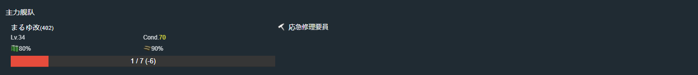

# 2022年春季活动

---

## E1-甲-斩杀切乙

### 开路阶段1

#### 到达E点、K点

- 当前使用配置(鼠标悬停可看到阵容对应的阶段)

- 推图情况

1. A | B-D | C-SS | D-D | E
2. A | F-D | G-SS | H-SS | I-D | K

#### J点S胜

- 当前使用配置(鼠标悬停可看到阵容对应的阶段)

- 推图情况

1. A | F-SS | H-SS | J-S

### 开路阶段2

#### M点到达三次

- 当前使用配置(鼠标悬停可看到阵容对应的阶段)

- 推图情况

1. A | F-SS | H-A  | J-S | L-SS | M
2. A | F-SS | H-SS | J-S | L-SS | M
3. A | F-SS | H-A  | J-S | L-S  | M

### 磨血斩杀

- 当前使用配置(鼠标悬停可看到阵容对应的阶段)

- 推图情况

1. A | F-SS | H-SS | J-S  | L-SS | N-A  | O-B  | Q | R-A
2. A | F-SS | H-A  | J-SS | L-SS | N-A  | O-SS | Q | R-S
3. A | F-S  | H-A  | J-S  | L-A  | N-A  | O-S  | Q | R-A
4. A | F-A  | H-A  | J-S  | L-SS | N-B Jervis 大破撤退
5. A | F-SS | H-A  | J-SS | L-SS | N-C 千代田大破撤退
6. A | F-SS | H-A  | J-SS | L-S 绫波大破撤退
7. A | F-S  | H-A  | J-S  | L-SS | N-B  | O-SS | Q | R-A
8. A | F-SS | H-SS | J-S  | L-SS | N-A  | O-SS | Q | R-A
9. A | F-SS | H-SS | J-SS | L-SS | N-SS | O-A  | Q | R-D
10. A | F-SS | H-A | J-S  | L-S  | N-A  | O-A  | Q | R-D
11. A | F-SS | H-A | J-SS | L-SS | N-A  | O-S  | Q | R-S
12. A | F-SS | H-A | J-S  | L-SS | N-C 照月大破撤退
13. A | F-SS | H-SS | J-SS | L-SS | N-SS | O-SS | Q | R-A
14. A | F-SS | H-A  | J-S  | L-SS | N-A  | O-A  | Q | R-A
15. A | F-SS | H-A  | J-S  | L-SS | N-A  | O-S Jervis 大破撤退
16. A | F-SS | H-SS | J-SS | L-SS | N-SS | O-S  | Q | R-D
17. A | F-SS | H-A  | J-S  | L-SS | N-B Jervis 大破撤退
18. A | F-SS | H-SS | J-S  | L-SS | N-B 照月大破撤退
19. A | F-SS | H-SS | J-SS | L-S  | N-A  | O-S  | Q | R-A
20. A | F-A  | H-SS | J-SS | L-A  | N-A  | O-S  | Q | R-A
21. A | F-SS | H-SS | J-S  | L-SS | N-A  | O-SS | Q | R-A
22. A | F-A  | H-SS | J-S  | L-A  | N-A  | O-S  | Q | R-A
23. A | F-B  | H-SS | J-S  | L-B  | N-A  | O-A  | Q | R-A
24. A | F-A  | H-SS | J-SS | L-A  | N-A  | O-SS | Q | R-A
25. A | F-A  | H-SS | J-SS | L-A  | N-B 千代田大破撤退

### 切乙

1. A | F-SS | H-A  | J-S  | L-A  | N-SS | O-S  | Q | R-A
2. A | F-A  | H-SS | J-S  | L-SS | N-A  | O-S  | Q | R-S
3. A | F-SS | H-A  | J-SS | L-A  | N-A  | O-SS | Q | R-A
4. A | F-A  | H-A  | J-SS | L-A  | N-SS | O-S  | Q | R-A
5. A | F-S  | H-SS | J-SS | L-A 绫波大破撤退
6. A | F-SS | H-A  | J-SS | L-A  | N-SS | O-S  | Q | R-A
7. A | F-SS | H-SS | J-SS | L-A  | N-A  | O-SS | Q | R-A
8. A | F-SS | H-SS | J-SS | L-SS | N-B  | O-S  | Q | R-S
 
---

## E2-甲

### P1運輸

- 当前使用配置(鼠标悬停可看到阵容对应的阶段)

- 推图情况

1. A | B-B | C-B | F-B | M | O-A
2. A | B-A | C-B | F-B | M | O-A
3. A | B-C | C-A | F-B | M | O-A
4. A | B-B | C-A | F-B | M | O-A
5. A | B-B | C-A | F-C | M | O-D
6. A | B-A | C-A | F-D 皋月大破撤退
7. A | B-B | C-B | F-B | M | O-A
8. A | B-A | C-B | F-B | M | O-A

### P2運輸

- 当前使用配置(鼠标悬停可看到阵容对应的阶段)

- 推图情况

1. P-SS | Q | S-S  | S1-A 阿布鲁奇大破撤退
2. P-S  | Q | S-S  | S1-S | T | T2-A
3. P-A  | Q | S-S  | S1-S | T | T2-A
4. P-SS | Q | S-S  | S1-A | T | T2-A
5. P-A  | Q | S-S  | S1-A | T | T2-A
6. P-A  | Q | S-SS | S1-S | T | T2-A
7. P-SS | Q | S-S  | S1-B | T | T2-A
8. P-S  | Q | S-S  | S1-B 日进大破撤退
9. P-SS | Q | S-S  | S1-A | T | T2-A

### P3开路

#### R点S胜

- 当前使用配置(鼠标悬停可看到阵容对应的阶段)

- 推图情况

1. P-S | Q | R-S

### P3磨血斩杀

- 当前使用配置(鼠标悬停可看到阵容对应的阶段)

- 推图情况

1. P-A  | Q | R-SS | U-A  | W-S  | W2-A
2. P-A  | Q | R-S  | U-B 白雪大破撤退
3. P-S  | Q | R-S  | U-A  | W-SS | W2-A
4. P-SS | Q | R-S  | U-A  | W-SS | W2-A
5. P-SS | Q | R-SS | U-A  | W-S  | W2-A
6. P-SS | Q | R-S  | U-SS | W-SS | W2-A
7. P-SS | Q | R-SS | U-A  | W-SS | W2-S
8. P-A  | Q | R-SS | U-A  | W-S  | W2-A
9. P-SS | Q | R-S  | U-A  | W-B  | W2-S

---

## E3-乙

### P1

#### 开路 E点空优1次、L点空优2次

- 当前使用配置(鼠标悬停可看到阵容对应的阶段)

- 推图情况

1. A-SS | B-A | D | E-A 空确 | H | J-SS | K | L-SS 空优
2. A-SS | B-A | D | E-A 空确 | H | J-SS | K | L-A 空优

#### 磨血斩杀

- 当前使用配置(鼠标悬停可看到阵容对应的阶段)

- 推图情况

1. M-SS | N-SS | O-A | P-S  | Q-S
2. M-S  | N-SS | O-A | P-S  | Q-S
3. M-SS | N-SS | O-A 火奴鲁鲁大破撤退
4. M-S  | N-S 大井大破撤退
5. M-SS | N-S 潮、加古大破撤退
6. M-SS | N-S  | O-A | P-S  | Q-S
7. M-SS | N-SS | O-A | P-S  | Q-S
8. M-SS | N-S  | O-A | P-SS | Q-S

### P2

#### 开路 L点空优1次

- 当前使用配置(鼠标悬停可看到阵容对应的阶段)

- 推图情况

1. A-SS | B-B | D | E-A | H | R-B | L-A 空优

#### 运输

