# 2023年夏季活动 这次活动摆烂了，没资源啊没资源

---

## E1-甲

### P1-开路阶段-C点S胜-C3点S胜-H3点到达-J点空优

#### P1-开路阶段-C点S胜

- 当前使用配置(鼠标悬停可看到阵容对应的阶段)

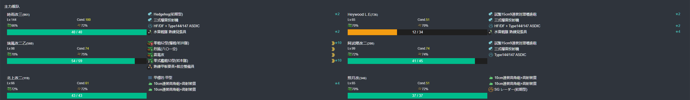

- 推图情况

1. A-SS | B | C-SS

#### P1-开路阶段-C3点S胜

- 当前使用配置(鼠标悬停可看到阵容对应的阶段)

- 推图情况

1. A-SS | B | C1-A | C2-S | C3-SS

#### P1-开路阶段-J点空优

- 当前使用配置(鼠标悬停可看到阵容对应的阶段)

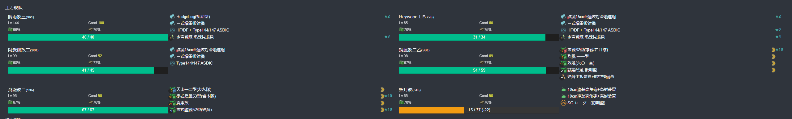

- 推图情况

1. A-SS | E-A | F | I | J-A 空优

#### P1-开路阶段-H3点到达

- 当前使用配置(鼠标悬停可看到阵容对应的阶段)

- 推图情况

1. A-SS | E-SS | F | G-SS | H | H1 | H2-A | H3

### P1-磨血斩杀

- 当前使用配置(鼠标悬停可看到阵容对应的阶段)

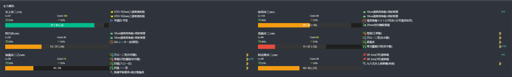

- 推图情况

1. A-SS | E-SS | F | I | J-SS | K-S  | N-S
2. A-A  | E-S  | F | I | J-A  | K-S  | N-S
3. A-SS | E-SS | F | I | J-A  | K-SS | N-S
4. A-A  | E-S 阿武畏大破撤退
5. A-SS | E-S  | F | I | J-SS | K-A  | N-S
6. A-SS | E-A  | F | I | J-B 阿武畏大破撤退
7. A-A  | E-SS | F | I | J-B  | K-A  | N-S

### P2-磨血斩杀

- 当前使用配置(鼠标悬停可看到阵容对应的阶段)

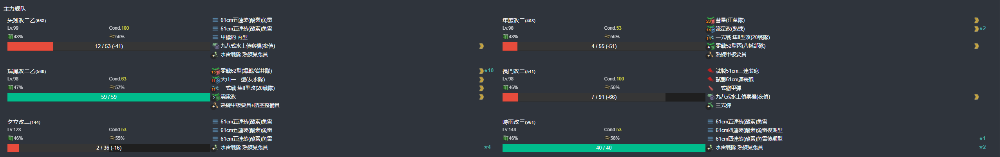

- 推图情况

1. A-SS | B | C-B | Q-SS | S-D
2. A-SS | B | C-B | Q-S  | S-A
3. A-SS | B | C-A | Q-SS | S-A
4. A-SS | B | C-B | O-SS | Q-S | R 沟了
5. A-SS | B | C-B | O-S  | Q-S | S-A
6. A-SS | B | C-B | O-S  | Q-A | S-A
7. A-SS | B | C-B | Q-A  | S-C
8. A-A  | B | C-B | Q-A  | S-A
9. A-SS | B | C-B | Q-A  | S-D
10. A-A | B | C-B | Q-A 弗莱彻大破撤退
11. A-SS | B | C-B | Q-SS | S-D
12. A-SS | B | C-B | Q-SS | S-A 第二十二号海防舰
13. A-A  | B | C-B | Q-A 北上大破撤退
14. A-SS | B | C-B | Q-A  | S-A
15. A-SS | B | C-B | Q-A  | S-D
16. A-SS | B | C-SS | O-SS | Q-S | S-A

## E2-丙

### E2-P1-开路阶段-C2点S胜一次-F2点S胜一次-J2点S胜一次-G点A胜两次

#### E2-P1-开路阶段-C2点S胜一次

- 当前使用配置(鼠标悬停可看到阵容对应的阶段)

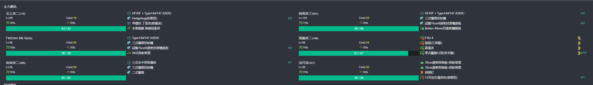

- 推图情况

1. A | B-A | B2 | C-SS | C2-SS

#### E2-P1-开路阶段-J2点S胜一次

- 当前使用配置(鼠标悬停可看到阵容对应的阶段)

- 推图情况

1. A | D | H-SS | I-S | J2-S

#### E2-P1-开路阶段-F2点S胜一次

- 当前使用配置(鼠标悬停可看到阵容对应的阶段)

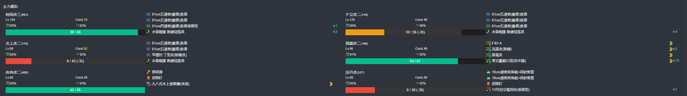

- 推图情况

1. A | B-A | B2 | E-B | F-SS | F2-S

#### E2-P1-开路阶段-G点A胜两次

- 当前使用配置(鼠标悬停可看到阵容对应的阶段)

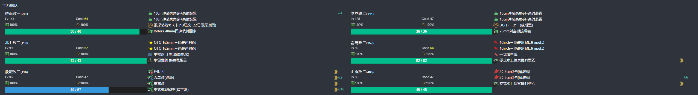

- 推图情况

1. A | D | G-S
2. A | D | G-SS

### E2-P1-运输阶段

- 当前使用配置(鼠标悬停可看到阵容对应的阶段)

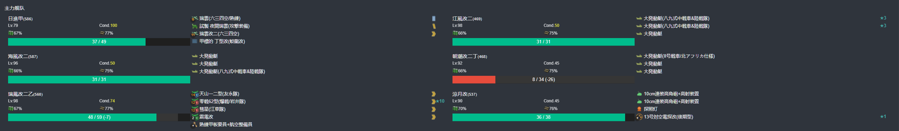

- 推图情况

1. K-A  | O-SS | P-A  | Q | S-A
2. K-SS | O-SS | P-SS | Q | S-A
3. K-SS | O-SS | P-A  | Q | S-A
4. K-A  | O-A  | P-A  | Q | S-A
5. K-A  | O-SS | P-A  | Q | S-A

### E2-P2-磨血斩杀

- 当前使用配置(鼠标悬停可看到阵容对应的阶段)

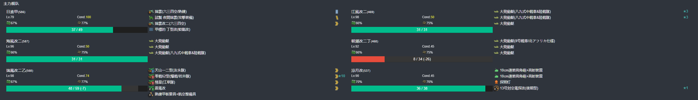

- 推图情况

1. A | D | G-SS | T-SS | V-S  | W-S
2. A | D | G-SS | T-A  | V-SS | W-S
3. A | D | G-SS | T-A  | V-S  | W-S
4. A | D | G-SS | T-SS | V-S  | W-S
5. A | D | G-SS | T-A  | V-S  | W-S

## E3-丙

### E3-P1-运输阶段

- 当前使用配置(鼠标悬停可看到阵容对应的阶段)

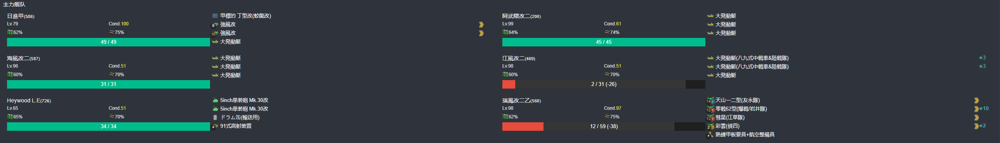

- 推图情况

1. A-SS | A1-SS | B | B1-SS | B2-SS | C | C2 | E-A
2. A-SS | A1-SS | B | B1-SS | B2-A  | C | C2 | E-A
3. A-B  | A1-A  | B | B1-SS | B2-S  | C | C2 | E-A
4. A-A  | A1-A  | B | B1-SS | B2-SS | C | C2 | E-A
5. A-A  | A1-A  | B | B1-SS | B2-S  | C | C2 | E-A

### E3-P2-磨血斩杀

- 当前使用配置(鼠标悬停可看到阵容对应的阶段)

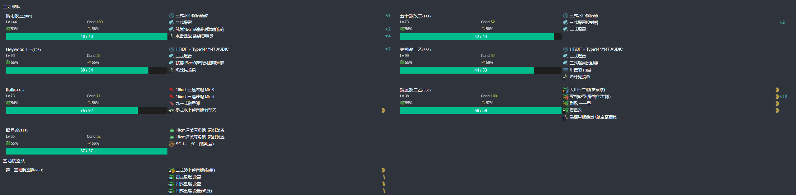

- 推图情况

1. F | H-A  | I-SS | L-SS | M-SS
2. F | H-A  | I-SS | L-SS | M-SS
3. F | H-SS | I-SS | L-SS | M-S
4. F | H-A  | I-S  | L-SS | M-S
5. F | H-SS | I-SS | L-SS | M-SS

### E3-P3-磨血斩杀

- 当前使用配置(鼠标悬停可看到阵容对应的阶段)

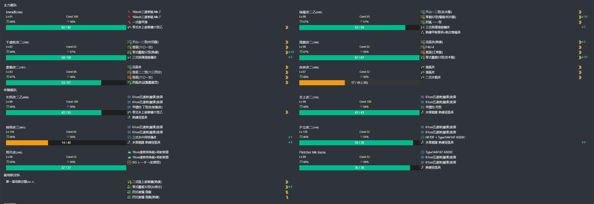

- 推图情况

1. O-SS | Q-A  | R-SS | T-SS | W-S
2. O-SS | Q-SS | R-SS | T-SS | W-S
3. O-SS | Q-A  | R-SS | T-S  | W-S
4. O-SS | Q-A  | R-SS | T-SS | W-SS
5. O-SS | Q-A  | R-SS | T-S  | W-S

## E4-丙

### E4-P1-运输阶段

- 当前使用配置(鼠标悬停可看到阵容对应的阶段)

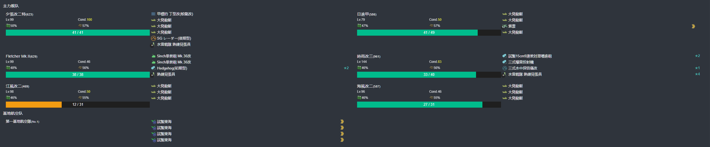

- 推图情况

1. A-SS | B-SS | C1-SS | C2-S  | D | F-SS
2. A-SS | B-B  | C1-A  | C2-SS | D | F-S
3. A-SS | B-A  | C1-A  | C2-A  | D | F-SS

### E4-P2-磨血斩杀

- 当前使用配置(鼠标悬停可看到阵容对应的阶段)

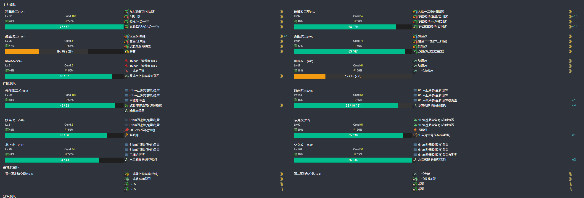

- 推图情况

1. G | I-SS | J-A  | M-S | N-A  | Q-S
2. G | I-SS | J-A  | M-S | N-A 照月大破撤退
3. G | I-SS | J-SS | M-S | N-A  | Q-S
4. G | I-SS | J-A  | M-S | N-SS | Q-S
5. G | I-S  | J-SS | M-S 由良大破撤退
6. G | I-SS | J-SS | M-S | N-A  | Q-S
7. G | I-S  | J-A  | M-S 夕立大破撤退
8. G | I-S  | J-A  | M-SS | N-A | Q-S

### E4-P3-开BOSS-T点A胜1次-U点A胜2次

- 当前使用配置(鼠标悬停可看到阵容对应的阶段)

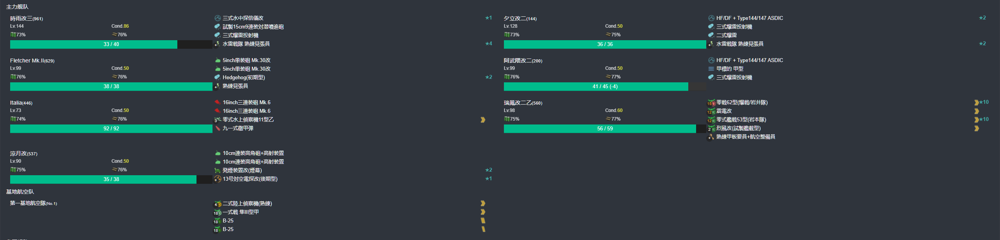

- 推图情况

1. R | S-B 阿武畏大破撤退
2. R | S-SS | T-SS | U-S
3. R | S-A  | T-SS | U-S

### E4-P3-磨血斩杀

- 当前使用配置(鼠标悬停可看到阵容对应的阶段)

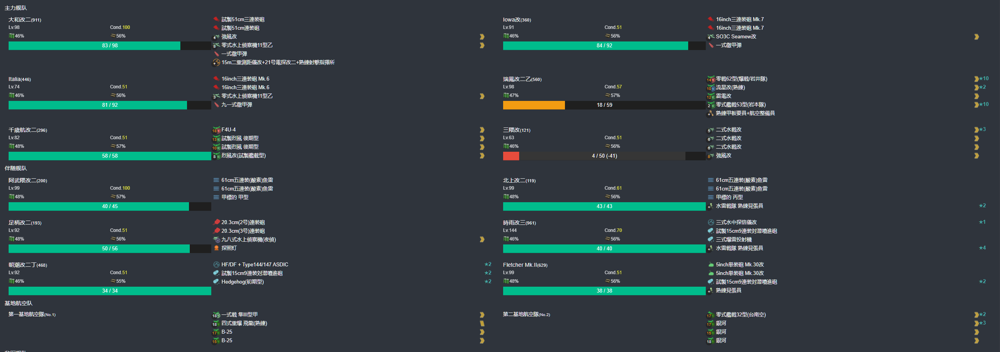

- 推图情况

  1. R | S-A  | T-SS | U-A  | V-S 千岁大破撤退
  2. R | S-SS | T-S  | U-S  | V-S | X-S
  3. R | S-A  | T-SS | U-A  | V-A 北上大破撤退
  4. R | S-A 千岁大破撤退
  5. R | S-A  | T-SS | U-S  | V-S | X-S
  6. R | S-A 千岁大破撤退
  7. R | S-A  | T-S  | U-SS | V-A | X-SS
  8. R | S-A  | T-S  | U-A  | V-S | X-S
  9. R | S-A 三隈大破撤退
  10. R | S-SS | T-S  | U-S 北上大破撤退
  11. R | S-A  | T-SS | U-S 时雨大破撤退
  12. R | S-A  | T-SS | U-S 海伍德大破撤退
  13. R | S-A  | T-SS | U-S  | V-S | X-S
  14. R | S-A  | T-SS | U-SS | V-A | X-S

  ## E5-丙

  ### E5-P1-开路阶段-L2点A胜一次-L1点A胜一次-H点A胜一次-G点A胜一次
  
  #### E5-P1-开路阶段-L2点A胜一次-L1点A胜一次

- 当前使用配置(鼠标悬停可看到阵容对应的阶段)

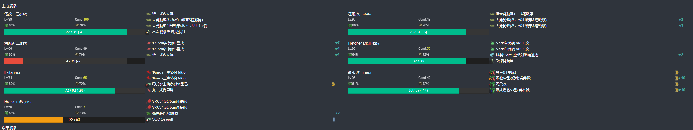

- 推图情况

1. A | C-A | D-B | F | I-SS | K-A | L | L2-S
2. A | C-A | D-B | F | I-SS | K-A | L | L1-S

#### E5-P1-开路阶段-H点A胜一次

- 当前使用配置(鼠标悬停可看到阵容对应的阶段)

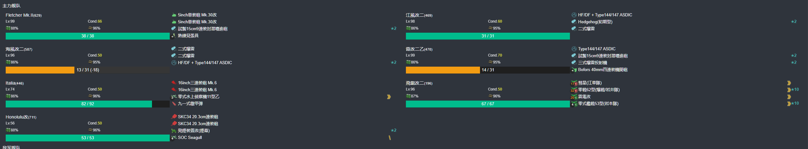

- 推图情况

1. A | C-B 弗莱彻大破撤退
2. A | C-A | D-SS | F | H-S

#### E5-P1-开路阶段-G点A胜一次

- 当前使用配置(鼠标悬停可看到阵容对应的阶段)

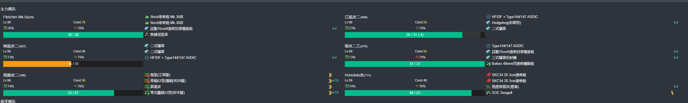

- 推图情况

1. A | C-A | E-B | G-S

#### E5-P1-磨血斩杀

- 当前使用配置(鼠标悬停可看到阵容对应的阶段)

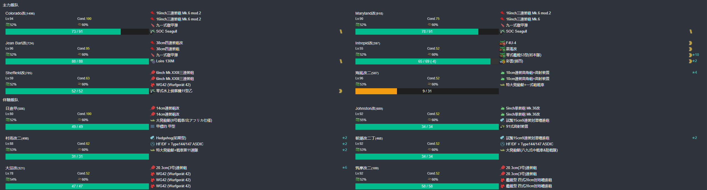

- 推图情况

1. D-SS | I-SS | M-SS | O-SS
2. D-SS | I-SS | M-SS | O-S
3. D-SS | I-S  | M-SS | O-S
4. D-SS | I-S  | M-S  | O-S

### E5-P2-运输

- 当前使用配置(鼠标悬停可看到阵容对应的阶段)

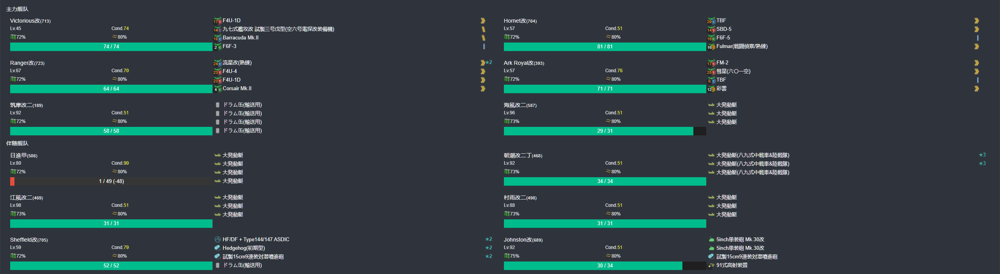

- 推图情况

1. I-S  | P-S  | R | S | T-S
2. I-SS | P-SS | R | S | T-S

### E5-P3-磨血斩杀

- 当前使用配置(鼠标悬停可看到阵容对应的阶段)

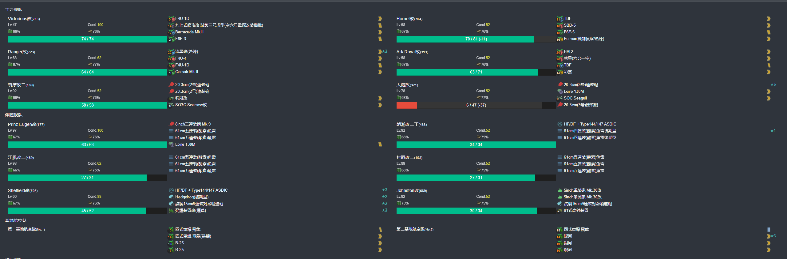

- 推图情况

1. I-SS | P-SS | R | V-A  | Y-S
2. I-S  | P-SS | R | V-SS | Y-S
3. I-S  | P-SS | R | V-SS | Y-S
4. I-S  | P-SS | R | V-A  | Y-S
5. I-S  | P-SS | R | V-SS | Y-A
6. I-S  | P-SS | R | V-SS | Y-S

## E6-丙

### E6-P1-开路阶段-B点A胜两次-C2点A胜两次

#### E6-P1-开路阶段-B点A胜两次

- 当前使用配置(鼠标悬停可看到阵容对应的阶段)

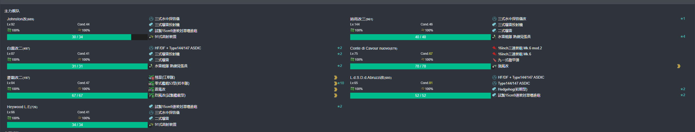

- 推图情况

1. A | B-SS
2. A | B-SS

#### E6-P1-开路阶段-C2点A胜两次

- 当前使用配置(鼠标悬停可看到阵容对应的阶段)

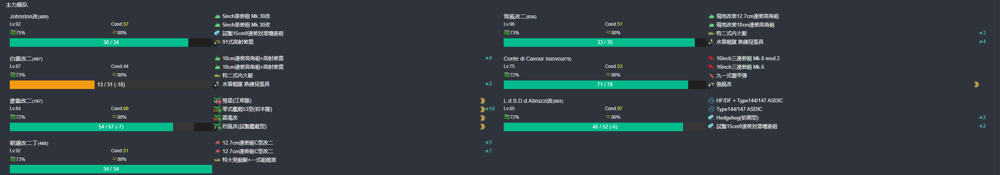

- 推图情况

1. A | C-S  | C1-S | C2-S
2. A | C-SS | C1-S | C2-S

### E6-P1-磨血斩杀

- 当前使用配置(鼠标悬停可看到阵容对应的阶段)

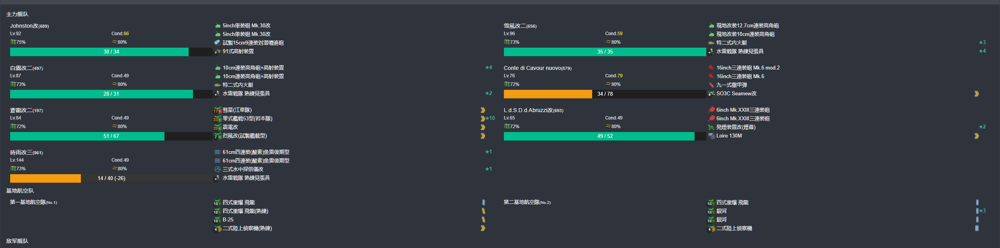

- 推图情况

1. A | B-D 時雨大破撤退
2. A | B-A | F-S  | H-SS
3. A | B-A | F-S  | H-S
4. A | B-A 時雨大破撤退
5. A | B-A | F-SS | H-SS
6. A | B-A | F-S  | H-SS
7. A | B-B | F-S  | H-SS
8. A | B-A | F-S  | H-S
9. A | B-B | F-S  | H-S

### E6-P2-开路阶段-M点空优两次-L点A胜两次

#### E6-P2-开路阶段-L点A胜两次

- 当前使用配置(鼠标悬停可看到阵容对应的阶段)

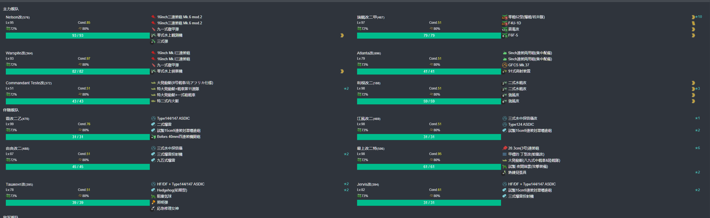

- 推图情况

1. I-SS | J-SS | K | L-SS
2. I-SS | J-SS | K | L-SS

#### E6-P2-开路阶段-M点空优两次

- 当前使用配置(鼠标悬停可看到阵容对应的阶段)

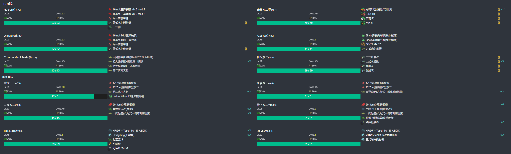

- 推图情况

1. I-SS | J-SS | K | M-SS 空确
2. I-SS | J-S  | K | M-SS 空确

### E6-P2-磨血斩杀

- 当前使用配置(鼠标悬停可看到阵容对应的阶段)

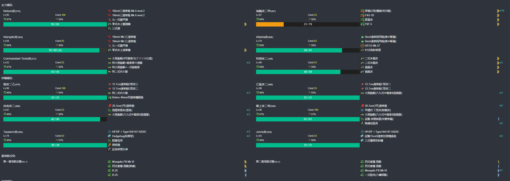

- 推图情况

1. I-SS | J-SS | K | M-SS | O-S  | Q-S
2. I-S  | J-S 李庚大破撤退
3. I-SS | J-SS | K | M-SS | O-SS | Q-S
4. I-SS | J-S  | K | M-SS | O-S 塔斯特大破撤退
5. I-SS | J-S  | K | M-SS | O-S  | Q-SS
6. I-SS | J-SS | K | M-SS | O-SS | Q-SS
7. I-SS | J-SS | K | M-SS | O-S  | Q-S

### E6-P3-开路-到达V点

- 当前使用配置(鼠标悬停可看到阵容对应的阶段)

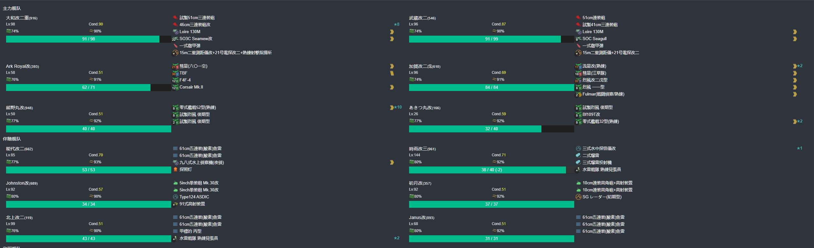

- 推图情况

1. R-SS | S-A | T-A | U-S | V

### E6-P3-磨血斩杀

- 当前使用配置(鼠标悬停可看到阵容对应的阶段)

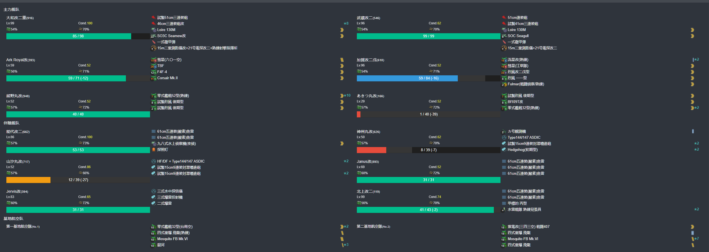

- 推图情况

1. R-SS | S-S 僵尸丸大破撤退
2. R-SS | S-A  | T-SS | U-S | X-A | V | Z-S
3. R-SS | S-A  | T-SS | U-S | X-B | V | Z-A
4. R-SS | S-SS | T-SS | U-S | V | Z-S
5. R-SS | S-A  | T-SS | U-S | V | Z-SS
6. R-S  | S-A  | T-A  | U-S | V | Z-A
7. R-S  | S-A  | T-SS | U-S | V | Z-S
8. R-SS | S-A  | T-SS | U-S | V | Z-S
9. R-A  | S-A  | T-SS | U-S | V | Z-A
10. R-SS | S-A | T-A 神舟丸大破撤退
11. R-SS | S-A 山汐丸大破撤退
12. R-S  | S-A | T-A | U-S | V | Z-C

### E6-P3-削甲-P1bossA胜一次-P2bossA胜一次-W点A胜一次-C2点A胜一次-守家空优一次

#### E6-P3-削甲-P1bossA胜一次

- 当前使用配置(鼠标悬停可看到阵容对应的阶段)

- 推图情况

1. A | B-A | F-S | H-S

#### E6-P3-削甲-P2bossA胜一次

- 当前使用配置(鼠标悬停可看到阵容对应的阶段)

- 推图情况

1. I-SS | J-S | K | M-SS | O-SS | Q-S

#### E6-P3-削甲-W点A胜两次(可能只需要一次)

- 当前使用配置(鼠标悬停可看到阵容对应的阶段)

- 推图情况

1. I-SS | J-SS | K | L-A | J1-A | W-A
2. I-S 江风大破撤退
3. I-S  | J-SS | K | L-S | J1-A | W-S

#### E6-P3-削甲-C2点A胜一次(未提示削甲)

- 当前使用配置(鼠标悬停可看到阵容对应的阶段)

- 推图情况

1. A | C-SS  | C1-SS | C2-S

### E6-P3-开路-磨血斩杀

- 当前使用配置(鼠标悬停可看到阵容对应的阶段)

- 推图情况

1. R-SS | S-A | T-A | U-SS | V | Z-A

## E7-乙

### E7-P1-开路-B3点S胜一次-B4点A胜一次-A4点A胜一次-A5点A胜两次-C3点到达一次

#### E7-P1-开路-B3点S胜一次

- 当前使用配置(鼠标悬停可看到阵容对应的阶段)

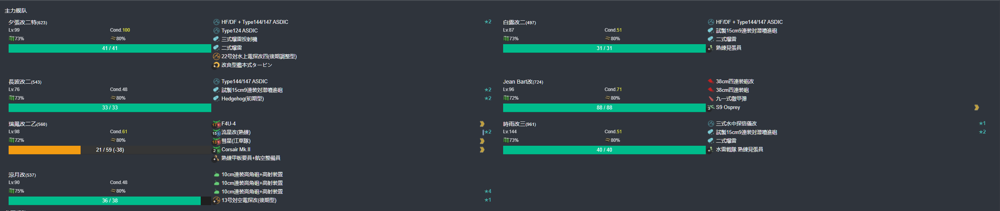

- 推图情况

1. A-SS | A2 | B-SS | B3-S

#### E7-P1-开路-B4点S胜一次

- 当前使用配置(鼠标悬停可看到阵容对应的阶段)

- 推图情况

1. A-SS | A2 | B-SS | B4-S

#### E7-P1-开路-A4点S胜一次

- 当前使用配置(鼠标悬停可看到阵容对应的阶段)

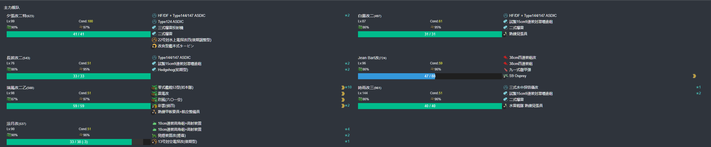

- 推图情况

1. A-S | A2 | A3-SS | A4-S

#### E7-P1-开路-A5点A胜两次

- 当前使用配置(鼠标悬停可看到阵容对应的阶段)

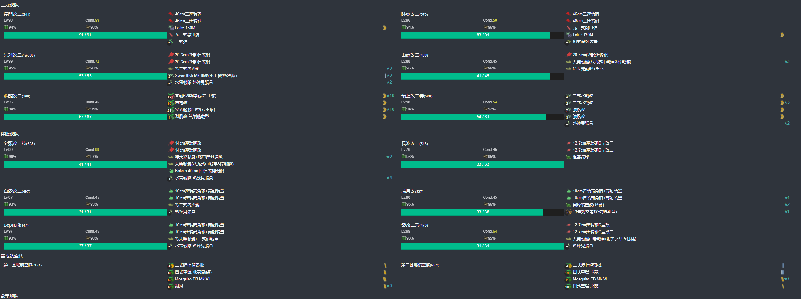

- 推图情况

1. C | A3-A  | A5-SS
2. C | A3-SS | A5-SS

#### E7-P1-开路-C3点到达一次

- 当前使用配置(鼠标悬停可看到阵容对应的阶段)

- 推图情况

1. C | C1-S 由良、凉月大破撤退
2. C | C1-S | C2-A | C3

#### E7-P1-运输

- 当前使用配置(鼠标悬停可看到阵容对应的阶段)

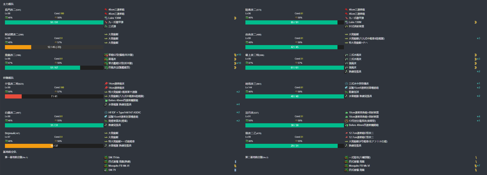

- 推图情况

1. C | C1-S | C2-SS | D-SS | F-S  | G | H-SS
2. C | C1-A | C2-SS | D-SS | F-A 响大破撤退
3. C | C1-S | C2-S 凉月大破撤退
4. C | C1-S | C2-SS | D-A  | F-SS | G | H-SS
5. C | C1-S | C2-SS | D-A  | F-S  | G | H-S
6. C | C1-A | C2-SS | D-SS | F-S  | G | H-S
7. C | C1-B | C2-S  | D-SS | F-S  | G | H-S

