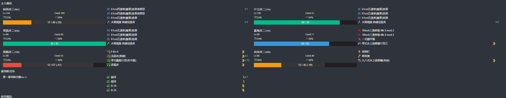

# 2023年夏季活动 这次活动摆烂了，没资源啊没资源

---

## E1-甲

### P1-开路阶段-C点S胜-C3点S胜-H3点到达-J点空优

#### P1-开路阶段-C点S胜

- 当前使用配置(鼠标悬停可看到阵容对应的阶段)

- 推图情况

1. A-SS | B | C-SS

#### P1-开路阶段-C3点S胜

- 当前使用配置(鼠标悬停可看到阵容对应的阶段)

- 推图情况

1. A-SS | B | C1-A | C2-S | C3-SS

#### P1-开路阶段-J点空优

- 当前使用配置(鼠标悬停可看到阵容对应的阶段)

- 推图情况

1. A-SS | E-A | F | I | J-A 空优

#### P1-开路阶段-H3点到达

- 当前使用配置(鼠标悬停可看到阵容对应的阶段)

- 推图情况

1. A-SS | E-SS | F | G-SS | H | H1 | H2-A | H3

### P1-磨血斩杀

- 当前使用配置(鼠标悬停可看到阵容对应的阶段)

- 推图情况

1. A-SS | E-SS | F | I | J-SS | K-S  | N-S
2. A-A  | E-S  | F | I | J-A  | K-S  | N-S
3. A-SS | E-SS | F | I | J-A  | K-SS | N-S
4. A-A  | E-S 阿武畏大破撤退
5. A-SS | E-S  | F | I | J-SS | K-A  | N-S
6. A-SS | E-A  | F | I | J-B 阿武畏大破撤退
7. A-A  | E-SS | F | I | J-B  | K-A  | N-S

### P2-磨血斩杀

- 当前使用配置(鼠标悬停可看到阵容对应的阶段)

- 推图情况

1. A-SS | B | C-B | Q-SS | S-D
2. A-SS | B | C-B | Q-S  | S-A
3. A-SS | B | C-A | Q-SS | S-A
4. A-SS | B | C-B | O-SS | Q-S | R 沟了
5. A-SS | B | C-B | O-S  | Q-S | S-A
6. A-SS | B | C-B | O-S  | Q-A | S-A
7. A-SS | B | C-B | Q-A  | S-C
8. A-A  | B | C-B | Q-A  | S-A
9. A-SS | B | C-B | Q-A  | S-D
10. A-A | B | C-B | Q-A 弗莱彻大破撤退
11. A-SS | B | C-B | Q-SS | S-D
12. A-SS | B | C-B | Q-SS | S-A 第二十二号海防舰
13. A-A  | B | C-B | Q-A 北上大破撤退
14. A-SS | B | C-B | Q-A  | S-A
15. A-SS | B | C-B | Q-A  | S-D
16. A-SS | B | C-SS | O-SS | Q-S | S-A

## E2-丙

### E2-P1-开路阶段-C2点S胜一次-F2点S胜一次-J2点S胜一次-G点A胜两次

#### E2-P1-开路阶段-C2点S胜一次

- 当前使用配置(鼠标悬停可看到阵容对应的阶段)

- 推图情况

1. A | B-A | B2 | C-SS | C2-SS

#### E2-P1-开路阶段-J2点S胜一次

- 当前使用配置(鼠标悬停可看到阵容对应的阶段)

- 推图情况

1. A | D | H-SS | I-S | J2-S

#### E2-P1-开路阶段-F2点S胜一次

- 当前使用配置(鼠标悬停可看到阵容对应的阶段)

- 推图情况

1. A | B-A | B2 | E-B | F-SS | F2-S

#### E2-P1-开路阶段-G点A胜两次

- 当前使用配置(鼠标悬停可看到阵容对应的阶段)

- 推图情况

1. A | D | G-S
2. A | D | G-SS

### E2-P1-运输阶段

- 当前使用配置(鼠标悬停可看到阵容对应的阶段)

- 推图情况

1. K-A  | O-SS | P-A  | Q | S-A
2. K-SS | O-SS | P-SS | Q | S-A
3. K-SS | O-SS | P-A  | Q | S-A
4. K-A  | O-A  | P-A  | Q | S-A
5. K-A  | O-SS | P-A  | Q | S-A

### E2-P2-磨血斩杀

- 当前使用配置(鼠标悬停可看到阵容对应的阶段)

- 推图情况

1. A | D | G-SS | T-SS | V-S | W-S
2. 

