# 2023年春季活动

---
## E1-甲

### 开路阶段-C2、G2、J点S胜

#### C2点S胜

- 当前使用配置(鼠标悬停可看到阵容对应的阶段)

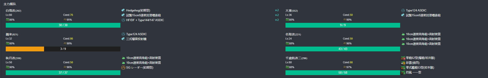

- 推图情况

1. A | B-SS | C | C1-A | C2-SS

#### G2点S胜

- 当前使用配置(鼠标悬停可看到阵容对应的阶段)

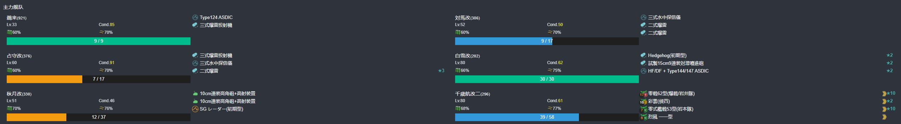

- 推图情况

1. A | E | F-SS | G-B | G1-D | G2-SS

#### J点S胜

- 当前使用配置(鼠标悬停可看到阵容对应的阶段)

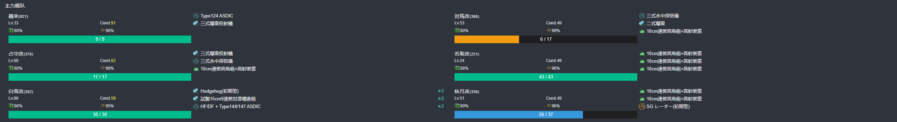

- 推图情况

1. A | E | F-B  | H | H1-B 占守大破撤退
2. A | E | F-SS | H | H1-B | J-SS

### E1-P1

- 当前使用配置(鼠标悬停可看到阵容对应的阶段)

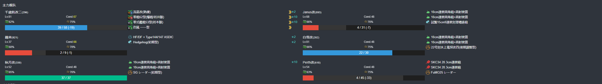

- 推图情况

1. A | E | F-S  | H | H2-A  | K-B | M-A
2. A | E | F-A  | H | H2-SS | K-B | M-S
3. A | E | F-SS | H | H2-A 大东大破撤退
4. A | E | F-SS | H | H2-A  | K-B | M-A
5. A | E | F-SS | H | H2-A  | K-C 名取大破撤退
6. A | E | F-A  | H | H2-A  | K-B | M-A
7. A | E | F-SS | H | H2-A  | K-B | M-S
8. A | E | F-SS | H | H2-A 秋月大破撤退
9. A | E | F-S  | H | H2-A  | K-B | M-A
10. A | E | F-SS | H | H2-SS | K-A | M-A
11. A | E | F-SS | H | H2-S  | K-B | M-C
12. A | E | F-SS | H | H2-A  | K-B | M-A
13. A | E | F-SS | H | H2-A  | K-A | M-A
14. A | E | F-S  | H | H2-A  | K-C 千岁大破撤退
15. A | E | F-SS | H | H2-S  | K-A | M-C
16. A | E | F-A  | H | H2-A Janus大破撤退
17. A | E | F-S  | H | H2-A  | K-C | M-B

### E1-P2

- 当前使用配置(鼠标悬停可看到阵容对应的阶段)

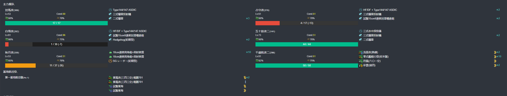

- 推图情况

1. A | B-S  | C | C3-A | O | P-S 对马大破撤退
2. A | B-SS | C | C3-A | O | P-A  | S-B
3. A | B-SS | C | C3-S | O | P-A  | S-D
4. A | B-SS | C | C3-S | O | P-A  | S-B
5. A | B-SS | C | C3-A | O | P-SS | S-B
6. A | B-SS | C | C3-A | O | P-S 对马大破撤退
7. A | B-SS | C | C3-S | O | P-A  | S-B
8. A | B-SS | C | C3-A | O | P-A  | S-B

---

## E2-乙

### E2-P1

- 当前使用配置(鼠标悬停可看到阵容对应的阶段)

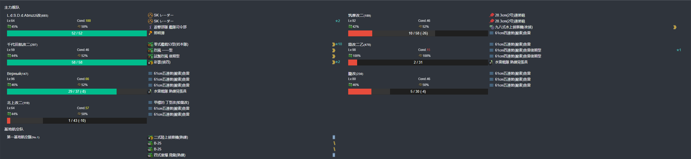

- 推图情况

1. A-SS | B-D | C-A  | E-B | G-A
2. A-A  | B-A | C-S  | E-B | G-S
3. A-A  | B-B | C-SS | E-A | G-S
4. A-SS | B-B | C-A  | E-A | G-A
5. A-A  | B-B | C-A  | E-C 响、北上大破撤退
6. A-A  | B-B | C-A  | E-C 霞、响大破撤退
7. A-A  | B-D 胧大破撤退
8. A-A  | B-B | C-A  | E-B | G-A
9. A-A  | B-B | C-B  | E-B | G-A

### E2-P2

- 当前使用配置(鼠标悬停可看到阵容对应的阶段)

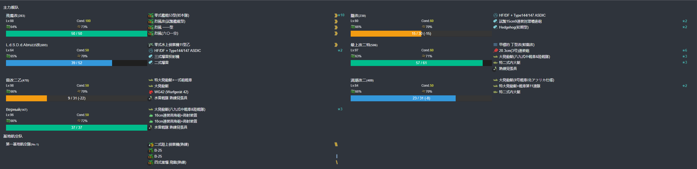

- 推图情况

1. A-SS | F | F2-A | H-A | J-S
2. A-SS | F | F2-A | H-S | J-S
3. A-SS | F | F2-A | H-S | J-S
4. A-A  | F | F2-S | H-A | J-S
5. A-SS | F | F2-A | H-A | J-S

### E2-P3-开路

#### E2-P3-开路-E2-S胜1次

- 当前使用配置(鼠标悬停可看到阵容对应的阶段)

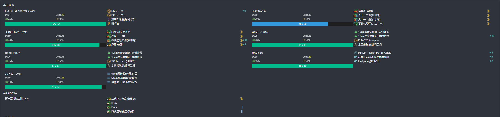

- 推图情况

1. A-SS | B-A | C-S 阿布鲁奇大破撤退
2. A-A  | B-A | C-S | E-B | E2-SS

#### E2-P3-开路-T点S胜1次

- 当前使用配置(鼠标悬停可看到阵容对应的阶段)

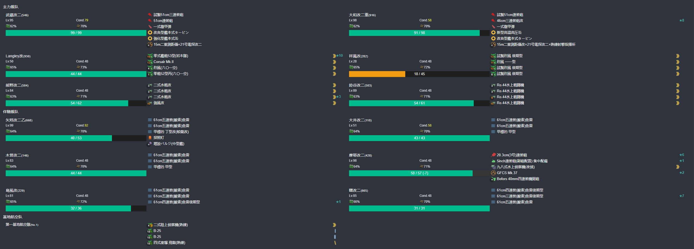

- 推图情况

1. M-A 铃谷大破撤退
2. M-A 大井大破撤退
3. M-A 兰利大破撤退
4. M-A | O-S 兰利大破撤退
5. M-B | O-A | Q | R-A | T-S

#### E2-P3-开路-V点到达1次

- 当前使用配置(鼠标悬停可看到阵容对应的阶段)

- 推图情况

1. M-A | O-S 大井、翔凤大破撤退
2. M-B | O-S | Q | U-S | V

#### E2-P3-磨血斩杀

- 当前使用配置(鼠标悬停可看到阵容对应的阶段)

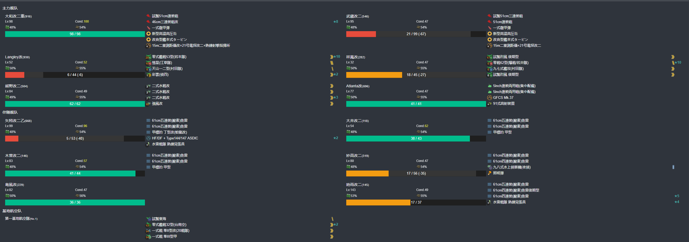

- 推图情况

1. M-A 兰利大破撤退
2. M-C 木曾、翔凤大破撤退
3. M-A | O-A | Q | U-S | V 沟了
4. M-A 铃谷、岛风大破撤退
5. M-C 翔凤大破撤退
6. M-A 兰利、翔凤、曙大破撤退
7. M-S 木曾大破撤退
8. M-C | O-S | Q | U-B 兰利大破撤退
9. M-A | O-S | Q | U-SS | W-A
10. M-A | O-S  | Q | U-A | W-A 海伍德
11. M-A 大井大破撤退
12. M-B | O-S  | Q | U-A 岛风大破撤退
13. M-B | O-SS | Q | U-S | W-A
14. M-A 摩耶大破撤退
15. M-A | O-A  | Q | U-S 木曾、岛风大破撤退
16. M-A 熊野、矢矧大破撤退
17. M-S 木曾大破撤退
18. M-SS | O-SS | Q | U-S  | W-A
19. M-SS | O-S  | Q | U-SS | W-A
20. M-SS | O-SS | Q | U-S  | W-A
21. M-SS | O-S  | Q | U-S 木曾、岛风大破撤退
22. M-A  | O-S  | Q | U-S  | W-A
23. M-SS | O-S  | Q | U-S 時雨大破撤退
24. M-SS | O-S 木曾大破撤退
25. M-A 木曾大破撤退
26. M-SS | O-S 時雨大破撤退
27. M-SS | O-S  | Q | U-S | W-SS
28. M-S 熊野、時雨大破撤退
29. M-S  | O-S  | Q | U-S | W-A

#### E2-P3-削甲-P1-BOSS-S胜

- 当前使用配置(鼠标悬停可看到阵容对应的阶段)

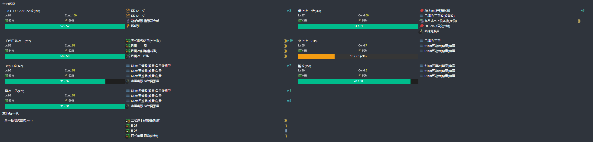

- 推图情况
- 备注：S胜后没有解密成功提示

1. A-A  | B-B | C-A  | E-A | G-A
2. A-SS | B-A | C-SS | E-A | G-S

#### E2-P3-削甲-P2-BOSS-S胜

- 当前使用配置(鼠标悬停可看到阵容对应的阶段)

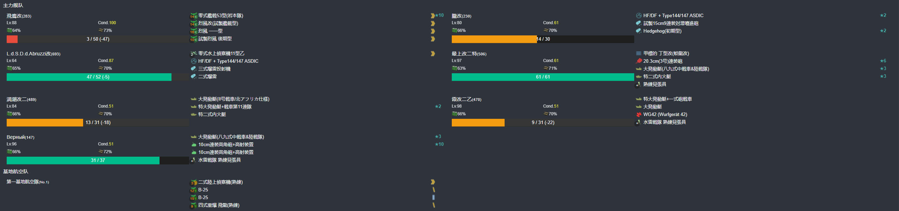

- 推图情况
- 备注：S胜后出现解密成功提示

1. A-SS | F | F2-A | H-S | J-S

#### E2-P3-削甲-守家空优-D点空优-E2-S胜

- 当前使用配置(鼠标悬停可看到阵容对应的阶段)

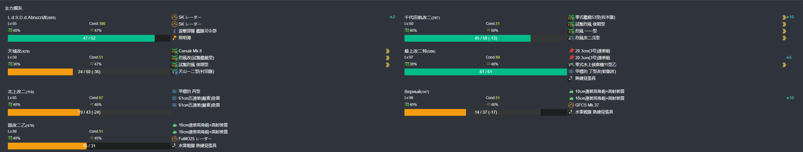
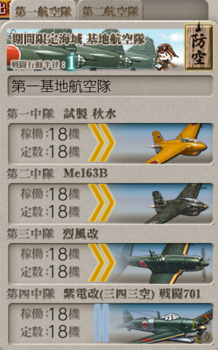
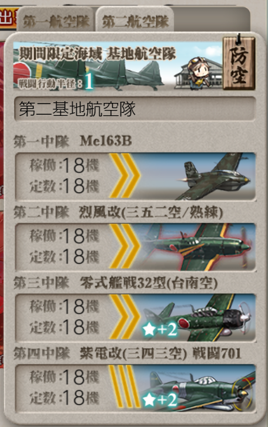

- 推图情况
- 备注：S胜后出现解密成功提示

1. A-SS | B-A | C-A | D-SS-空优 | 触发守家空优 | E-A | E2-S

#### E2-P3-削甲后-磨血斩杀

- 当前使用配置(鼠标悬停可看到阵容对应的阶段)

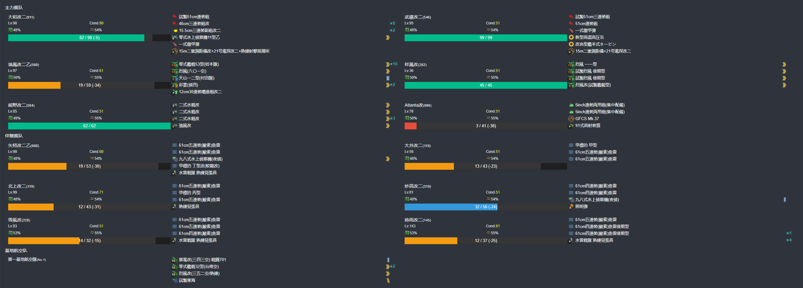

- 推图情况

1. M-A 武藏、翔凤大破撤退
2. M-SS | O-S | Q | U-SS | W-A
3. M-C 兰利、時雨大破撤退
4. M-C 兰利大破撤退
5. M-B  | O-S 翔凤大破撤退
6. M-A  | O-S | Q | U-S | W-A
7. M-A  | O-S | Q | U-A | W-A
8. M-A 木曾大破撤退
9. M-S 亚特兰大大破撤退
10. M-A 木曾、時雨大破撤退
11. M-SS | O-S  | Q | U-SS | W-A
12. M-A  兰利中破撤退
13. M-A  | O-S  | Q | U-S 兰利大破撤退
14. M-A  | O-S  | Q | U-S  | W-A
15. M-SS | O-SS | Q | U-S  | W-A
16. M-A  | O-S  | Q | U-S  | W-A
17. M-S 熊野、瑞凤大破撤退 
18. M-A  | O-S  | Q | U-S  | W-A
19. M-B  | O-S  | Q | U-S  | W-A
20. M-A  | O-S  | Q | U-SS | W-A
21. M-A  | O-S  | Q | U-S 雪风大破撤退
22. M-A  瑞凤中破撤
23. M-B  翔凤大破撤退
24. M-B  矢矧大破撤退
25. M-B  翔凤大破撤退
26. M-C  翔凤大破撤退
27. M-B  | O-SS | Q | U-S | W-C
28. M-S  熊野大破撤退
29. M-S  瑞凤大破撤退 
30. M-S  | O-S  | Q | U-A | W-A

---

## E3-甲

### E3-P1-运输

- 当前使用配置(鼠标悬停可看到阵容对应的阶段)

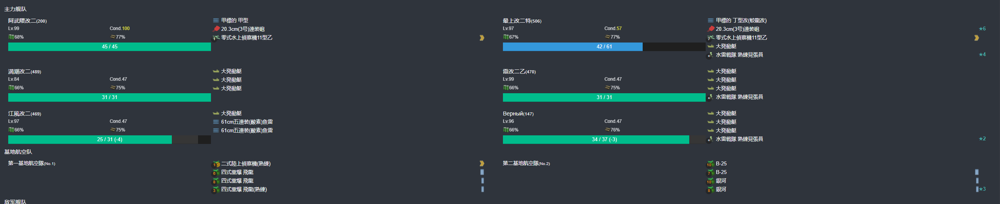

- 推图情况

1. A | B-C 最上大破撤退
2. A | B-B | B1-B  | C-SS | D | K-A
3. A | B-D | B1-C 满朝、江风大破撤退
4. A | B-B | B1-A  | C-SS | D | K-D
5. A | B-C | B1-SS | C-S  | D | K-A
6. A | B-C | B1-B 江风大破撤退
7. A | B-B | B1-C  | C-A  | D | K-C
8. A | B-B | B1-B  | C-SS | D | K-A
9. A | B-B | B1-B  | C-A 最上大破撤退
10. A | B-B | B1-A  | C-SS | D | K-A
11. A | B-B | B1-A  | C-A  | D | K-A
12. A | B-D | B1-B  | C-A 阿武畏大破撤退
13. A | B-B | B1-SS | C-B  | D | K-A
14. A | B-B | B1-A  | C-SS | D | K-A
15. A | B-B | B1-B  | C-A 响大破撤退
16. A | B-B | B1-A  | C-A  | D | K-A
17. A | B-C 响大破撤退
18. A | B-C | B1-A  | C-SS | D | K-A
19. A | B-B | B1-A  | C-B  | D | K-S

### E3-P2-开路-I点S胜2次

- 当前使用配置(鼠标悬停可看到阵容对应的阶段)

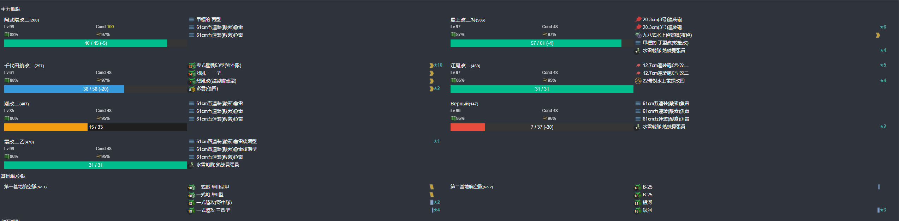

- 推图情况

1. A | F-A  | G | H-A | I-A
2. A | F-B  | G | H-A | I-A
3. A | F-B  | G | H-A | I-A
4. A | F-A  | G | H-A | I-A
5. A | F-A  | G | H-A | I-A
6. A | F-SS | G | H-A | I-A
7. A | F-B  | G | H-A | I-A
8. A | F-A  | G | H-A | I-A
9. A | F-SS | G | H-A | I-D
10. A | F-A | G | H-A | I-A
11. A | F-SS | G | H-B | I-A
12. A | F-B  | G | H-A | I-A
13. A | F-SS | G | H-A | I-A
14. A | F-A  | G | H-B | I-A
15. A | F-B  | G | H-B | I-S
16. A | F-A  | G | H-B | I-S

### E3-P2-开路-J点S胜2次

- 当前使用配置(鼠标悬停可看到阵容对应的阶段)

- 推图情况

1. A | F-A | G | J-SS
2. A | F-B 千代田大破撤退
3. A | F-A | G | J-S

### E3-P2-开路-P点S胜3次

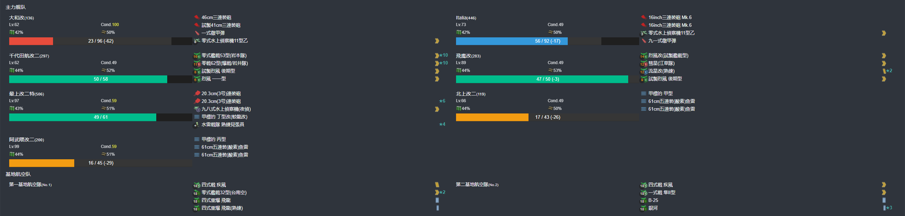

- 推图情况

1. A | F-A | G | J-B | N-SS | O2-S  | P-A
2. A | F-B | G | J-D 罗马大破撤退
3. A | F-A | G | J-C | N-SS | O2-S  | P-A
4. A | F-B | G | J-B | N-S  | O2-S  | P-A
5. A | F-A | G | J-C | N-SS | O2-A 飞鹰大破撤退
6. A | F-A | G | J-D | N-SS | O2-SS | P-A

### 切乙

### E3-P2-开路-P点S胜3次

- 推图情况
- 备注：两次S胜后出现解密成功提示

1. A | F-A | G | J-B | N-SS | O2-S 飞鹰大破撤退
2. A | F-B | G | J-B | N-SS | O2-SS | P-S
3. A | F-A 北上大破撤退
4. A | F-A | G | J-C | N-SS | O2-S  | P-A
5. A | F-A | G | j-C | N-S  | O2-SS | P-S

### E3-P2-开路-R点到达1次

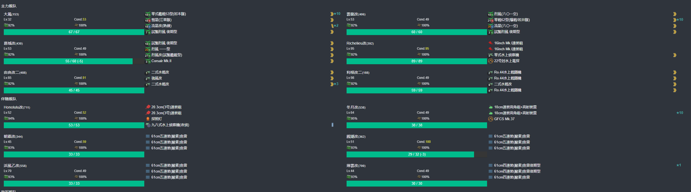

- 推图情况

1. L | M-A | O-A | R

### E3-P2-磨血斩杀

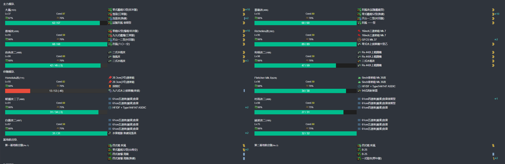

- 推图情况

1. L | M-A  | O-SS | R | S-S | T-A
2. L | M-SS | O-SS | R | S-S | T-S
3. L | M-S  | O-A  | R | S-S | T-S
4. L | M-A  | O-SS | R | S-S | T-S
5. L | M-A  | O-B  | R | S-S | T-S
6. L | M-B  | O-A  | R | S-S 云龙大破撤退
7. L | M-SS | O-A  | R | S-S | T-A
8. L | M-A  | O-A  | R | S-S | T-A
9. L | M-A  | O-A  | R | S-S | T-A
10. L | M-S | O-B 葛城大破撤退
11. L | M-A | O-A  | R | S-S 绫波大破撤退
12. L | M-SS | O-A | R | S-SS | T-A
13. L | M-A  | O-A | R | S-S  | T-S

### E3-P3-磨血斩杀

- 推图情况

1. U-A  | V-S  | V2-S 约翰斯顿大破撤退
2. U-A  | V-S  | V2-S  | X-S
3. U-S  | V-SS | V2-S 夕立大破撤退
4. U-S  | V-SS | V2-S  | X-S
5. U-SS | V-S  | V2-S 夕立大破撤退
6. U-S  | V-S  | V2-SS | X-S
7. U-A  | V-SS | V2-SS | X-A
8. U-S  | V-SS | V2-S  | X-A
9. U-A  | V-S  | V2-S 夕立大破撤退
10. U-S | V-S  | V2-S  | X-A
11. U-S 夕张大破撤退
12. U-A 塔斯特大破撤退
13. U-A 翔鹤、约翰斯顿大破撤退
14. U-A 隼鹰大破撤退
15. U-A 塔斯特、隼鹰大破撤退
16. U-A | V-SS | V2-S 塔什干大破撤退
17. U-A | V-SS | V2-S | X-C
18. U-S 隼鹰大破撤退
19. U-B | V-SS | V2-S 大井、夕立大破撤退
20. U-A | V-S 陆奥大破撤退
21. U-A 竹中破撤退
22. U-S | V-S  | V2-S 竹大破撤退
23. U-S | V-S  | V2-S 大井、塔什干大破撤退
24. U-S | V-S  | V2-S 竹大破撤退

### E3-P3-削甲-V1-空优

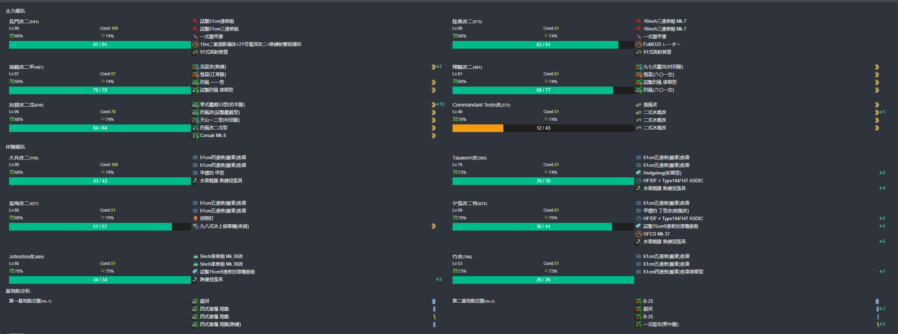

- 推图情况

1. U-S | V-SS | V1-SS-空优

### E3-P3-削甲-T点A胜及以上一次

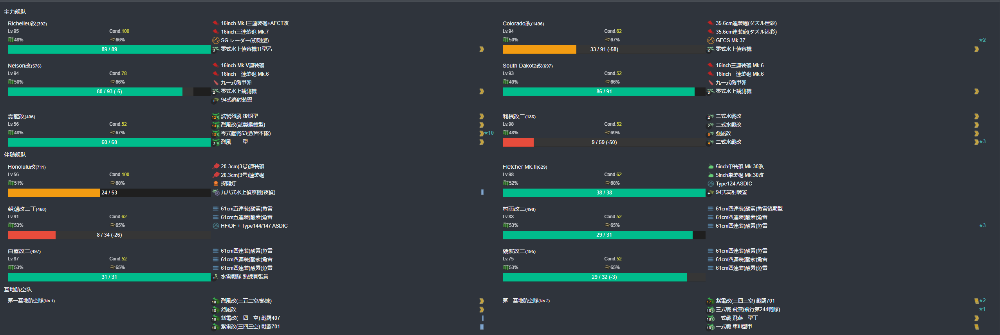

- 推图情况

1. L | M-A  | J-A 绫波大破撤退
2. L | M-SS | J-A | O-A | R | S1-SS | S-SS | T-A

### E3-P3-削甲-S2点空优及以上一次

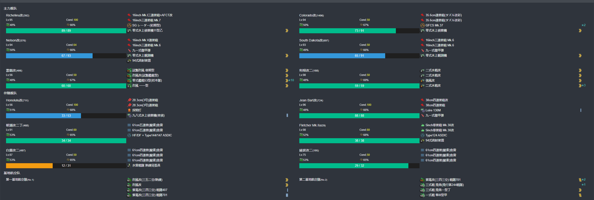

- 推图情况

1. L | M-A | J-A | O-A | R | S1-A | S-S | S2-SS-空优

### E3-P3-削甲-守家空优及以上一次

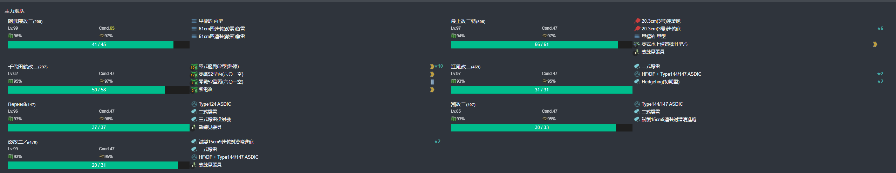
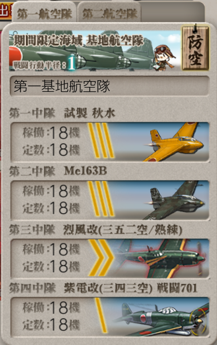
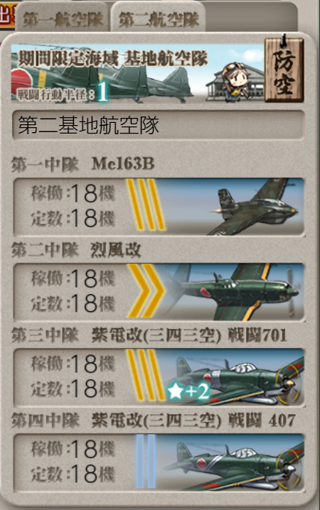

- 推图情况

1. A | F-SS | 触发守家空劣
2. A | F-C 最上大破撤退
3. A | F-A 霞大破撤退
4. A | F-A  | H-SS | H1-B 没触发空袭，刷新
5. A | F-SS | 触发守家空均
6. A | F-A  | H-SS 触发守家空优

### E3-P3-削甲后斩杀

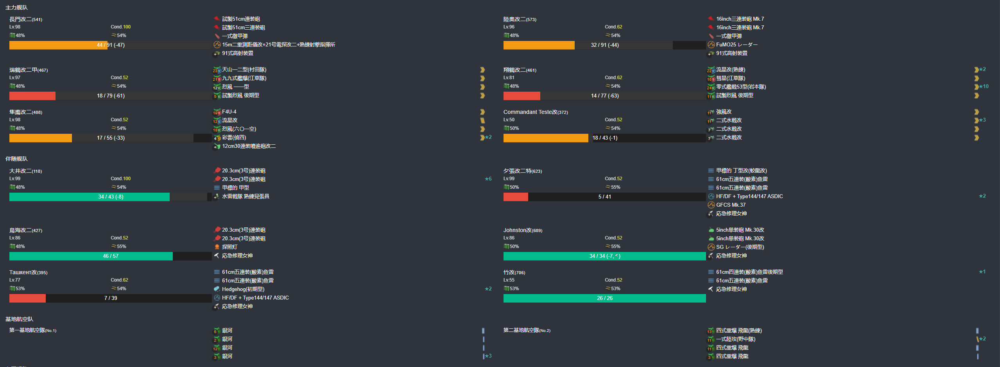

- 推图情况

