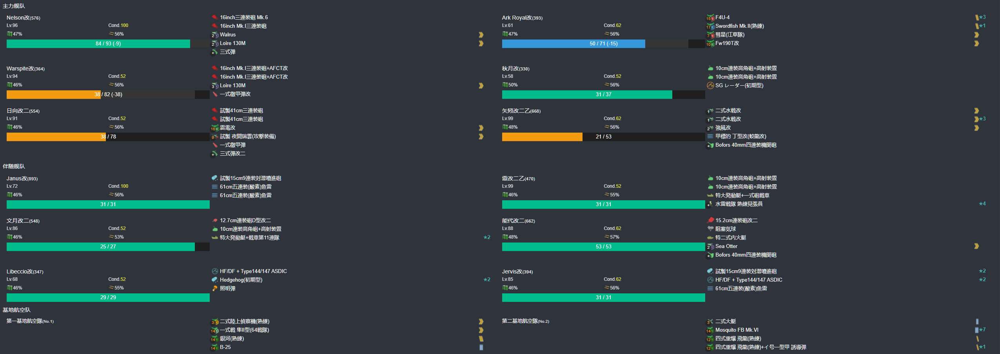
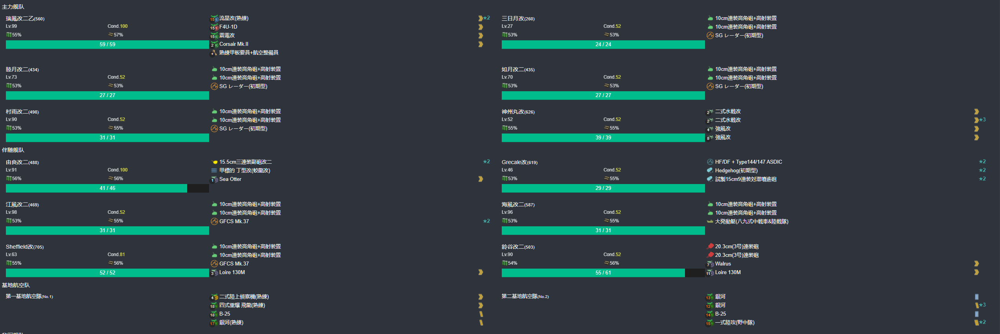

# 2024年夏季活动 能打啥样就打啥样
---

## E1-甲

### P1-开路阶段-C点S胜2次-F点到达2次-H点到达2次

####  P1-开路阶段-C点S胜2次

- 当前使用配置(鼠标悬停可看到阵容对应的阶段)

- 推图情况

1. A | B-SS | C | C2-SS
2. A | B-SS | C | C2-SS

####  P1-开路阶段-F点到达2次-H点到达2次

- 当前使用配置(鼠标悬停可看到阵容对应的阶段)

- 推图情况

1. A | D-A | E | F
2. A | D-A | E | F
3. A | D-A | E | G-A | H
4. A | D-A | E | G-A | H

### P1-开路阶段-L点S胜2次-K点S胜1次-B点S胜1次-守家空优1次

####  P1-开路阶段-L点S胜2次-K点S胜1次

- 当前使用配置(鼠标悬停可看到阵容对应的阶段)

- 推图情况

1. J-A | G-SS | K-SS | L-S 守家空优1次
2. J-A | G-A  | K-S  | L-S

####  P1-开路阶段-B点S胜1次

- 当前使用配置(鼠标悬停可看到阵容对应的阶段)

- 推图情况

1. A | B-SS

### P1-磨血斩杀

- 当前使用配置(鼠标悬停可看到阵容对应的阶段)

- 推图情况

1. J-A | G-A  | L-A | M-S
2. J-A | G-B 大淀大破撤退
3. J-A | G-SS | L-C 约翰斯顿大破撤退
4. J-A | G-SS | L-B | M-S
5. J-B | G-A  | L-B | M-A
6. J-A | G-A  | L-B | M-S
7. J-A | G-A  | L-B | M-A
8. J-B | G-SS | L-A | M-S

---

## E2-甲

### P1-运输

- 当前使用配置(鼠标悬停可看到阵容对应的阶段)

- 推图情况

1. A-SS | A2-B | B-A | C | E-A
2. A-A 皋月大破撤退
3. A-B  | A2-C 约翰斯顿大破撤退
4. A-A  | A2-B | B-A | C | E-A
5. A-SS | A2-C | B-B | C | E-A
6. A-A  | A2-B | B-A | C | E-A
7. A-B  | A2-C | B-B 皋月大破撤退
8. A-SS | A2-B | B-A | C | E-A
9. A-A  | A2-B | B-B | C | E-A
10. A-SS | A2-B | B-A | C | E-A
11. A-A  | A2-C | B-B | C | E-A

### P2-开路阶段-M点S胜2次-Q点S胜1次-R点S胜1次

#### P2-开路阶段-M点S胜2次

- 当前使用配置(鼠标悬停可看到阵容对应的阶段)

- 推图情况

1. F | G-SS | I-SS | L | M-S
2. F | G-SS | I-SS | L | M-A
3. F | G-S  | I-SS | L | M-S

#### P2-开路阶段-Q点S胜1次-R点S胜1次

- 当前使用配置(鼠标悬停可看到阵容对应的阶段)

- 推图情况

1. F | G-SS | I-S  | L | N | P | Q-SS
2. F | G-SS | I-SS | L | N | P | R-S

### P2-磨血斩杀

- 当前使用配置(鼠标悬停可看到阵容对应的阶段)

- 推图情况

1. F | G-SS | I-SS | L | N | O-SS | S-SS | U-S  Mogador
2. F | G-S  | I-SS | L | N | O-SS | S-S  | U-SS 
3. F | G-SS | I-SS | L | N | O-A  | S-A  | U-S 
4. F | G-SS | I-SS | L | N | O-A  | S-S  | U-S 
5. F | G-SS | I-S  | L | N | O-A  | S-S  | U-S

### P3-磨血斩杀

- 当前使用配置(鼠标悬停可看到阵容对应的阶段)

- 推图情况

1. F | G-SS | I-SS | L | N | P | R-A | W-S
2. F | G-SS | I-S  | L | N | P | R-S 皇家方舟大破撤退
3. F | G-S  | I-SS | L | N | P | R-S | W-A
4. F | G-SS | I-SS | L | N | P | R-A | W-S
5. F | G-SS | I-SS | L | N | P | R-S | W-A
6. F | G-S  | I-SS | L | N | P | R-A | W-A
7. F | G-SS | I-SS | L | N | P | R-S | W-A
8. F | G-SS | I-SS | L | N | P | R-A 贾维斯大破撤退
9. F | G-S  | I-SS | L | N | P | R-S | W-A
10. F | G-SS | I-SS | L | N | P | R-S | W-A
11. F | G-SS | I-S  | L | N | P | R-A | 沟了
12. F | G-SS | I-S  | L | N | P | R-B 皇家方舟大破撤退
13. F | G-SS | I-SS | L | N | P | R-A | W-A

---

## E3-乙

### P1-开路阶段-B2点S胜2次-C2点空优1次

#### P1-开路阶段-B2点S胜2次

- 当前使用配置(鼠标悬停可看到阵容对应的阶段)

- 推图情况

1. A-S  | B-SS | B2-S
2. A-SS | B-B  | B2-S

#### P1-开路阶段-C2点空优1次

- 当前使用配置(鼠标悬停可看到阵容对应的阶段)

- 推图情况

1. A-S | B-SS | C | C2-SS 空优

### P1-磨血斩杀

- 当前使用配置(鼠标悬停可看到阵容对应的阶段)

- 推图情况

1. A-SS | B-A  | C | C2-SS | C3-S  | F-S
2. A-SS | B-SS | C | C2-A  | C3-SS | F-S
3. A-SS | B-SS | C | C2-SS | C3-A  | F-S
4. A-S  | B-A  | C | C2-SS | C3-S  | F-A
5. A-SS | B-S 海伍德大破撤退
6. A-SS | B-S  | C | C2-A  | C3-S  | F-S

### P2-运输

- 当前使用配置(鼠标悬停可看到阵容对应的阶段)

- 推图情况

1. H-A | H2-D | I | K-A
2. H-B | H2-B 皋月大破撤退
3. H-B | H2-C | I | K-A
4. H-A | H2-C | I | K-A
5. H-B | H2-C 皋月大破撤退
6. H-B | H2-B | I | K-A
7. H-A | H2-B | I | K-A
8. H-B 满朝大破撤退
9. H-A | H2-B | I | K-A

### P3-运输

- 当前使用配置(鼠标悬停可看到阵容对应的阶段)

- 推图情况

1. L | M-S  | B1-SS | P-A | Q | S-S
2. L | M-SS | B1-SS | P-S | Q | S-SS
3. L | M-S  | B1-SS | P-A | Q | S-S
4. L | M-SS | B1-SS | P-B Grecale 大破撤退
5. L | M-S  | B1-A  | P-A 江风、Sheffield大破撤退
6. L | M-S  | B1-SS | P-SS | Q | S-S

### P4-开路阶段-S点S胜1次-V1点A胜2次-V3点S胜1次

#### P4-开路阶段-S点S胜1次

- 当前使用配置(鼠标悬停可看到阵容对应的阶段)

- 推图情况

1. L | M-S | B1-SS | P-SS | Q | S-SS

#### P4-开路阶段-V1点A胜2次

- 当前使用配置(鼠标悬停可看到阵容对应的阶段)

- 推图情况

1. P-S 江风大破撤退
2. P-SS | U-SS | V-S 海风大破撤退
3. P-SS | U-SS | V-S  | V1-S
4. P-A 由良大破撤退
5. P-S  | U-SS | V-SS | V1-S

#### P4-开路阶段-V3点S胜1次

- 当前使用配置(鼠标悬停可看到阵容对应的阶段)

- 推图情况

1. P-SS | U-SS | V-S | V3-S

### P4-磨血斩杀

- 当前使用配置(鼠标悬停可看到阵容对应的阶段)

- 推图情况

1. P-A  | U-SS | V-S  | X-S
2. P-SS | U-SS | V-S  | X-S
3. P-SS | U-SS | V-S  | X-S
4. P-S  | U-SS | V-S  | X-S
5. P-SS | U-SS | V-SS | X-S
6. P-SS | U-SS | V-S  | X-S

---

## E4-丙

### P1-磨血斩杀

- 当前使用配置(鼠标悬停可看到阵容对应的阶段)

- 推图情况

1. A-SS | A2 | C-SS | L-S
2. A-SS | A2 | C-S  | L-S
3. A-SS | A2 | C-SS | L-S
4. A-SS | A2 | C-SS | L-S
5. A-SS | A2 | C-SS | L-A
6. A-SS | A2 | C-S  | L-A
7. A-SS | A2 | C-SS | L-S

### P2-运输

- 当前使用配置(鼠标悬停可看到阵容对应的阶段)

- 推图情况

1. A-SS | A2 | C-SS | M | O-A  | P-B  | Q | S-A
2. A-SS | A2 | C-SS | M | O-A  | P-A  | Q | S-A
3. A-SS | A2 | C-SS | M | O-SS | P-A  | Q | S-A
4. A-SS | A2 | C-SS | M | O-A  | P-B  | Q | S-A
5. A-SS | A2 | C-SS | M | O-SS | P-SS | Q | S-S
6. A-SS | A2 | C-SS | M | O-A  | P-C  | Q | S-A
7. A-SS | A2 | C-SS | M | O-B  | P-A 矢矧、海风大破撤退
8. A-SS | A2 | C-SS | M | O-SS | P-C  | Q | S-A
9. A-SS | A2 | C-SS | M | O-A  | P-C 江风大破撤退
10. A-SS | A2 | C-SS | M | O-C 朝潮大破撤退
11. A-SS | A2 | C-SS | M | O-B | P-B | Q | S-A

### P3-开路阶段-H点A胜2次-V点S胜2次

#### P3-开路阶段-H点A胜2次

- 当前使用配置(鼠标悬停可看到阵容对应的阶段)

- 推图情况

1. A-SS | A2 | B-SS | D | F-A  | F1-A | G-B | H-S
2. A-S  | A2 | B-SS | D | F-SS | F1-A | G-B | H-A

#### P3-开路阶段-V点S胜2次

- 当前使用配置(鼠标悬停可看到阵容对应的阶段)

- 推图情况

1. T | T2-A | U-B | U1-A  | U2 | V-SS
2. T | T2-A | U-B | U1-SS | U2 | V-SS

### P3-磨血斩杀

- 当前使用配置(鼠标悬停可看到阵容对应的阶段)

- 推图情况

1. T | T2-B | U-A | U1-A  | U2 | V-SS | W-S  | X-A  | Z-A
2. T | T2-A | U-A 初月大破撤退
3. T | T2-D | U-A | U1-SS | U2 | V-SS | W-SS | X-SS | Z-A
4. T | T2-D | U-A | U1-SS | U2 | V-SS | W-SS | X-A  | Y-SS | Z-A
5. T | T2-B | U-A 初月大破撤退
6. T | T2-A | U-B 初月大破撤退
7. T | T2-D | U-A | U1-SS | U2 | V-SS | W-SS | X-SS | Z-S
8. T | T2-B | U-B 矢矧大破撤退
9. T | T2-B | U-B 矢矧大破撤退
10.  T | T2-B | U-S | U1-SS | U2 | V-SS | W-A | X-A | Z-A
11.  T | T2-B | U-A 大井大破撤退
12.  T | T2-B | U-A | U1-SS | U2 | V-S  | W-SS | X-A | Z-A
13.  T | T2-B | U-B | U1-A  | U2 | V-SS | W-A  | X-A | Z-A
14.  T | T2-B | U-A | U1-SS | U2 | V-SS | W-SS | X-A | Z-A
15.  T | T2-B | U-B | U1-SS | U2 | V-S  | W-SS | X-D | Z-C
16.  T | T2-B | U-A | U1-SS | U2 | V-S  | W-B  | X-A | Z-A
17.  T | T2-A | U-B | U1-SS | U2 | V-S 弗莱彻大破撤退
18.  T | T2-A | U-B | U1-A 熊野玩大破撤退
19.  T | T2-A | U-A | U1-SS | U2 | V-SS | W-SS | X-A | Y-B | Z-A
20.  T | T2-B | U-C | U1-SS | U2 | V-SS | W-A 能代大破撤退
21.  T | T2-SS | U-A | U1-A | U2 | V-SS | W-C 夕立、霞大破撤退
22.  T | T2-A  | U-B | U1-A | U2 | V-S  | W-A 欧根、时雨、弗莱彻大破撤退
23.  T | T2-A  | U-B | U1-A | U2 | V-SS | W-B | Z-A

切丁

- 当前使用配置(鼠标悬停可看到阵容对应的阶段)

- 推图情况

1.   T | T2-A | U-B | U1-A | U2 | V-SS | W-SS | Z-S
2.   T | T2-A | U-D 能代大破撤退
3.   T | T2-A | U-B | U1-SS | U2 | V-S  | W-S | Z-A
4.   T | T2-A | U-B | U1-A  | U2 | V-SS | W-B | Z-S

---

## E5-丁

### P1-运输

- 当前使用配置(鼠标悬停可看到阵容对应的阶段)

- 推图情况

1. A-SS | B-B | C | C2-S
2. A-SS | B-A | C | C2-S
3. A-SS | B-B | C | C2-A
4. A-A  | B-B | C | C2-S
5. A-SS | B-B | C | C2-S
6. A-SS | B-C | C | C2-S

### P2-磨血斩杀

- 当前使用配置(鼠标悬停可看到阵容对应的阶段)

- 推图情况

1. E-SS | G | I-A  | J-SS | L-S
2. E-SS | G | I-A  | J-S 隼鹰大破撤退
3. E-SS | G | I-SS | J-SS | L-SS
4. E-SS | G | I-SS | J-SS | L-SS
5. E-SS | G | I-A  | J-S  | L-SS
6. E-SS | G | I-SS | J-SS | L-S

