# 2024年初春活动 能打啥样就打啥样
---

## E1-甲

### P1-开路阶段-G点S胜1次-H点S胜1次-C点S胜1次

####  P1-开路阶段-C点S胜1次

- 当前使用配置(鼠标悬停可看到阵容对应的阶段)

- 推图情况

1. A | B-SS | C-SS

####  P1-开路阶段-G点S胜1次

- 当前使用配置(鼠标悬停可看到阵容对应的阶段)

- 推图情况

1. A | D-SS | E-SS | F | G-S

####  P1-开路阶段-H点S胜1次

- 当前使用配置(鼠标悬停可看到阵容对应的阶段)

- 推图情况

1. A | D-SS | E-SS | F | H-SS

### P1-运输

- 当前使用配置(鼠标悬停可看到阵容对应的阶段)

- 推图情况

1. I | N-SS | O-C | P | Q
2. I | N-SS | O-C | P | Q
3. I | N-A  | O-B | P | Q

### P2-开路阶段-M点S胜2次-T点S胜2次-R1空优1次

#### P2-开路阶段-M点S胜2次

- 当前使用配置(鼠标悬停可看到阵容对应的阶段)

- 推图情况

1. I | D-SS | K-A | M-SS
2. I | D-SS | K-S 千代田大破撤退
3. I | D-SS | K-A | M-A
4. I | D-B  | K-A | M-S

#### P2-开路阶段-T点S胜2次

- 当前使用配置(鼠标悬停可看到阵容对应的阶段)

- 推图情况

1. A | B-SS | C-S  | R-SS | R2-S | S-SS | T-A
2. A | B-SS | C-SS | R-SS | R2-S 春雨大破撤退
3. A | B-S  | C-SS | R-SS | R2-S | S-SS | T-S
4. A | B-SS | C-S  | R-SS | R2-S | S-SS | T-S

#### P2-开路阶段-R1空优1次

- 当前使用配置(鼠标悬停可看到阵容对应的阶段)

- 推图情况

1. A | B-SS | C-A | R-SS | R1-SS 空优

#### P2-磨血斩杀

- 当前使用配置(鼠标悬停可看到阵容对应的阶段)

- 推图情况

1. V | W-A  | R2-SS | S-A | T-A  天城大破撤退
2. V | W-B 飞龙大破撤退
3. V | W-A  | R2-S  | S-B 冬月大破撤退
4. V | W-A  | R2-SS | S-B | T-B 绫波大破撤退
5. V | W-SS | R2-SS | T-B | X-S
6. V | W-SS | R2-SS | T-B | X-S
7. V | W-A  | R2-S  | T-B | X-S
8. V | W-SS | R2-S  | T-B | X-S
9. V | W-SS | R2-SS | T-C | X-A
10. V | W-SS | R2-S | T-D 冬月
11. V | W-B  | R2-S 飞龙大破撤退
12. V | W-SS | R2-A | T-C | X-A
13. V | W-A  | R2-SS | T-B | X-A
14. V | W-SS | R2-S  | T-B | X-A
16. V | W-A  | R2-S  | T-D 绫波大破撤退
17. V | W-SS | R2-S  | T-D | X-A
18. V | W-SS | R2-A  | S-B 不知火大破撤退
19. V | W-SS | R2-S  | S-SS 沟了
20. V | W-A  | R2-A  | S-A | T-B | X-A
21. V | W-A  | R2-S  | S-A 木曾大破撤退
22. V | W-C 绫波-木曾大破撤退
23. V | W-A  | R2-S  | S-SS | T-C | X-A
24. V | W-SS | R2-SS | S-A  | T-C | X-S

--- 

## E2-甲

### P1-开路阶段-J点S胜1次-I点S胜1次-C点空优1次-D2点S胜1次

#### P1-开路阶段-C点空优1次-D2点S胜1次

- 当前使用配置(鼠标悬停可看到阵容对应的阶段)

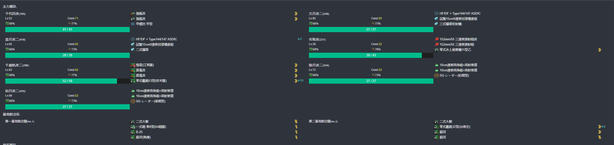

- 推图情况

1. A-SS | B | C-SS 空优 | D-S | D2-SS

#### P1-开路阶段-I点S胜1次

- 当前使用配置(鼠标悬停可看到阵容对应的阶段)

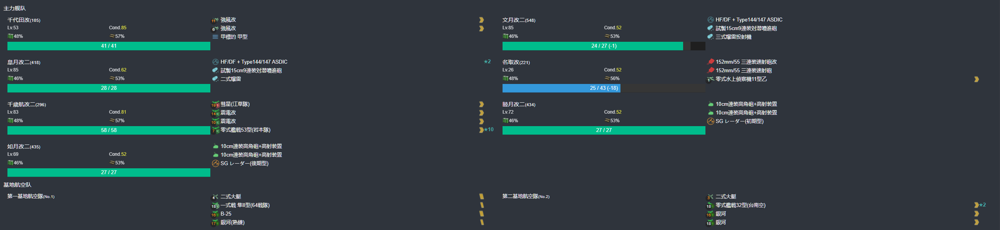

- 推图情况

1. A-SS | B | E-SS | G-A | H-SS | I-S

#### P1-开路阶段-J点S胜1次

- 当前使用配置(鼠标悬停可看到阵容对应的阶段)

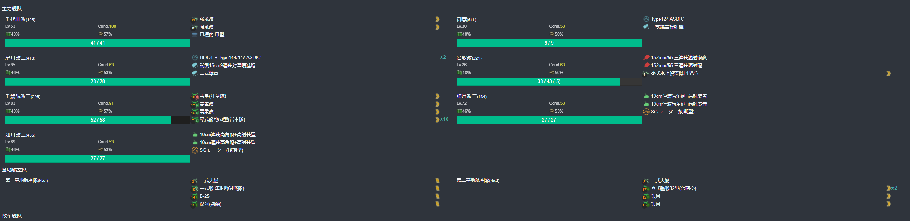

- 推图情况

1. A-SS | B | E-SS | G-SS | H-S | I-S

### P1-磨血斩杀

- 当前使用配置(鼠标悬停可看到阵容对应的阶段)

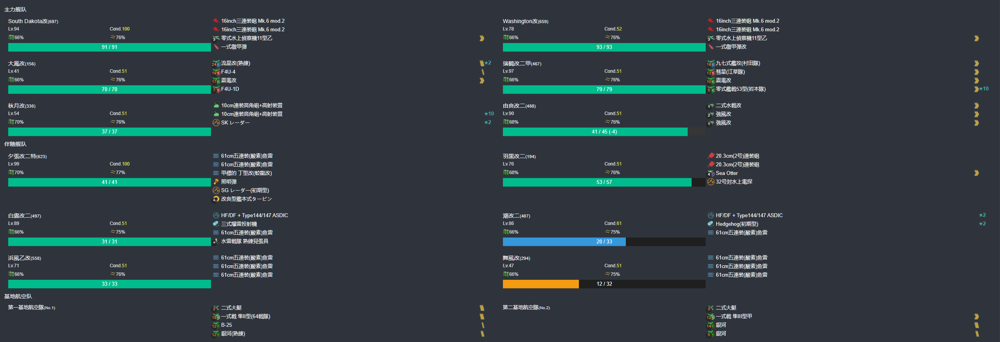

- 推图情况

1. L | M-SS | J-S  | P-A 浜风大破撤退
2. L | M-SS | J-SS | P-A  | R-SS
3. L | M-SS | J-S  | P-A  | R-SS
4. L | M-SS | J-SS | P-A  | R-S
5. L | M-S  | J-S  | P-SS | R-S
6. L | M-S  | J-S  | P-A  | R-S

### P2-磨血斩杀

- 当前使用配置(鼠标悬停可看到阵容对应的阶段)

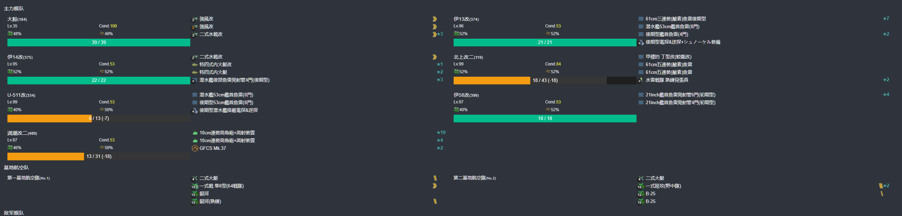

- 推图情况

1. S | T-SS | U-SS | V-SS | X-S  | Y-A
2. S | T-SS | U-SS | V-SS | X-S U-511 大破撤退
3. S | T-B  | U-A  | V-SS | X-A  | Y-A
4. S | T-B  | U-A  | V-SS | X-SS | Y-A
5. S | T-B  | U-A  | V-S  | X-B  | Y-A
6. S | T-SS | U-A  | V-S  | X-SS | Y-S 伊36
7. S | T-SS | U-SS | V-SS | X-S  | Y-S
8. S | T-SS | U-A  | V-SS | X-S  | Y-A
9. S | T-SS | U-SS | V-SS | X-S  | Y-S

--- 

## E3-甲

### P1-开路阶段-P点S胜2次-N点S胜2次-O点S胜2次

#### P1-开路阶段-P点S胜2次-N点S胜2次

- 当前使用配置(鼠标悬停可看到阵容对应的阶段)

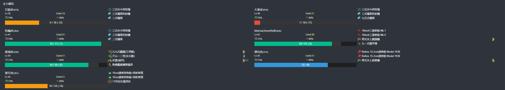

- 推图情况

1. H-A  | I-S 酒匂大破撤退
2. H-S  | I-SS | M | P-S
3. H-S  | I-SS | M | P-B
4. H-S  | I-SS | M | P-S
5. H-SS | I-SS | M | N-S
6. H-S  | I-SS | M | N-S

#### P1-开路阶段-O点S胜2次

- 当前使用配置(鼠标悬停可看到阵容对应的阶段)

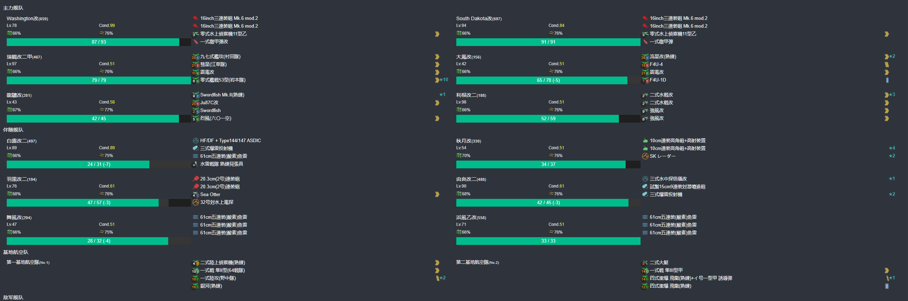

- 推图情况

1. A | B-A | D-S | F-A | O-S
2. A | B-S | D-S | F-A | O-S

### P1-磨血斩杀

- 当前使用配置(鼠标悬停可看到阵容对应的阶段)

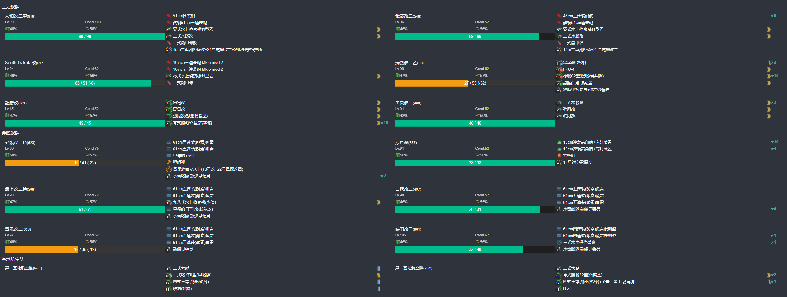

- 推图情况

1. A | B-A | D-S | F-A | O-A 白露、由良、舞风大破撤退
2. A | B-A | D-S 浜风大破撤退

切乙

1. A | B-SS | D-S  | F-A | O-A 羽黑大破撤退
2. A | B-SS | D-S  | F-A | O-S 秋月大破撤退
3. A | B-A  | D-S 秋月、由良、舞风大破撤退
4. A | B-SS | D-SS | F-SS | O-S  | Q-S
5. A | B-A  | D-S  | F-A  | O-SS | Q-S
6. A | B-S  | D-SS | F-SS | O-A  | Q-S
7. A | B-A  | D-S  | F-A  | O-B  | Q-S
8. A | B-S 妙高大破撤退
9. A | B-S  | D-S  | F-SS | O-B 羽黑大破撤退
10. A | B-A | D-S  | F-A  | O-SS | Q-A
11. A | B-SS | D-SS | F-A | O-B  | Q-A
12. A | B-A  | D-S  | F-A | O-C 浜风大破撤退
13. A | B-A  | D-S  | F-A | O-A 妙高大破撤退
14. A | B-S  | D-SS | F-A | O-A  | Q-A
15. A | B-A  | D-S  | F-A | O-B  | Q-A
16. A | B-A  | C-F |  D-S | F-A | O-B | Q-A
17. A | B-SS | D-SS | F-A | O-A 秋月大破撤退
18. A | B-S 秋云大破撤退
19. A | B-A 白露大破撤退
20. A | B-SS | D-SS | F-A 秋月大破撤退
21. A | B-SS | D-SS 秋月大破撤退
22. A | B-SS | D-S 秋月大破撤退
23. A | B-A  | D-S  | F-SS | O-B | Q-A
24. A | B-A  | D-S  | F-A  | O-B 凉月、时雨大破撤退
25. A | B-SS | D-SS | F-SS | O-A | Q-S

### P2-磨血斩杀

- 当前使用配置(鼠标悬停可看到阵容对应的阶段)

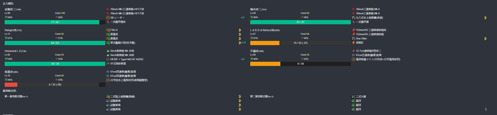

- 推图情况

1. I-SS | M | P-A  | R-S | S-SS | U-S
2. I-SS | M | P-S  | R-S | S-SS | U-S
3. I-SS | M | P-A  | R-S | S-A  | U-S
4. I-A  | M | P-SS | R-A | S-A  | U-S

### P3-磨血斩杀

- 当前使用配置(鼠标悬停可看到阵容对应的阶段)

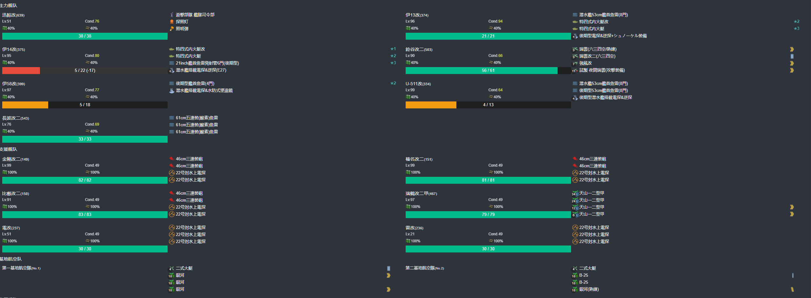

- 推图情况

1. V | W-SS | Y-S 伊58大破撤退
2. V | W-SS | Y-S  | Y2-A 伊14大破撤退
3. V | W-SS | Y-SS | Y2-S | Z-A
4. V | W-SS | Y-SS | Y2-S | Z-A
5. V | W-S  | Y-S 伊13大破撤退
6. V | W-S  | Y-S 伊13大破撤退
7. V | W-SS | Y-S  | Y2-SS | Z-A
8. V | W-S  | Y-SS | Y2-A  | Z-A
9. V | W-SS | Y-S  | Y2-SS | Z-A
10. V | W-S  | Y-S  | Y2-SS | Z-S
11. V | W-SS | Y-S  | Y2-SS | Z-A
12. V | W-S  | Y-S  | Y2-A 伊13大破撤退
13. V | W-SS | Y-SS | Y2-SS | Z-A
14. V | W-S  | Y-S  | Y2-A  | Z-A
15. V | W-SS | Y-S  | Y2-A  | Z-A
16. V | W-S  | Y-S  | Y2-A  | Z-A
17. V | W-S  | Y-S  | Y2-SS | Z-S 

--- 

## E4-乙

### P1-开路一阶段-C点S胜2次-D点S胜2次-A3点S胜2次

#### P1-开路一阶段-A3点S胜2次

- 当前使用配置(鼠标悬停可看到阵容对应的阶段)

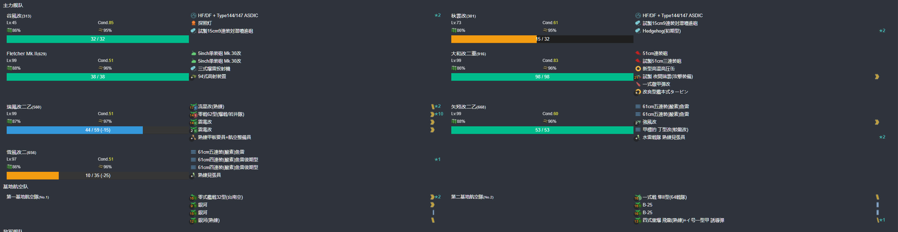

- 推图情况

1. A1-SS | A2-SS | A3-S
2. A1-S  | A2-SS | A3-S

#### P1-开路一阶段-C点S胜2次-D点S胜2次

- 当前使用配置(鼠标悬停可看到阵容对应的阶段)

- 推图情况

1. A-SS | B | C-S
2. A-SS | B | C-SS
3. A-S  | B | D-S
4. A-S  | B | D-S

### P1-开路二阶段-D2点S胜1次-C1点空优1次-D1点S胜1次-C2点S胜1次

#### P1-开路二阶段-D2点S胜1次-C1空优1次

- 当前使用配置(鼠标悬停可看到阵容对应的阶段)

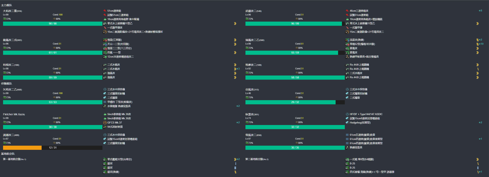

- 推图情况

1. A-SS | B | D-S | D2-S
2. A-SS | B | C-S | C1 空确

#### P1-开路二阶段-D1点S胜1次

- 当前使用配置(鼠标悬停可看到阵容对应的阶段)

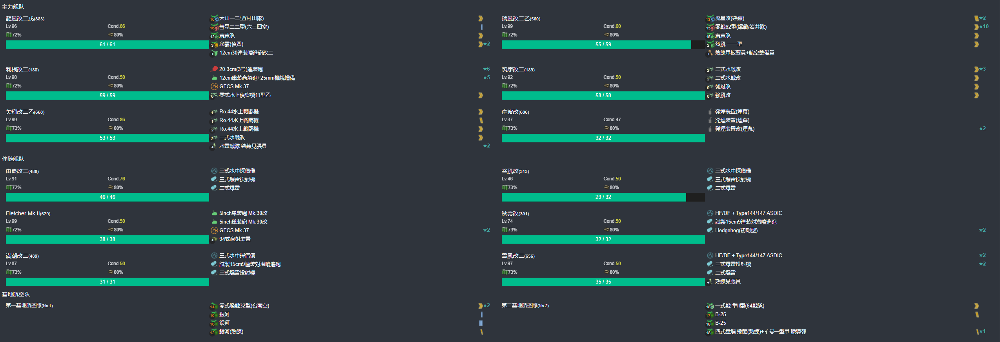

- 推图情况

1. A1-SS | B | D-A | D1-SS

#### P1-开路二阶段-C2点S胜1次

- 当前使用配置(鼠标悬停可看到阵容对应的阶段)

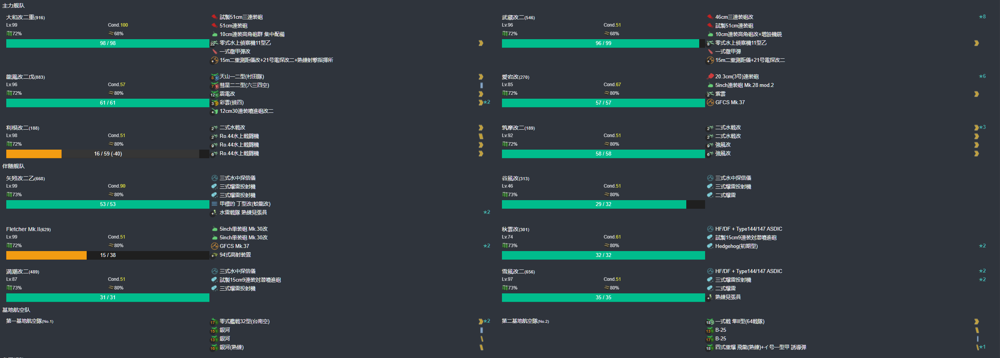

- 推图情况

1. A-SS | B | C-S | C2-S

### P1-磨血斩杀

- 当前使用配置(鼠标悬停可看到阵容对应的阶段)

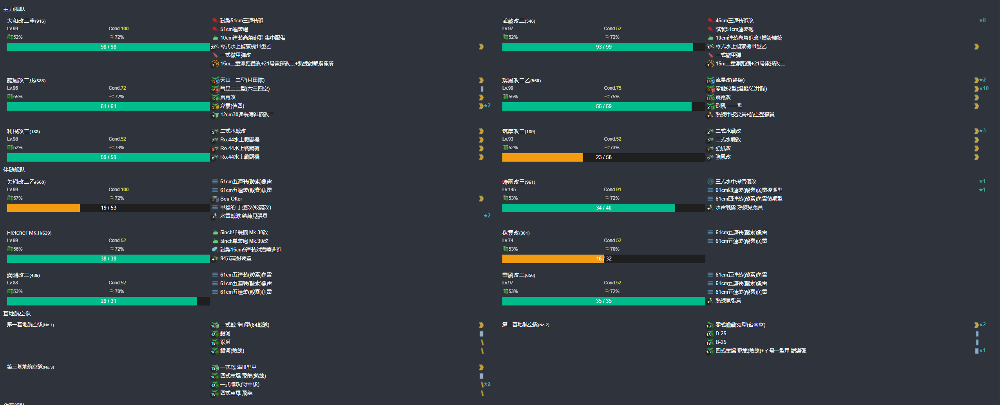

- 推图情况

1. A-S | B | C-S 谷风大破撤退 
2. A-SS | B | C-S | C1-SS | E-S  | F1-SS | G-S
3. A-SS | B | C-S | C1-SS | E-SS | F1-SS | G-S
4. A-SS | B | C-S | C1-A 龙凤大破撤退
5. A-SS | B | C-S | C1-A  | E-S  | F1-SS | G-S
6. A-SS | B | C-S | C1-SS | E-SS | F1-A  | G-S
7. A-S  | B | C-S | C1-SS | E-A  | F1-SS | G-SS
8. A-S  | B | C-S | C1-SS | E-A  | F1-A  | G-SS

### P2-运输

- 当前使用配置(鼠标悬停可看到阵容对应的阶段)

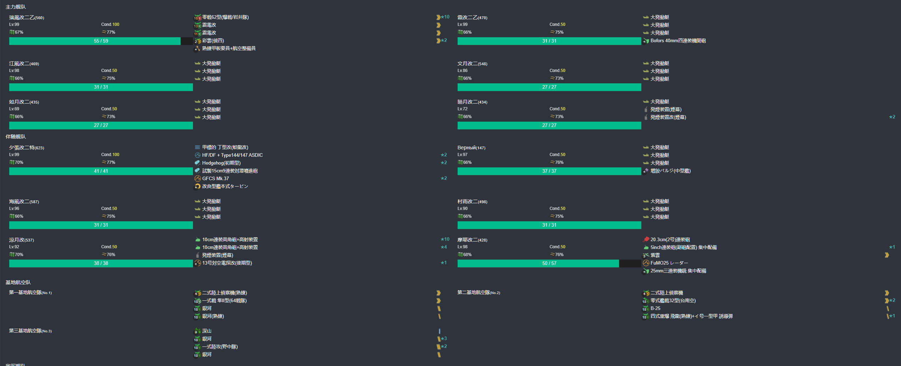

- 推图情况

1. H | J-SS | J1-A  | J2-B | M | O-S
2. H | J-SS | J1-SS | J2-B | M | O-SS
3. H | J-SS | J1-SS | J2-A | M | O-S
4. H | J-SS | J1-SS | J2-B | M | O-SS

### P3-磨血斩杀

- 当前使用配置(鼠标悬停可看到阵容对应的阶段)

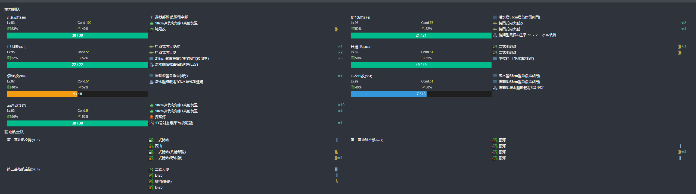

- 推图情况

1. P-SS | J-C 日进大破撤退
2. P-SS | J-B  | J1-B  | R-B | S-S
3. P-B  | J-SS | J1-A  | R-A | S-S
4. P-A  | J-B  | J1-A  | Q-SS | R-B | S-A
5. P-SS | J-B  | J1-S  | R-B | S-S
6. P-A  | J-SS | J1-SS | R-A | S-S

### P4-磨血斩杀

- 当前使用配置(鼠标悬停可看到阵容对应的阶段)

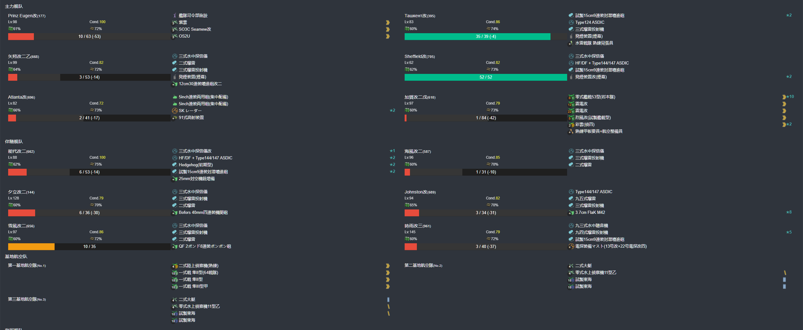

- 推图情况

1. T-SS | U-SS | V-D 约翰斯顿大破撤退
2. T-SS | U-SS | V-D 雪风、夕张大破撤退
3. T-SS | U-A  | V-C | X-A  | 沟了
4. T-SS | U-A  | V-C | X-A  | Z-B
5. T-SS | U-SS | V-D | X-SS | 沟了
6. T-SS | U-A  | V-D | X-A  | Z-B
7. T-SS | U-A  | V-D | X-SS | Z-B
8. T-SS | U-SS | V-D | X-SS | Z-B
9. T-SS | U-SS | V-D | X-A  | Z-B
10. T-SS | U-A | V-B | X-A  | Z-B
11. T-SS | U-SS | V-D | X-A | Z-D
12. T-SS | U-A 谢菲尔德大破撤退
13. T-SS | U-A | V-D | X-A | Z-B

--- 

## E0-捞船

### 平安丸

#### E2-Y点

- 当前使用配置(鼠标悬停可看到阵容对应的阶段)

- 捞船情况

1. S | T-SS | U-SS | V-S 伊14大破撤退
2. S | T-SS | U-SS | V-S  | X-S  | Y-S 熊野
3. S | T-SS | U-SS | V-SS | X-S  | Y-S 扶桑
4. S | T-SS | U-A  | V-S U-511大破撤退
5. S | T-A  | U-SS | V-S  | X-A 伊13大破撤退
6. S | T-C 北上大破撤退
7. S | T-A  | U-SS | V-SS | X-SS | Y-S 马萨诸塞
8. S | T-B  | U-SS | V-SS | X-S  | Y-