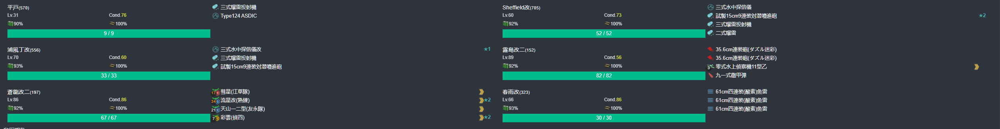
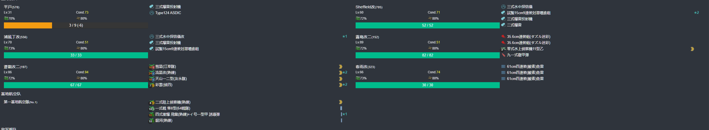
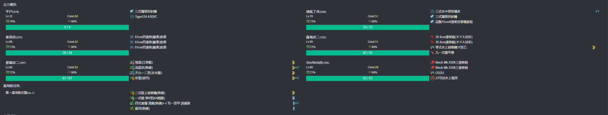
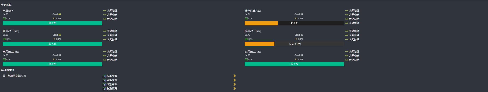
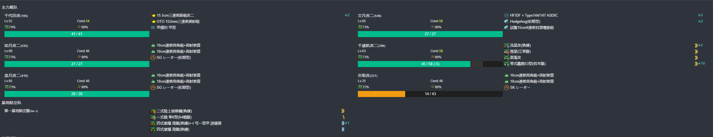
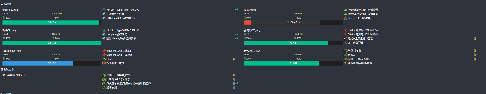
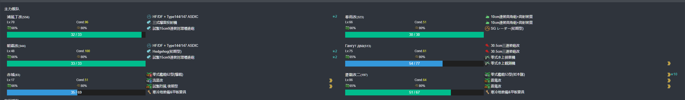
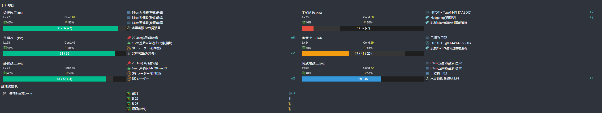

# 2024年初春活动 能打啥样就打啥样
---

## E1-甲

### P1-开路阶段-G点S胜1次-H点S胜1次-C点S胜1次

####  P1-开路阶段-C点S胜1次

- 当前使用配置(鼠标悬停可看到阵容对应的阶段)

- 推图情况

1. A | B-SS | C-SS

####  P1-开路阶段-G点S胜1次

- 当前使用配置(鼠标悬停可看到阵容对应的阶段)

- 推图情况

1. A | D-SS | E-SS | F | G-S

####  P1-开路阶段-H点S胜1次

- 当前使用配置(鼠标悬停可看到阵容对应的阶段)

- 推图情况

1. A | D-SS | E-SS | F | H-SS

### P1-运输

- 当前使用配置(鼠标悬停可看到阵容对应的阶段)

- 推图情况

1. I | N-SS | O-C | P | Q
2. I | N-SS | O-C | P | Q
3. I | N-A  | O-B | P | Q

### P2-开路阶段-M点S胜2次-T点S胜2次-R1空优1次

#### P2-开路阶段-M点S胜2次

- 当前使用配置(鼠标悬停可看到阵容对应的阶段)

- 推图情况

1. I | D-SS | K-A | M-SS
2. I | D-SS | K-S 千代田大破撤退
3. I | D-SS | K-A | M-A
4. I | D-B  | K-A | M-S

#### P2-开路阶段-T点S胜2次

- 当前使用配置(鼠标悬停可看到阵容对应的阶段)

- 推图情况

1. A | B-SS | C-S  | R-SS | R2-S | S-SS | T-A
2. A | B-SS | C-SS | R-SS | R2-S 春雨大破撤退
3. A | B-S  | C-SS | R-SS | R2-S | S-SS | T-S
4. A | B-SS | C-S  | R-SS | R2-S | S-SS | T-S

#### P2-开路阶段-R1空优1次

- 当前使用配置(鼠标悬停可看到阵容对应的阶段)

- 推图情况

1. A | B-SS | C-A | R-SS | R1-SS 空优

#### P2-磨血斩杀

- 当前使用配置(鼠标悬停可看到阵容对应的阶段)

- 推图情况

1. V | W-A  | R2-SS | S-A | T-A  天城大破撤退
2. V | W-B 飞龙大破撤退
3. V | W-A  | R2-S  | S-B 冬月大破撤退
4. V | W-A  | R2-SS | S-B | T-B 绫波大破撤退
5. V | W-SS | R2-SS | T-B | X-S
6. V | W-SS | R2-SS | T-B | X-S
7. V | W-A  | R2-S  | T-B | X-S
8. V | W-SS | R2-S  | T-B | X-S
9. V | W-SS | R2-SS | T-C | X-A
10. V | W-SS | R2-S | T-D 冬月
11. V | W-B  | R2-S 飞龙大破撤退
12. V | W-SS | R2-A | T-C | X-A
13. V | W-A  | R2-SS | T-B | X-A
14. V | W-SS | R2-S  | T-B | X-A
16. V | W-A  | R2-S  | T-D 绫波大破撤退
17. V | W-SS | R2-S  | T-D | X-A
18. V | W-SS | R2-A  | S-B 不知火大破撤退
19. V | W-SS | R2-S  | S-SS 沟了
20. V | W-A  | R2-A  | S-A | T-B | X-A
21. V | W-A  | R2-S  | S-A 木曾大破撤退
22. V | W-C 绫波-木曾大破撤退
23. V | W-A  | R2-S  | S-SS | T-C | X-A
24. V | W-SS | R2-SS | S-A  | T-C | X-S

--- 

## E2-甲

### P1-开路阶段-J点S胜1次-I点S胜1次-C点空优1次-D2S胜1次

#### P1-开路阶段-C点空优1次-D2S胜1次

- 当前使用配置(鼠标悬停可看到阵容对应的阶段)

- 推图情况

1. 
