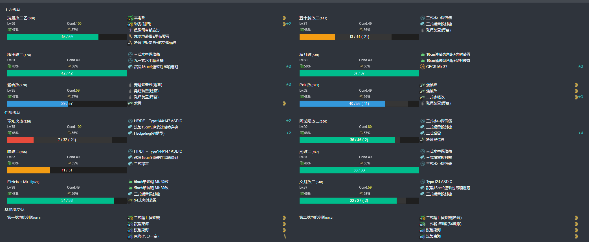
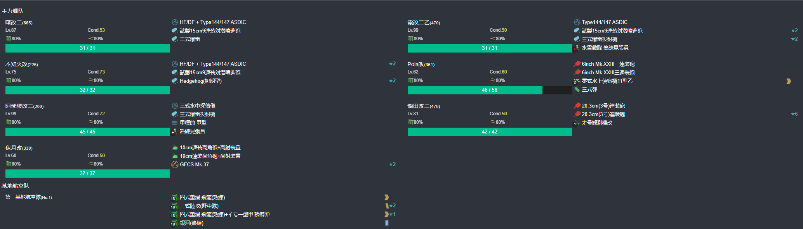

# 2025年春季活动 咸鱼打

--- 

#### 进活动时资源


---

## E1-甲

### 开新出发点阶段-E点S胜3次-C点S胜3次-到达C2点2次

#### 开新出发点阶段-E点S胜3次

- 当前使用配置(鼠标悬停可看到阵容对应的阶段)


- 推图情况
- A 能动 --> D 警戒 --> D3 轮型 --> E 单横
```
陆航1队(3航程) 40 --> D3 
陆航2队 守家
```

1. A | D-SS | D3-A  | E-SS
2. A | D-SS | D3-SS | E-SS
3. A | D-SS | D3-SS | E-SS

#### 开新出发点阶段-C点S胜3次

- 当前使用配置(鼠标悬停可看到阵容对应的阶段)


- 推图情况
- A 能动 --> B 无战斗 ---> B2 轮型 ---> C 单纵
```
陆航1队(5航程) 04 --> C
陆航2队 守家
```

1. A | B | B2-SS | C-SS
2. A | B | B2-SS | C-S
3. A | B | B2-A  | C-SS

#### 开新出发点阶段-到达C2点2次

- 当前使用配置(鼠标悬停可看到阵容对应的阶段)


- 推图情况
- A 能动 --> B 无战斗 ---> B2 轮型 ---> C1 单纵 ---> C2 油点无战斗
```
陆航1队 退避
陆航2队 守家
```

1. A | B | B2-SS | C1-A | C2
2. A | B | B2-A  | C1-C | C2

### 开BOSS点-H点S胜3次-到达C2点1次-G点S胜3次

#### 开BOSS点-H点S胜3次

- 当前使用配置(鼠标悬停可看到阵容对应的阶段)


- 推图情况
- A 能动 --> D 警戒 --> D3 轮型 --> E 警戒 --> H 单纵
```
陆航1队(5航程) 04 --> H
陆航2队 守家
```

1. A | D-SS | D3-SS | E-S  | H-S
2. A | D-SS | D3-B  | E-SS | H-S
3. A | D-A  | D3-SS | E-SS | H-SS

#### 开BOSS点-到达C2点1次

- 当前使用配置(鼠标悬停可看到阵容对应的阶段)


- 推图情况
- A 能动 --> B 无战斗 ---> B2 轮型 ---> C1 单纵 ---> C2 油点无战斗
```
陆航1队 休息
陆航2队 守家
```

1. A | B | B2-SS | C1-B | C2

#### 开BOSS点-G点S胜3次

- 当前使用配置(鼠标悬停可看到阵容对应的阶段)


- 推图情况
- F 无战斗 --> C 警戒阵 ---> G 单纵
```
陆航1队(5航程) 04 --> G点
陆航2队 守家
```

1. F | C-SS | G-SS
2. F | C-A  | G-SS
3. F | C-A  | G-S

### 磨血斩杀

- 当前使用配置(鼠标悬停可看到阵容对应的阶段)


- 推图情况
- F 无战斗 --> C 警戒阵 ---> G 警戒阵 ---> M 警戒阵并拉烟 ---> O 单纵阵
```
陆航1队(5航程) 04 --> O点
陆航2队 守家
```

1. F | C-SS | G-S  | M-C | O-A
2. F | C-SS | G-SS | M-D 酒匂大破撤退
3. F | C-SS | G-S  | M-B | O-S
4. F | C-SS | G-S  | M-B | O-S
5. F | C-SS | G-S  | M-B | O-A
6. F | C-S  | G-SS | M-B | O-A
7. F | C-SS | G-S  | M-D | O-S
8. F | C-S  | G-SS | M-B | O-S

--- 

## E2-丙

### P1-1阶段解谜-F2点A胜2次-F1点A胜2次-C点S胜2次

#### P1-1阶段解谜-F2点A胜2次

- 当前使用配置(鼠标悬停可看到阵容对应的阶段)


- 推图情况
- A 无战斗 --> A2 轮型阵 --> B 能动 --> D 警戒阵 --> E 能动 --> F 轮型阵 --> F2 单纵阵
```
陆航1队(3航程) 04 --> F2点
陆航2队 守家
```

1. A | A2-A  | B | D-SS | E | F-SS | F2-S
2. A | A2-SS | B | D-S 苍龙大破撤退
3. A | A2-SS | B | D-S  | E | F-SS | F2-S 

#### P1-1阶段解谜-F1点A胜2次

- 当前使用配置(鼠标悬停可看到阵容对应的阶段)


- 推图情况
- A 无战斗 --> A2 轮型阵 --> B 能动 --> D 警戒阵 --> E 能动 --> F1 单纵阵
```
陆航1队(4航程) 013 --> F1点
陆航2队 守家
```

1. A | A2-SS | B | D-S 苍龙大破撤退
2. A | A2-A  | B | D-S 比叡、鬼怒大破撤退
3. A | A2-SS | B | D-A  | E | F1-S
4. A | A2-SS | B | D-SS | E | F1-S

#### P1-1阶段解谜-C点S胜2次

- 当前使用配置(鼠标悬停可看到阵容对应的阶段)


- 推图情况
- A 无战斗 --> A2 轮型阵 --> B 能动 --> C 单纵阵
```
陆航1队(7航程) 013 --> C点
陆航2队 守家
```

1. A | A2-SS | B | C-SS
2. A | A2-SS | B | C-SS

### P1-2阶段解谜-K点A胜3次

- 当前使用配置(鼠标悬停可看到阵容对应的阶段)


- 推图情况
- A 无战斗 --> A2 轮型阵 --> B 能动 --> C 警戒阵 --> H 警戒阵 --> I 警戒阵 --> K 单纵阵
```
陆航1队(6航程) 013 --> K点
陆航2队 守家
```

1. A | A2-SS | B | C-SS | H-A | I-S  | K-S
2. A | A2-SS | B | C-S  | H-A | I-SS | K-S
3. A | A2-A  | B | C-S  | H-A | I-S  | K-S

### P1-运输

- 当前使用配置(鼠标悬停可看到阵容对应的阶段)


- 推图情况（水打联合）
- L 无战斗 --> M 第四阵 --> N 能动 --> P 第一阵并拉烟 --> R 第四阵 --> T 运输点无战斗 --> U 第四阵
```
陆航1队(3航程) 04 --> U点
陆航2队(7航程) 112 --> M点
```

1. L | M-SS | N | P-B | R-B  | T | U-S
2. L | M-SS | N | P-A | R-SS | T | U-S
3. L | M-SS | N | P-B | R-S  | T | U-S 

### P2-磨血斩杀

- 当前使用配置(鼠标悬停可看到阵容对应的阶段)



- 推图情况（水打联合）
- L 无战斗 --> M 第四阵 --> N 能动 --> O 第三阵 --> Q 第一阵 --> V 第四阵并拉烟 --> V1 无战斗 --> W 第一阵
```
陆航1队(5航程) 1陆侦3东海 --> W点
陆航2队(7航程) 112 --> M点
或b
陆航2队(5航程) 1陆侦3东海 --> W点
```

1. L | M-SS | N | O-A  | Q-SS | V-C 睦月大破撤退
2. L | M-SS | N | O-SS | Q-SS | V-A 曙大破撤退
3. L | M-S  | N | O-SS | Q-SS | V-C 秋月大破撤退
4. L | M-SS | N | O-SS | Q-SS | V-C | W-B
5. L | M-SS | N | O-SS | Q-SS | V-A | W-B
6. L | M-SS | N | O-SS | Q-SS | V-B | W-B
7. L | M-SS | N | O-SS | Q-SS | V-C | W-B
8. L | M-A  | N | O-SS | Q-SS | V-B | W-B
9. L | M-A 爱宕大破撤退
10. L | M-A | N | O-A  | Q-SS | V-B | W-B

--- 

## E3-乙

### P1-解谜-D3点A胜1次-B4点A胜1次-E2点A胜1次

#### P1-解谜-D3点A胜1次

- 当前使用配置(鼠标悬停可看到阵容对应的阶段)



- 推图情况
- A 能动 --> C 能动 --> D 警戒阵 --> D3 单横阵
```
陆航1队(4航程) 04 --> D点
陆航2队 休息
陆航3队 守家
```

1. A | C | D-SS | D3-SS

#### P1-解谜-B4点A胜1次

- 当前使用配置(鼠标悬停可看到阵容对应的阶段)


- 推图情况
- A 能动 --> B 警戒阵 --> B2 警戒阵 --> B4 单纵阵
```
陆航1队(8航程) 1大艇/陆侦3陆攻 --> B4点
陆航2队 休息
陆航3队 守家
```

1. A | B-B | B2-S | B4-A

#### P1-解谜-E2点A胜1次

- 当前使用配置(鼠标悬停可看到阵容对应的阶段)


- 推图情况
- A 能动 --> C 能动 --> E 警戒阵 --> E2 单纵阵
```
陆航1队(6航程) 1大艇/陆侦1陆战2陆攻 --> E2点
陆航2队(6航程) 1大艇/陆侦1陆战2陆攻 --> E2点
陆航3队 守家
```

1. A | C | E-S | E2-S

### P1-磨血斩杀

- 【足柄 那智 阿武隈 多摩 木曾 潮 曙 不知火 霞 初春 初霜 若叶 薄云 】 四史实带路,需装备一个北方迷彩
- 当前使用配置(鼠标悬停可看到阵容对应的阶段)


- 推图情况
- A 能动 --> C 能动 --> E 警戒阵 --> F 警戒阵 --> F1 轮型阵 --> G 单纵阵（斩杀用警戒有奇效）
```
陆航1队(6航程) 1大艇/陆侦1陆战2陆攻（斩杀31） --> G点
陆航2队(6航程) 1大艇/陆侦1陆战2陆攻（斩杀04） --> G点
陆航3队 守家
```

1. A | C | E-SS | F-S  | F1-SS | G-S
2. A | C | E-S  | F-SS | F1-SS | G-S
3. A | C | E-S  | F-S  | F1-A  | G-S
4. A | C | E-S  | F-A  | F1-SS | G-S
5. A | C | E-A  | F-SS | F1-SS | G-A
6. A | C | E-SS | F-S  | F1-SS | G-A
7. A | C | E-SS | F-S  | F1-A  | F3-B | G-C
8. A | C | E-S  | F-SS | F1-A  | F3-B | G-A
9. A | C | E-S  | F-SS | F1-SS | F3-D 由良大破撤退
10. A | C | E-S | F-S  | F1-B 不知火大破撤退
11. A | C | E-A | F-S  | F1-A  | F3-D | G-A
12. A | C | E-A | F-SS | F1-A  | F3-D | G-A
13. A | C | E-S | F-S  | F1-A 霞大破撤退
14. A | C | E-S | F-S  | F1-A  | G-A
15. A | C | E-A | F-SS | F1-SS | G-A
16. A | C | E-SS | F-SS | F1-A | G-S 

### P2-解谜-H3点S胜1次-I1点A胜1次-I3点S胜1次-K2点A胜1次-M2点空优1次-M1点A胜1次

#### P2-解谜-H3点S胜1次

- 当前使用配置(鼠标悬停可看到阵容对应的阶段)


- 推图情况
- H 能动 --> H1 轮型阵 --> H3 单横阵
```
陆航1队 休息
陆航2队 休息
陆航3队 守家
```

1. H | H1-SS | H3-SS

#### P2-解谜-I1点A胜1次

- 当前使用配置(鼠标悬停可看到阵容对应的阶段)


- 推图情况
- H 能动 --> I 警戒阵 --> I1 单横阵
```
陆航1队 休息
陆航2队 休息
陆航3队 守家
```

1. H | I-A | I1-SS

#### P2-解谜-I3点S胜1次

- 当前使用配置(鼠标悬停可看到阵容对应的阶段)


- 推图情况
- H 能动 --> I 警戒阵 --> I2 轮型阵 --> I3 单纵阵
```
陆航1队 休息
陆航2队 休息
陆航3队 守家
```

1. H | I-A | I2-SS | I3-S

#### P2-解谜-K2点A胜1次

- 需要至少2舰娘装备北方迷彩
- 当前使用配置(鼠标悬停可看到阵容对应的阶段)


- 推图情况
- H 能动 --> I 警戒阵 --> J 警戒阵 --> K 警戒阵 --> K2 警戒阵
```
陆航1队(5航程) 103 --> K2点
陆航2队(5航程) 103 --> K2点
陆航3队 守家
```

1. H | I-A | J-S | K-SS | K2-S

#### P2-解谜-M2点空优1次

- 当前使用配置(鼠标悬停可看到阵容对应的阶段)


- 推图情况
- K 第一阵 --> L 第二阵 --> M 能动 --> M2 第三阵
```
陆航1队(5航程) 4东海 --> K点
陆航2队(4航程) 22  --> L点
陆航3队 守家
```

1. K-SS | L-SS | M | M2-SS 空优

#### P2-解谜-M1点A胜1次

- 当前使用配置(鼠标悬停可看到阵容对应的阶段)


- 推图情况
- K 第一阵 --> L 第二阵 --> M 能动 --> M1 第四阵
```
陆航1队(5航程) 4东海 --> K点
陆航2队(4航程) 22  --> L点
陆航3队 守家
```

1. K-SS | L-S | M | M1-S 

### P2-磨血斩杀

- 当前使用配置(鼠标悬停可看到阵容对应的阶段)


- 推图情况
- K 第一阵 --> L 第四阵 --> M 能动 --> M2 第三阵 --> P 第三阵 --> O1 无战斗 --> R 第二阵
```
陆航1队(2航程) 13 --> R点
陆航2队(2航程) 13 --> R点
陆航3队 守家
```

1. K-SS | L-S 熊野大破撤退
2. K-SS | L-S  | M | M2-SS | P-A  | O1 | R-A
3. K-SS | L-SS | M | M2-SS | P-SS | O1 | R-A
4. K-SS | L-SS | M | M2-SS | P-SS | O1 | R-A
5. K-A  | L-SS | M | M2-SS | P-SS | O1 | R-A
6. K-A  | L-S  | M | M2-SS | P-A  | O1 | R-A
7. K-A  | L-A  | M | M2-SS | P-SS | O1 | R-A
8. K-S  | L-S  | M | M2-SS | P-A  | O1 | R-A
9. K-SS | L-SS | M | M2-SS | P-SS | O1 | R-A

### P3-解谜-U点A胜2次

- 当前使用配置(鼠标悬停可看到阵容对应的阶段)


- 推图情况
- K 第一阵 --> L 第四阵 --> M 能动 --> M2 第三阵 --> S 能动 --> S1 无战斗 --> T 第四阵 --> F3 第一阵 --> U 第二阵
```
陆航1队(2航程) 13 --> U点
陆航2队(2航程) 13 --> U点
陆航3队 守家
```

1. K-A | L-S | M | M2-SS | S | S1 | T-S | F3-A | U-A
2. K-S 北上大破撤退
3. K-S 东北风大破撤退
4. K-S | L-S | M | M2-A  | S | S1 | T-S | F3-S | U-A

### P3-磨血斩杀

- 当前使用配置(鼠标悬停可看到阵容对应的阶段)


- 推图情况
- K 第一阵 --> L 第四阵 --> M 能动 --> M2 第三阵 --> S 能动 --> S2 无战斗 --> V 第四阵 --> X 第二阵
```
陆航1队(2航程) 112 --> X点
陆航2队(2航程) 112 --> X点
陆航3队 守家
```

1. K-A  | L-S | M | M2-SS | S | S2 | V-S  | X-A
2. K-SS | L-S | M | M2-SS | S | S2 | V-SS | X-A
3. K-SS | L-S | M | M2-SS | S | S2 | V-SS | X-S
4. K-B  | L-S | M | M2-A  | S | S2 | V-S  | X-A
5. K-S  | L-S | M | M2-A  | S | S2 | V-S  | X-A
6. K-A  | L-S | M | M2-SS | S | S2 | V-S  | X-A
7. K-A  | L-S | M | M2-SS | S | S2 | V-S  | X-A
8. K-A  | L-S | M | M2-SS | S | S2 | V-S  | X-A
9. K-A  | L-S | M | M2-SS | S | S2 | v-SS | X-A

### P3-削甲-B4点A胜2次-G点A胜2次-R点A胜2次-U点A胜2次-守家空优2次

#### P3-削甲-B4点A胜2次

- 当前使用配置(鼠标悬停可看到阵容对应的阶段)


- 推图情况
- A 能动 --> B 警戒阵 --> B2 警戒阵 --> B4 单纵阵
```
陆航1队(8航程) 1大艇/陆侦3陆攻 --> B4点
陆航2队 休息
陆航3队 守家
```

1. A | B-B | B2-SS | B4-A
2. A | B-B | B2-SS | B4-A

#### P3-削甲-G点A胜2次

- 【足柄 那智 阿武隈 多摩 木曾 潮 曙 不知火 霞 初春 初霜 若叶 薄云 】 四史实带路,需装备一个北方迷彩
- 当前使用配置(鼠标悬停可看到阵容对应的阶段)


- 推图情况
- A 能动 --> C 能动 --> E 警戒阵 --> F 警戒阵 --> F1 轮型阵 --> G 单纵阵（斩杀用警戒有奇效）
```
陆航1队(6航程) 1大艇/陆侦1陆战2陆攻（斩杀31） --> G点
陆航2队(6航程) 1大艇/陆侦1陆战2陆攻（斩杀04） --> G点
陆航3队 守家
```

1. A | C | E-SS | F-S  | F1-SS | G-A
2. A | C | E-S  | F-SS | F1-SS | G-A

#### P3-削甲-R点A胜2次

- 当前使用配置(鼠标悬停可看到阵容对应的阶段)


- 推图情况
- K 第一阵 --> L 第四阵 --> M 能动 --> M2 第三阵 --> P 第三阵 --> O1 无战斗 --> R 第二阵
```
陆航1队(2航程) 13 --> R点
陆航2队(2航程) 13 --> R点
陆航3队 守家
```

1. K-A | L-SS | M | M2-SS | P-A | O1 | R-A
2. K-A | L-S  | M | M2-A  | P-A | O1 | R-A

#### P3-削甲-U点A胜2次

- 当前使用配置(鼠标悬停可看到阵容对应的阶段)


- 推图情况
- K 第一阵 --> L 第四阵 --> M 能动 --> M2 第三阵 --> S 能动 --> S1 无战斗 --> T 第四阵 --> F3 第一阵 --> U 第二阵
```
陆航1队(2航程) 13 --> U点
陆航2队(2航程) 13 --> U点
陆航3队 守家
```

1. K-S  | L-S | M | M2-SS | S | S1 | T-S  | F3-SS | U-A
2. K-SS | L-S | M | M2-SS | S | S1 | T-SS | F3-S 时雨大破撤退
3. K-SS | L-S | M | M2-SS | S | S1 | T-S  | F3-S  | U-A

### P3-斩杀

- 当前使用配置(鼠标悬停可看到阵容对应的阶段)


- 推图情况
- K 第一阵 --> L 第二阵 --> M 能动 --> M2 第三阵 --> S 能动 --> S2 无战斗 --> V 第二阵 --> X 第四阵
```
陆航1队(2航程) 112 --> X点
陆航2队(2航程) 112 --> X点
陆航3队 守家
```

1. K-SS | L-SS | M | M2-SS | S | S2 | V-S  | X-S

---

## E4-丙

### P1-解谜-C点A胜1次-H点S胜2次-F2点S胜2次-守家空优1次

#### P1-解谜-C点A胜1次

- 当前使用配置(鼠标悬停可看到阵容对应的阶段)


- 推图情况
- A 能动 --> B 轮型 --> C 单横
```
陆航1队 休息
陆航2队 休息
陆航3队 守家
```

1. A | B-SS | C-S

#### P1-解谜-H点S胜1次

- 当前使用配置(鼠标悬停可看到阵容对应的阶段)


- 推图情况
- A 能动 --> D 警戒 --> F 能动 --> G 能动 --> H 单横
```
陆航1队 休息
陆航2队 休息
陆航3队 守家
```

1. A | D-SS | F | G | H-SS

#### P1-解谜-F2点S胜1次

- 当前使用配置(鼠标悬停可看到阵容对应的阶段)


- 推图情况
- A 能动 --> D 警戒 --> F 能动 --> F1 警戒（拉烟） --> F2 单纵
```
陆航1队 112 --> F2 
陆航2队 112 --> F2
陆航3队 守家
```

1. A | D-SS | F | F1-D | F2-S

### P1-磨血斩杀

- 当前使用配置(鼠标悬停可看到阵容对应的阶段)


- 推图情况
- A 能动 --> D 警戒 --> F 能动 --> G 能动 --> G1 警戒（拉烟） --> I 警戒 --> L 单纵
```
陆航1队 112 --> L 
陆航2队 112 --> L
陆航3队 守家
```

1. A | D-S  | F | G | G1-B | I-A 夕张大破撤退
2. A | D-SS | F | G | G1-B 夕张大破撤退
3. A | D-SS | F | G | G1-B | I-SS | L-S
4. A | D-S  | F | G | G1-B | I-C 夕张大破撤退
5. A | D-SS | F | G | G1-B | I-A  | L-S
6. A | D-SS | F | G | G1-B | I-C  | L-S
7. A | D-SS | F | G | G1-B | I-A  | L-S
8. A | D-S  | F | G | G1-B | I-A  | L-S

### P2-运输

- 当前使用配置(鼠标悬停可看到阵容对应的阶段)


- 推图情况
- A 能动 --> D 警戒 --> F 能动 --> G 能动 --> H 警戒 --> M 警戒（拉烟） --> O 轮型 --> P --> R 单纵
```
陆航1队（9航程） 112 --> R 
陆航2队（9航程） 112 --> R
陆航3队 守家
```

1. A | D-SS | F | G | H-B | M-A | O-A  | P | R-A
2. A | D-SS | F | G | H-B | M-B | O-A  | P | R-A
3. A | D-SS | F | G | H-B | M-B | O-B  | P | R-S
4. A | D-SS | F | G | H-B | M-A | O-SS | P | R-A
5. A | D-S  | F | G | H-B | M-A | O-A  | P | R-A
6. A | D-SS | F | G | H-B | M-A | O-A  | P | R-A
7. A | D-S  | F | G | H-B | M-A | O-A  | P | R-A
8. A | D-S  | F | G | H-B | M-B | O-A  | P | R-A
9. A | D-SS | F | G | H-B | M-B | O-SS | P | R-S

### P3-磨血斩杀

- 当前使用配置(鼠标悬停可看到阵容对应的阶段)


- 推图情况
- A 能动 --> B 第三阵 --> C 第一阵 --> W 第二阵
```
陆航1队（4航程） 112 --> W 
陆航2队（4航程） 22 --> W
陆航3队 守家
```

1. A | B-SS | C-SS | W-A
2. A | B-A  | C-A  | W-S
3. A | B-SS | C-SS | W-S
4. A | B-SS | C-A  | W-S
5. A | B-SS | C-SS | W-S
6. A | B-SS | C-SS | W-S

---

## E5-丙

### P1-解谜-F2点S胜1次-D2点S胜1次-B1点S胜1次-B2点S胜1次

#### P1-解谜-F2点S胜1次

- 当前使用配置(鼠标悬停可看到阵容对应的阶段)


- 推图情况
- C 无战斗 --> D 能动 --> E 警戒 --> E2 警戒 --> F 轮型 --> F2 单纵
```
陆航1队 休息
陆航2队 休息
陆航3队 守家
```

1. C | D | E-A | E2-B | F-SS | F2-S

#### P1-解谜-D2点S胜1次

- 当前使用配置(鼠标悬停可看到阵容对应的阶段)


- 推图情况
- C 无战斗 --> D 能动 --> D1 轮型 --> D2 单纵
```
陆航1队 休息
陆航2队 休息
陆航3队 守家
```

1. C | D | D1-SS | D2-S

#### P1-解谜-B1点S胜1次-B2点S胜1次

- 当前使用配置(鼠标悬停可看到阵容对应的阶段)


- 推图情况
- A 无战斗 --> B 能动 --> B1 
```
陆航1队 休息
陆航2队 休息
陆航3队 守家
```

1. A | B | B1-S
2. A | B | B2-S

### P1-运输

- 当前使用配置(鼠标悬停可看到阵容对应的阶段)


- 推图情况
- A 无战斗 --> B 能动 --> B1 警戒 --> H 警戒 --> I 警戒 --> J1 警戒（拉烟） --> J --> K 警戒
```
陆航1队 103或112 --> K
陆航2队 休息
陆航3队 守家
```

1. A | B | B1-S  | H-B | I-S | J1-A  | J | K-S
2. A | B | B1-SS | H-B | I-S | J1-A  | J | K-A
3. A | B | B1-SS | H-B | I-A | J1-SS | J | K-S
4. A | B | B1-SS | H-A | I-S | J1-A  | J | K-S
5. A | B | B1-S  | H-B | I-S | J1-A  | J | K-A
6. A | B | B1-S  | H-A | I-S 夕张、伊14大破撤退
7. A | B | B1-S  | H-A | I-S | J1-A  | J | K-A
8. A | B | B1-S  | H-B | I-S | J1-B  | J | K-A
9. A | B | B1-S  | H-A | I-S | J1-A  | J | K-A
10. A | B | B1-SS | H-A | I-S | J1-A | J | K-A
11. A | B | B1-SS | H-A | I-SS | J1-A | J | K-C
12. A | B | B1-SS | H-B | I-S  | J1-A | J | K-S 


### P2-磨血斩杀

- 【足柄、大淀、霞、朝霜、清霜、榧、杉】 4史实带路
- 当前使用配置(鼠标悬停可看到阵容对应的阶段)


- 推图情况
- L 无战斗 --> M 第四阵（拉烟） --> N 第一阵 --> P 第三阵 --> P2 无战斗 --> R 第四阵 --> T 第二阵
```
陆航1队 103或112 --> K
陆航2队 休息
陆航3队 守家
```

1. L | M-A | N-SS | P-A | P2 | R-SS | T-S
2. 

---

## E6-丙