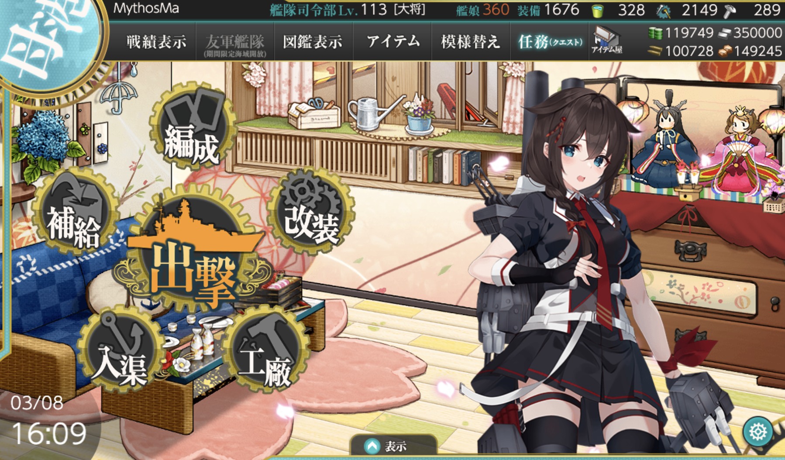

# 2025年春季活动 咸鱼打

--- 

#### 进活动时资源



---

## E1-甲

### 开新出发点阶段-E点S胜3次-C点S胜3次-到达C2点2次

#### 开新出发点阶段-E点S胜3次

- 当前使用配置(鼠标悬停可看到阵容对应的阶段)


- 推图情况
- A 能动 --> D 警戒 --> D3 轮型 --> E 单横
```
陆航1队(3航程) 40 --> D3 
陆航2队 守家
```

1. A | D-SS | D3-A  | E-SS
2. A | D-SS | D3-SS | E-SS
3. A | D-SS | D3-SS | E-SS

#### 开新出发点阶段-C点S胜3次

- 当前使用配置(鼠标悬停可看到阵容对应的阶段)


- 推图情况
- A 能动 --> B 无战斗 ---> B2 轮型 ---> C 单纵
```
陆航1队(5航程) 04 --> C
陆航2队 守家
```

1. A | B | B2-SS | C-SS
2. A | B | B2-SS | C-S
3. A | B | B2-A  | C-SS

#### 开新出发点阶段-到达C2点2次

- 当前使用配置(鼠标悬停可看到阵容对应的阶段)


- 推图情况
- A 能动 --> B 无战斗 ---> B2 轮型 ---> C1 单纵 ---> C2 油点无战斗
```
陆航1队 退避
陆航2队 守家
```

1. A | B | B2-SS | C1-A | C2
2. A | B | B2-A  | C1-C | C2

### 开BOSS点-H点S胜3次-到达C2点1次-G点S胜3次

#### 开BOSS点-H点S胜3次

- 当前使用配置(鼠标悬停可看到阵容对应的阶段)


- 推图情况
- A 能动 --> D 警戒 --> D3 轮型 --> E 警戒 --> H 单纵
```
陆航1队(5航程) 04 --> H
陆航2队 守家
```

1. A | D-SS | D3-SS | E-S  | H-S
2. A | D-SS | D3-B  | E-SS | H-S
3. A | D-A  | D3-SS | E-SS | H-SS

#### 开BOSS点-到达C2点1次

- 当前使用配置(鼠标悬停可看到阵容对应的阶段)


- 推图情况
- A 能动 --> B 无战斗 ---> B2 轮型 ---> C1 单纵 ---> C2 油点无战斗
```
陆航1队 休息
陆航2队 守家
```

1. A | B | B2-SS | C1-B | C2

#### 开BOSS点-G点S胜3次

- 当前使用配置(鼠标悬停可看到阵容对应的阶段)


- 推图情况
- F 无战斗 --> C 警戒阵 ---> G 单纵
```
陆航1队(5航程) 04 --> G点
陆航2队 守家
```

1. F | C-SS | G-SS
2. F | C-A  | G-SS
3. F | C-A  | G-S

### 磨血斩杀

- 当前使用配置(鼠标悬停可看到阵容对应的阶段)


- 推图情况
- F 无战斗 --> C 警戒阵 ---> G 警戒阵 ---> M 警戒阵并拉烟 ---> O 单纵阵
```
陆航1队(5航程) 04 --> O点
陆航2队 守家
```

1. F | C-SS | G-S  | M-C | O-A
2. F | C-SS | G-SS | M-D 酒匂大破撤退
3. F | C-SS | G-S  | M-B | O-S
4. F | C-SS | G-S  | M-B | O-S
5. F | C-SS | G-S  | M-B | O-A
6. F | C-S  | G-SS | M-B | O-A
7. F | C-SS | G-S  | M-D | O-S
8. F | C-S  | G-SS | M-B | O-S

--- 

## E2-丙

### P1-1阶段解谜-F2点A胜2次-F1点A胜2次-C点S胜2次

#### P1-1阶段解谜-F2点A胜2次

- 当前使用配置(鼠标悬停可看到阵容对应的阶段)


- 推图情况
- A 无战斗 --> A2 轮型阵 --> B 能动 --> D 警戒阵 --> E 能动 --> F 轮型阵 --> F2 单纵阵
```
陆航1队(3航程) 04 --> F2点
陆航2队 守家
```

1. A | A2-A  | B | D-SS | E | F-SS | F2-S
2. A | A2-SS | B | D-S 苍龙大破撤退
3. A | A2-SS | B | D-S  | E | F-SS | F2-S 

#### P1-1阶段解谜-F1点A胜2次

- 当前使用配置(鼠标悬停可看到阵容对应的阶段)


- 推图情况
- A 无战斗 --> A2 轮型阵 --> B 能动 --> D 警戒阵 --> E 能动 --> F1 单纵阵
```
陆航1队(4航程) 013 --> F1点
陆航2队 守家
```

1. A | A2-SS | B | D-S 苍龙大破撤退
2. A | A2-A  | B | D-S 比叡、鬼怒大破撤退
3. A | A2-SS | B | D-A  | E | F1-S
4. A | A2-SS | B | D-SS | E | F1-S

#### P1-1阶段解谜-C点S胜2次

- 当前使用配置(鼠标悬停可看到阵容对应的阶段)


- 推图情况
- A 无战斗 --> A2 轮型阵 --> B 能动 --> C 单纵阵
```
陆航1队(7航程) 013 --> C点
陆航2队 守家
```

1. A | A2-SS | B | C-SS
2. A | A2-SS | B | C-SS

### P1-2阶段解谜-K点A胜3次

- 当前使用配置(鼠标悬停可看到阵容对应的阶段)


- 推图情况
- A 无战斗 --> A2 轮型阵 --> B 能动 --> C 警戒阵 --> H 警戒阵 --> I 警戒阵 --> K 单纵阵
```
陆航1队(6航程) 013 --> K点
陆航2队 守家
```

1. A | A2-SS | B | C-SS | H-A | I-S  | K-S
2. A | A2-SS | B | C-S  | H-A | I-SS | K-S
3. A | A2-A  | B | C-S  | H-A | I-S  | K-S

### P1-运输

- 当前使用配置(鼠标悬停可看到阵容对应的阶段)


- 推图情况（水打联合）
- L 无战斗 --> M 第四阵 --> N 能动 --> P 第一阵并拉烟 --> R 第四阵 --> T 运输点无战斗 --> U 第四阵
```
陆航1队(3航程) 04 --> U点
陆航2队(7航程) 112 --> M点
```

1. L | M-SS | N | P-B | R-B  | T | U-S
2. L | M-SS | N | P-A | R-SS | T | U-S
3. L | M-SS | N | P-B | R-S  | T | U-S 

### P2-磨血斩杀

- 当前使用配置(鼠标悬停可看到阵容对应的阶段)


- 推图情况（水打联合）
- L 无战斗 --> M 第四阵 --> N 能动 --> O 第三阵 --> Q 第一阵 --> V 第四阵并拉烟 --> V1 无战斗 --> W 第一阵
```
陆航1队(5航程) 1陆侦3东海 --> W点
陆航2队(7航程) 112 --> M点
或b
陆航2队(5航程) 1陆侦3东海 --> W点
```

1. L | M-SS | N | O-A  | Q-SS | V-C 睦月大破撤退
2. L | M-SS | N | O-SS | Q-SS | V-A 曙大破撤退
3. L | M-S  | N | O-SS | Q-SS | V-C 秋月大破撤退
4. L | M-SS | N | O-SS | Q-SS | V-C | W-B
5. L | M-SS | N | O-SS | Q-SS | V-A | W-B
6. L | M-SS | N | O-SS | Q-SS | V-B | W-B
7. L | M-SS | N | O-SS | Q-SS | V-C | W-B
8. L | M-A  | N | O-SS | Q-SS | V-B | W-B
9. L | M-A 爱宕大破撤退
10. L | M-A | N | O-A  | Q-SS | V-B | W-B

--- 

## E3-乙

### P1-解谜-D3点A胜1次-B4点A胜2次-E2点A胜2次

#### P1-解谜-D3点A胜1次

- 当前使用配置(鼠标悬停可看到阵容对应的阶段)


- 推图情况
- A 能动 --> C 能动 --> D 警戒阵 --> D3 单横阵
```
陆航1队(4航程) 04 --> D点
陆航2队 守家
```

1. A | C | D-SS | D3-SS

#### P1-解谜-B4点A胜1次

- 当前使用配置(鼠标悬停可看到阵容对应的阶段)


- 推图情况
- A 能动 --> B 警戒阵 --> B2 警戒阵 --> B4 单纵阵
```
陆航1队(8航程) 1大艇3陆攻 --> B4点
陆航2队 守家
```

1. A | B-B | B2-S | B4-A

---

## E4-丙

---

## E5-丙