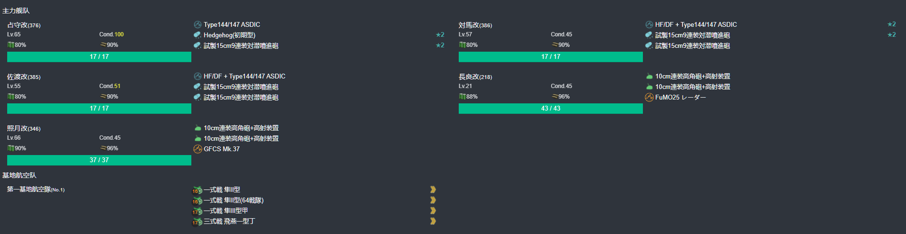

# 2025年春季活动 咸鱼打

--- 

#### 进活动时资源


---

## E1-甲

### 开新出发点阶段-E点S胜3次-C点S胜3次-到达C2点2次

#### 开新出发点阶段-E点S胜3次

- 当前使用配置(鼠标悬停可看到阵容对应的阶段)



- 推图情况
- A 能动 --> D 警戒 --> D3 轮型 --> E 单横
```
陆航1队(3航程) 40 --> D3 
陆航2队 守家
```

1. A | D-SS | D3-A  | E-SS
2. A | D-SS | D3-SS | E-SS
3. A | D-SS | D3-SS | E-SS

#### 开新出发点阶段-C点S胜3次

- 当前使用配置(鼠标悬停可看到阵容对应的阶段)


- 推图情况
- A 能动 --> B 无战斗 ---> B2 轮型 ---> C 单纵
```
陆航1队(5航程) 04 --> C
陆航2队 守家
```

1. A | B | B2-SS | C-SS
2. A | B | B2-SS | C-S
3. A | B | B2-A  | C-SS

#### 开新出发点阶段-到达C2点2次

- 当前使用配置(鼠标悬停可看到阵容对应的阶段)


- 推图情况
- A 能动 --> B 无战斗 ---> B2 轮型 ---> C1 单纵 ---> C2 油点无战斗
```
陆航1队 退避
陆航2队 守家
```

1. A | B | B2-SS | C1-A | C2
2. A | B | B2-A  | C1-C | C2

### 开BOSS点-H点S胜3次-到达C2点1次-G点S胜三次

#### 开BOSS点-H点S胜3次

- 当前使用配置(鼠标悬停可看到阵容对应的阶段)


- 推图情况
- A 能动 --> D 警戒 --> D3 轮型 --> E 警戒 --> H 单纵
```
陆航1队(5航程) 04 --> H
陆航2队 守家
```

1. A | D-SS | D3-SS | E-S | H-S
2. A | D-

--- 

## E2-丙

--- 

## E3-丙

---

## E4-丙

---

## E5-丙