# 2025年秋季活动 咸鱼打

--- 

#### 进活动时资源

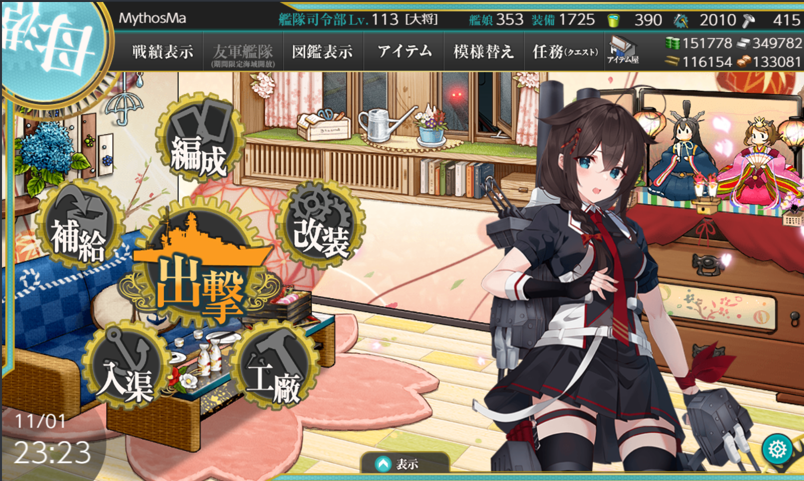

---

## E1-甲

### E1-P1-开路-E点S胜1次-I点S胜1次-D点S胜1次-N点S胜1次

#### E1-P1-开路-E点S胜1次

- 当前使用配置(鼠标悬停可看到阵容对应的阶段)

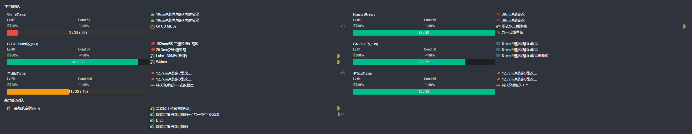

- 推图情况
- A 能动 --> B 警戒 --> E 单纵
```
陆航1队 13 E点
陆航2队 待机
```

1. A | B-S | E-S

#### E1-P1-开路-I点S胜1次

- 当前使用配置(鼠标悬停可看到阵容对应的阶段)

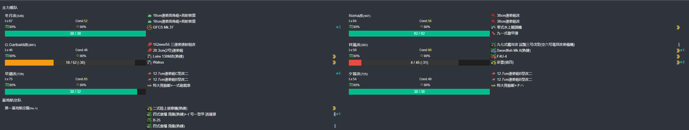

- 推图情况
- A 能动 --> F 能动 --> G 警戒 --> I 单纵
```
陆航1队 13 I点
陆航2队 待机
```

1. A | F | G-A | I-S

#### E1-P1-开路-D点S胜1次

- 当前使用配置(鼠标悬停可看到阵容对应的阶段)

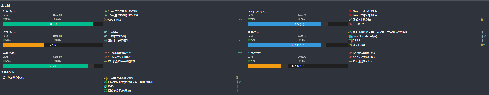

- 推图情况
- A 能动 --> B 单纵 --> C 单横 --> D 单纵
```
陆航1队 13 D点
陆航2队 待机
```

1. A | B-C  凤翔大破撤退
2. A | B-B | C-S 夕暮大破撤退
3. A | B-A | C-SS | D-S

#### E1-P1-开路-N点S胜1次

- 当前使用配置(鼠标悬停可看到阵容对应的阶段)

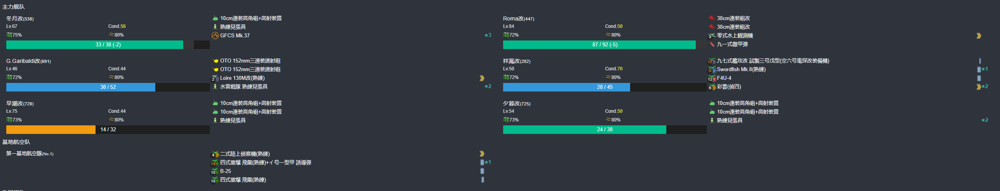

- 推图情况
- A 能动 --> F 能动 --> J 单纵 --> L 能动 --> M 单横 --> N 单纵
```
陆航1队 13 N点
陆航2队 守家
```

1. A | F | J-A | L | M-SS | N-A
2. A | F | J-S | L | M-SS | N-A
3. A | F | J-S | L | M-A  | N-S

### E1-P1-磨血斩杀

- 当前使用配置(鼠标悬停可看到阵容对应的阶段)

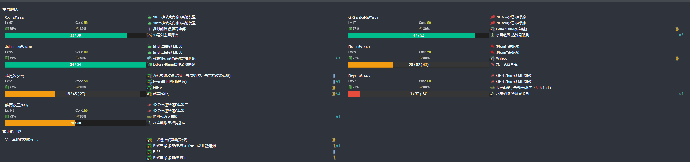

- 推图情况
- A 能动 --> F 能动 --> J 单纵 --> L 能动 --> M 单横 --> O 单纵
```
陆航1队 13 O点
陆航2队 守家
```

1. A | F | J-A  | L | M-B | O-S
2. A | F | J-A  | L | M-B | O-A
3. A | F | J-SS | L | M-B | O-A
4. A | F | J-S  | L | M-A | O-A
5. A | F | J-A  | L | M-S | O-S

### E1-P2-开路-守家空优2次-S点空优2次

#### E1-P2-开路-守家空优2次

- 当前使用配置(鼠标悬停可看到阵容对应的阶段)

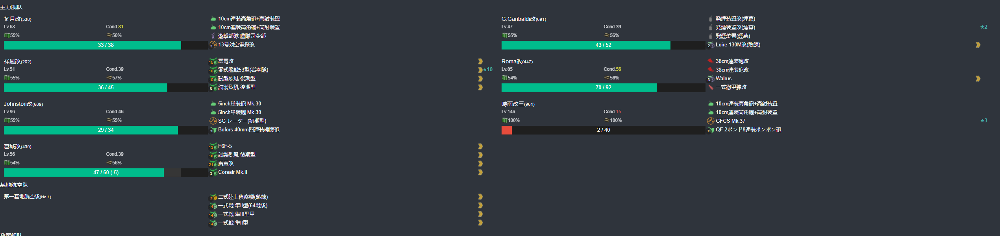

- 推图情况
- A 能动 --> F 能动 --> J 单纵 --> L 能动 --> M 单横 --> O 单纵
```
陆航1队 守家
陆航2队 守家
```

1. A | F | J-S | L | M-S 守家空优
2. A | F | J-S 守家空优

#### E1-P2-开路-S点空优2

- 当前使用配置(鼠标悬停可看到阵容对应的阶段)


- 推图情况
- A 能动 --> F 能动 --> J 警戒 --> L 能动 --> P 警戒（拉烟） --> R 轮型 --> S 轮型
```
陆航1队 130 S点
陆航2队 守家
```

1. A | F | J-B | L | P-B | R-SS | S-A 空优
2. A | F | J-B | L | P-B | R-S  | s-A 空优

### E1-P2-磨血斩杀

#### E1-P2-磨血

- 当前使用配置(鼠标悬停可看到阵容对应的阶段)

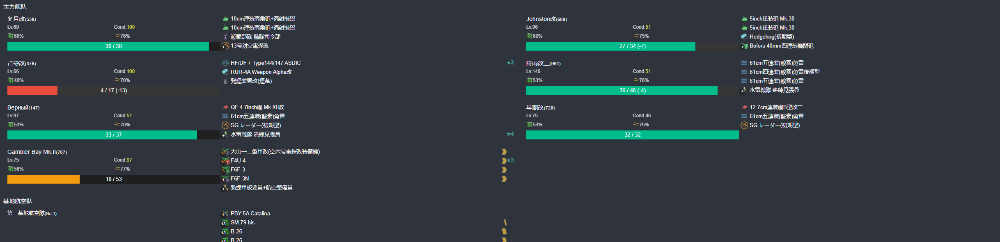

- 推图情况
- A 能动 --> F 能动 --> J 警戒 --> K 警戒 --> Q 警戒 --> S 轮型（拉烟） --> T 警戒 --> V 单纵
```
陆航1队 103 V点
陆航2队 守家
```

1. A | F | J-B | K-A  | Q-SS | S-A  | T-S  | V-A
2. A | F | J-A | K-A  | Q-S  | S-SS | T-SS | U
3. A | F | J-A | K-A  | Q-A  | S-SS | T-SS | V-A
4. A | F | J-B | K-SS | Q-SS | S-SS | T-SS | V-A
5. A | F | J-B | K-SS | Q-SS | S-A  | T-SS | V-A
6. A | F | J-A | K-SS | Q-SS | S-B  | T-SS | V-A

#### E1-P2-削甲-O点A胜2次-P点A胜2次-守家空优2次

##### E1-P2-削甲-O点A胜2次-守家空优2次

- 当前使用配置(鼠标悬停可看到阵容对应的阶段)


- 推图情况
- A 能动 --> F 能动 --> J 单纵 --> L 能动 --> M 单横 --> O 单纵
```
陆航1队 守家
陆航2队 守家
```

1. A | F | J-S      | L | M-SS 空优  | O-A
2. A | F | J-S 空优 | L | M-S        | O-A

##### E1-P2-削甲-P点A胜2次

- 当前使用配置(鼠标悬停可看到阵容对应的阶段)


- 推图情况
- A 能动 --> F 能动 --> J 警戒 --> L 能动 --> P 警戒
```
陆航1队 103 P点
陆航2队 守家
```

1. A | F | J-SS | L | P-A
2. A | F | J-B  | L | P-A

#### E1-P2-斩杀

- 当前使用配置(鼠标悬停可看到阵容对应的阶段)


- 推图情况
- A 能动 --> F 能动 --> J 警戒 --> K 警戒 --> Q 警戒 --> S 轮型（拉烟） --> T 警戒 --> V 单纵
```
陆航1队 103 V点
陆航2队 守家
```

1. A | F | J-B | K-SS | Q-B  | S-SS | T-A  | V-A
2. A | F | J-A | K-SS | Q-SS | S-SS | T-S  | V-A
3. A | F | J-A 响大破撤退
4. A | F | J-A | K-SS | Q-SS | S-SS | T-S  | V-A
5. A | F | J-B | K-SS | Q-SS | S-SS | T-SS | V-A
6. A | F | J-S | K-SS | Q-S  | S-SS | T-A  | V-S

---

## E2-甲

### E2-P1-磨血斩杀

- 当前使用配置(鼠标悬停可看到阵容对应的阶段)

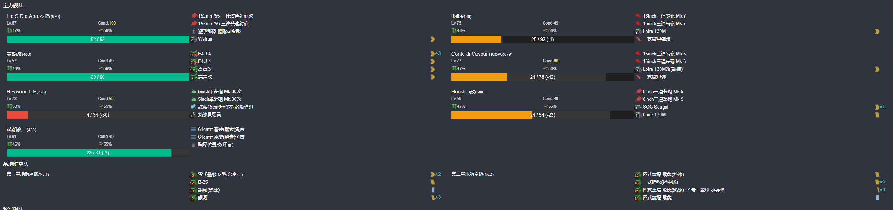

- 推图情况
- A 能动 --> B 警戒 --> D 警戒 --> K 轮型（拉烟） --> L 警戒 --> M 单纵
```
陆航1队 13 L点 5航程
陆航2队 04 M点 4航程
```

1. A | B-S | D-A | K-SS | L-S  | M-S
2. A | B-S | D-B | K-SS | L-A  | M-S
3. A | B-S | D-B | K-SS | L-S  | M-S
4. A | B-S | D-B | K-SS | L-SS | M-SS
5. A | B-S | D-B | K-A  | L-A  | M-S

### E2-P2-开路1阶段-J点S胜1次

- 当前使用配置(鼠标悬停可看到阵容对应的阶段)

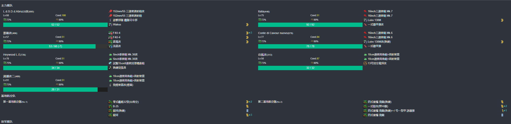

- 推图情况
- A 能动 --> F 警戒 --> I 警戒（拉烟） --> J 单纵
```
陆航1队 4东海 I点
陆航2队 04 J点 5航程
```

1. A | F-SS | I-SS | J-S

### E2-P2-开路2阶段-R点S胜1次-E点S胜1次-Q点S胜2次-守家空优2次

#### E2-P2-开路2阶段-R点S胜1次

- 当前使用配置(鼠标悬停可看到阵容对应的阶段)


- 推图情况
- A 能动 --> F 警戒 --> I 警戒（拉烟） --> J 警戒 --> R 单纵
```
陆航1队 4东海 I点
陆航2队 04 J点 5航程
```

1. A | F-S | I-SS | J-SS | R-S

#### E2-P2-开路2阶段-E点S胜1次

- 当前使用配置(鼠标悬停可看到阵容对应的阶段)

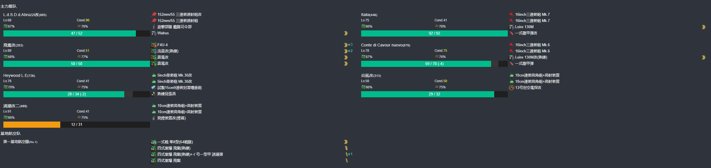

- 推图情况
- A 能动 --> B 警戒 --> D 警戒 --> K 轮型（拉烟） --> E 单纵
```
陆航1队 04 E点 6航程
陆航2队 守家
```

1. A | B-S | D-B | K-SS | E-S

#### E2-P2-开路2阶段-守家空优2次

- 当前使用配置(鼠标悬停可看到阵容对应的阶段)

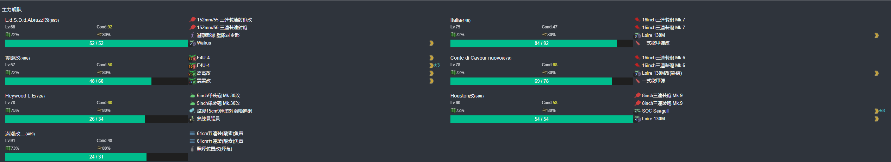

- 推图情况
- A 能动 --> B 警戒 --> D 警戒 --> K 轮型（拉烟） --> L 警戒 --> M 单纵
```
陆航1队 守家
陆航2队 守家
```

1. A | B-S | D-B | K-A  | L-S 空优
2. A | B-S | D-A | K-SS | L-S 空优

#### E2-P2-开路2阶段-Q点S胜2次

- 当前使用配置(鼠标悬停可看到阵容对应的阶段)

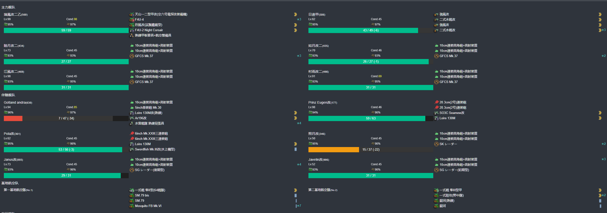

- 推图情况
- K 第三阵 --> O 第四阵 --> P 无战斗 --> Q 第四阵
```
陆航1队 13 O点 6航程
陆航2队 13 Q点 4航程
```

1. K-SS | O-B | P | Q-S
2. K-A  | O-C | P | Q-S

