# 2025年秋季活动 咸鱼打

--- 

#### 进活动时资源


---

## E1-甲

### E1-P1-开路-E点S胜1次-I点S胜1次-D点S胜1次-N点S胜1次

#### E1-P1-开路-E点S胜1次

- 当前使用配置(鼠标悬停可看到阵容对应的阶段)


- 推图情况
- A 能动 --> B 警戒 --> E 单纵
```
陆航1队 13 E点
陆航2队 待机
```

1. A | B-S | E-S

#### E1-P1-开路-I点S胜1次

- 当前使用配置(鼠标悬停可看到阵容对应的阶段)


- 推图情况
- A 能动 --> F 能动 --> G 警戒 --> I 单纵
```
陆航1队 13 I点
陆航2队 待机
```

1. A | F | G-A | I-S

#### E1-P1-开路-D点S胜1次

- 当前使用配置(鼠标悬停可看到阵容对应的阶段)


- 推图情况
- A 能动 --> B 单纵 --> C 单横 --> D 单纵
```
陆航1队 13 D点
陆航2队 待机
```

1. A | B-C  凤翔大破撤退
2. A | B-B | C-S 夕暮大破撤退
3. A | B-A | C-SS | D-S

#### E1-P1-开路-N点S胜1次

- 当前使用配置(鼠标悬停可看到阵容对应的阶段)


- 推图情况
- A 能动 --> F 能动 --> J 单纵 --> L 能动 --> M 单横 --> N 单纵
```
陆航1队 13 N点
陆航2队 守家
```

1. A | F | J-A | L | M-SS | N-A
2. A | F | J-S | L | M-SS | N-A
3. A | F | J-S | L | M-A  | N-S

### E1-P1-磨血斩杀

- 当前使用配置(鼠标悬停可看到阵容对应的阶段)


- 推图情况
- A 能动 --> F 能动 --> J 单纵 --> L 能动 --> M 单横 --> O 单纵
```
陆航1队 13 O点
陆航2队 守家
```

1. A | F | J-A  | L | M-B | O-S
2. A | F | J-A  | L | M-B | O-A
3. A | F | J-SS | L | M-B | O-A
4. A | F | J-S  | L | M-A | O-A
5. A | F | J-A  | L | M-S | O-S

### E1-P2-开路-守家空优2次-S点空优2次

#### E1-P2-开路-守家空优2次

- 当前使用配置(鼠标悬停可看到阵容对应的阶段)


- 推图情况
- A 能动 --> F 能动 --> J 单纵 --> L 能动 --> M 单横 --> O 单纵
```
陆航1队 守家
陆航2队 守家
```

1. A | F | J-S | L | M-S 守家空优
2. A | F | J-S 守家空优

#### E1-P2-开路-S点空优2

- 当前使用配置(鼠标悬停可看到阵容对应的阶段)


- 推图情况
- A 能动 --> F 能动 --> J 警戒 --> L 能动 --> P 警戒（拉烟） --> R 轮型 --> S 轮型
```
陆航1队 130 S点
陆航2队 守家
```

1. A | F | J-B | L | P-B | R-SS | S-A 空优
2. A | F | J-B | L | P-B | R-S  | s-A 空优

### E1-P2-磨血斩杀

#### E1-P2-磨血

- 当前使用配置(鼠标悬停可看到阵容对应的阶段)


- 推图情况
- A 能动 --> F 能动 --> J 警戒 --> K 警戒 --> Q 警戒 --> S 轮型（拉烟） --> T 警戒 --> V 单纵
```
陆航1队 103 V点
陆航2队 守家
```

1. A | F | J-B | K-A  | Q-SS | S-A  | T-S  | V-A
2. A | F | J-A | K-A  | Q-S  | S-SS | T-SS | U
3. A | F | J-A | K-A  | Q-A  | S-SS | T-SS | V-A
4. A | F | J-B | K-SS | Q-SS | S-SS | T-SS | V-A
5. A | F | J-B | K-SS | Q-SS | S-A  | T-SS | V-A
6. A | F | J-A | K-SS | Q-SS | S-B  | T-SS | V-A

#### E1-P2-削甲-O点A胜2次-P点A胜2次-守家空优2次

##### E1-P2-削甲-O点A胜2次-守家空优2次

- 当前使用配置(鼠标悬停可看到阵容对应的阶段)


- 推图情况
- A 能动 --> F 能动 --> J 单纵 --> L 能动 --> M 单横 --> O 单纵
```
陆航1队 守家
陆航2队 守家
```

1. A | F | J-S      | L | M-SS 空优  | O-A
2. A | F | J-S 空优 | L | M-S        | O-A

##### E1-P2-削甲-P点A胜2次

- 当前使用配置(鼠标悬停可看到阵容对应的阶段)


- 推图情况
- A 能动 --> F 能动 --> J 警戒 --> L 能动 --> P 警戒
```
陆航1队 103 P点
陆航2队 守家
```

1. A | F | J-SS | L | P-A
2. A | F | J-B  | L | P-A

#### E1-P2-斩杀

- 当前使用配置(鼠标悬停可看到阵容对应的阶段)


- 推图情况
- A 能动 --> F 能动 --> J 警戒 --> K 警戒 --> Q 警戒 --> S 轮型（拉烟） --> T 警戒 --> V 单纵
```
陆航1队 103 V点
陆航2队 守家
```

1. A | F | J-B | K-SS | Q-B  | S-SS | T-A  | V-A
2. A | F | J-A | K-SS | Q-SS | S-SS | T-S  | V-A
3. A | F | J-A 响大破撤退
4. A | F | J-A | K-SS | Q-SS | S-SS | T-S  | V-A
5. A | F | J-B | K-SS | Q-SS | S-SS | T-SS | V-A
6. A | F | J-S | K-SS | Q-S  | S-SS | T-A  | V-S

---

## E2-甲

### E2-P1-磨血斩杀

- 当前使用配置(鼠标悬停可看到阵容对应的阶段)


- 推图情况
- A 能动 --> B 警戒 --> D 警戒 --> K 轮型（拉烟） --> L 警戒 --> M 单纵
```
陆航1队 13 L点 5航程
陆航2队 04 M点 4航程
```

1. A | B-S | D-A | K-SS | L-S  | M-S
2. A | B-S | D-B | K-SS | L-A  | M-S
3. A | B-S | D-B | K-SS | L-S  | M-S
4. A | B-S | D-B | K-SS | L-SS | M-SS
5. A | B-S | D-B | K-A  | L-A  | M-S

### E2-P2-开路1阶段-J点S胜1次

- 当前使用配置(鼠标悬停可看到阵容对应的阶段)


- 推图情况
- A 能动 --> F 警戒 --> I 警戒（拉烟） --> J 单纵
```
陆航1队 4东海 I点
陆航2队 04 J点 5航程
```

1. A | F-SS | I-SS | J-S

### E2-P2-开路2阶段-R点S胜1次-E点S胜1次-Q点S胜2次-守家空优2次

#### E2-P2-开路2阶段-R点S胜1次

- 当前使用配置(鼠标悬停可看到阵容对应的阶段)


- 推图情况
- A 能动 --> F 警戒 --> I 警戒（拉烟） --> J 警戒 --> R 单纵
```
陆航1队 4东海 I点
陆航2队 04 J点 5航程
```

1. A | F-S | I-SS | J-SS | R-S

#### E2-P2-开路2阶段-E点S胜1次

- 当前使用配置(鼠标悬停可看到阵容对应的阶段)


- 推图情况
 
```
陆航1队 04 E点 6航程
陆航2队 守家
```

1. A | B-S | D-B | K-SS | E-S

#### E2-P2-开路2阶段-守家空优2次

- 当前使用配置(鼠标悬停可看到阵容对应的阶段)


- 推图情况
- A 能动 --> B 警戒 --> D 警戒 --> K 轮型（拉烟） --> L 警戒 --> M 单纵
```
陆航1队 守家
陆航2队 守家
```

1. A | B-S | D-B | K-A  | L-S 空优
2. A | B-S | D-A | K-SS | L-S 空优

#### E2-P2-开路2阶段-Q点S胜2次

- 当前使用配置(鼠标悬停可看到阵容对应的阶段)


- 推图情况
- K 第三阵 --> O 第四阵 --> P 无战斗 --> Q 第四阵
```
陆航1队 13 O点 6航程
陆航2队 13 Q点 4航程
```

1. K-SS | O-B | P | Q-S
2. K-A  | O-C | P | Q-S

### E2-P2-运输

- 当前使用配置(鼠标悬停可看到阵容对应的阶段)

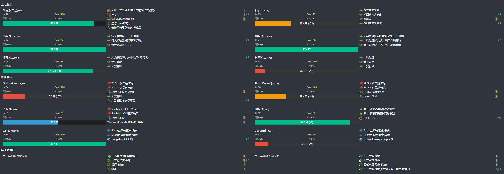

- 推图情况
- K 第三阵 --> P 无战斗 --> Q 第四阵 --> T 第一阵 --> V 第四阵 --> W 运输点 --> X 第四阵
```
陆航1队 13 Q点 4航程
陆航2队 04 X点 1航程
```

1. K-SS | P | Q-SS | T-SS | V-S 雅努斯大破撤退
2. K-SS | P | Q-SS | T-S  | V-S | W | X-A
3. K-SS | P | Q-SS | T-A  | V-S | W | X-A
4. K-S  | P | Q-A  | T-S  | V-B 江风、照月大破撤退
5. K-SS | P | Q-A  | T-A  | V-B | W | X-D
6. K-A  | P | Q-B  | T-SS | V-S | W | X-A
7. K-SS | P | Q-S  | T-SS | V-A | W | X-C
8. K-SS | P | Q-S 照月大破撤退
9. K-SS | P | Q-SS | T-SS | V-S | W | X-S
10. K-SS | P | Q-A | T-B  | V-S | W | X-A
11. K-SS | P | Q-A 照月大破撤退
12. K-SS | P | Q-SS | T-A | V-S | W | X-A

### E2-P3-开路-S点S胜1次

- 当前使用配置(鼠标悬停可看到阵容对应的阶段)

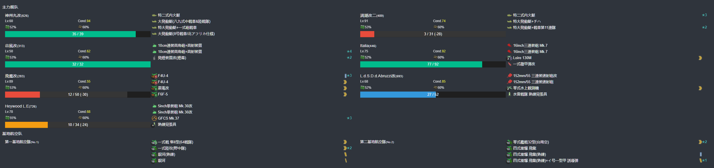

- 推图情况
- A 能动 --> B 警戒 --> D 警戒 --> E 警戒 --> S 单纵
```
陆航1队 13 S点 5航程
陆航2队 13 S点 5航程
```

1. A | B-S  | D-B | E-S 满朝大破撤退
2. A | B-SS | D-B | E-A | S-S

### E2-P3-磨血斩杀

- 当前使用配置(鼠标悬停可看到阵容对应的阶段)
- 

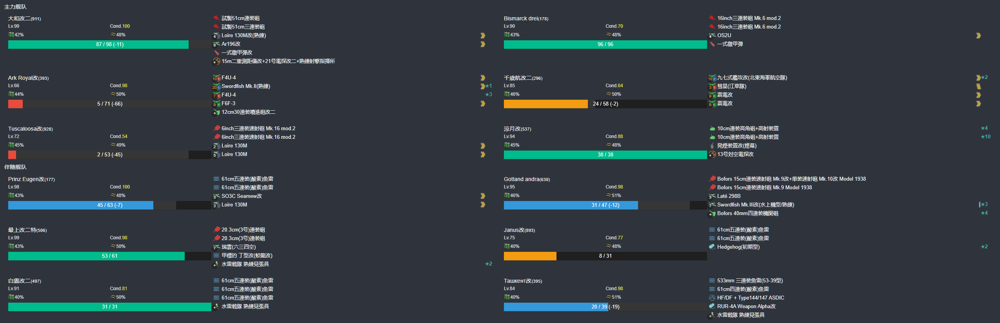

- 推图情况
- K 第三阵 --> O 第二阵 --> P 无战斗 --> Q 第二阵 --> T 第一阵 --> V 第二阵（拉烟） --> Y 第四阵
```
陆航1队 04 Y点 1航程
陆航2队 04 Y点 1航程
```

1. K-SS | O-B | P | Q-S | T-A  | V-S 村雨大破撤退
2. K-A  | O-S | P | Q-S | T-SS | V-A 照月大破撤退
3. K-SS | O-B | P | Q-S | T-A  | V-A | Y-A
4. K-SS | O-B | P | Q-S | T-S 贾努斯大破撤退
5. K-SS | O-B 江风大破撤退
6. K-SS | O-B | P | Q-S 贾努斯大破撤退
7. K-SS | O-C | P | Q-SS | T-A  | V-S 日进、欧根大破撤退
8. K-A  | O-S | P | Q-S  | T-SS | V-B | Y-A
9. K-A  | O-A | P | Q-S 日进大破撤退
10. K-SS | O-S | P | Q-S | T-SS | V-A | Y-A
11. K-SS | O-A | P | Q-S | T-A  | V-B | Y-A
12. K-SS | O-A | P | Q-S 哥特兰大破撤退
13. K-SS | O-A | P | Q-S | T-S  | V-S 最上、塔什干大破撤退
14. K-SS | O-A 白露大破撤退
15. K-SS | O-B | P | Q-S  | T-SS | V-SS | Y-A
16. K-SS | O-A | P | Q-SS | T-S  | V-A  | Y-A
17. K-A  | O-S | P | Q-S 塔什干大破撤退
18. K-SS | O-A | P | Q-S  | T-S  | V-A 最上大破撤退
19. K-A 千岁航中破撤退
20. K-A 白露中破撤退
21. K-SS | O-A | P | Q-S  | T-A | V-A Tuscaloosa大破撤退
22. K-SS | O-S | P | Q-A  | T-A | V-A | Y-A
23. K-SS | O-B | P | Q-S 哥特兰大破撤退
24. K-SS | O-A | P | Q-S  | T-S | V-S 皇家方舟、贾努斯、白露大破撤退
25. K-SS | O-A | P | Q-S 白露大破撤退
26. K-A Tuscaloosa大破撤退
27. K-SS | O-A | P | Q-S  | T-SS | V-A | Y-A

### E2-P3-削甲-M点A胜1次-X点A胜2次-R点A胜1次-S点A胜2次-守家空优2次

#### E2-P3-削甲-M点A胜1次

- 当前使用配置(鼠标悬停可看到阵容对应的阶段)


- 推图情况
- A 能动 --> B 警戒 --> D 警戒 --> K 轮型（拉烟） --> L 警戒 --> M 单纵
```
陆航1队 13 L点 5航程
陆航2队 04 M点 4航程
```

1. A | B-S | D-B | K-A | L-S | M-S


#### E2-P3-削甲-X点A胜2次

- 当前使用配置(鼠标悬停可看到阵容对应的阶段)

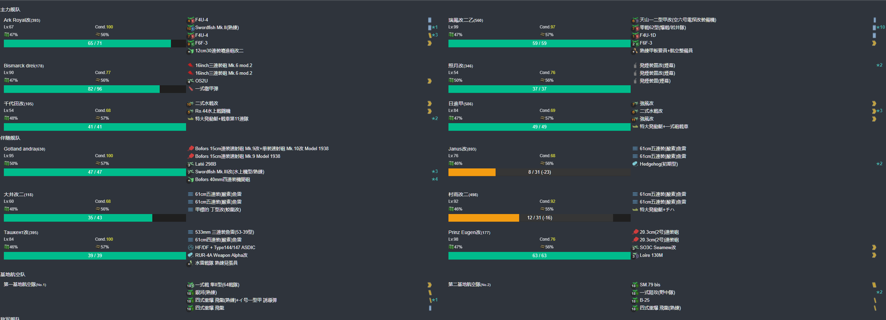

- 推图情况
- K 第三阵 --> P 无战斗 --> Q 第四阵 --> T 第一阵 --> V 第四阵 --> W 运输点 --> X 第四阵
```
陆航1队 13 Q点 4航程
陆航2队 04 X点 1航程
```

1. K-A  | P | Q-S 哥特兰大破撤退
2. K-A  | P | Q-S 欧根大破撤退
3. K-A  | P | Q-S | T-A | V-SS | W | X-A
4. K-SS | P | Q-S 贾努斯大破撤退
5. K-A  | P | Q-S | T-S 贾努斯大破撤退
6. K-A  | P | Q-S 塔斯特大破撤退
7. K-A  | P | Q-S 照月、日进大破撤退
8. K-SS | P | Q-SS | T-S | V-A | W | X-S

#### E2-P3-削甲-R点A胜1次


- 推图情况
- A 能动 --> F 警戒 --> I 警戒（拉烟） --> J 警戒 --> R 单纵
```
陆航1队 4东海 I点
陆航2队 04 J点 5航程
```

1. A | F-S | I- SS| J-S | R-S

#### E2-P3-削甲-S点A胜2次

- 当前使用配置(鼠标悬停可看到阵容对应的阶段)


- 推图情况
- A 能动 --> B 警戒 --> D 警戒 --> E 警戒 --> S 单纵
```
陆航1队 13 S点 5航程
陆航2队 13 S点 5航程
```

1. A | B-S  | D-B | E-B | S-A
2. A | B-SS | D-D | E-A | S-D
3. A | B-S  | D-B | E-B | S-S


#### E2-P3-削甲-守家空优2次

- 当前使用配置(鼠标悬停可看到阵容对应的阶段)


- 推图情况
- A 能动 --> B 警戒 --> D 警戒 --> K 轮型（拉烟） --> L 警戒 --> M 单纵
```
陆航1队 守家
陆航2队 守家
```

1. A | B-S | D-B | K-A | L-A 空优
2. A | B-S | D-B | K-A | L-A 空优

### E2-P3-斩杀

- 当前使用配置(鼠标悬停可看到阵容对应的阶段)

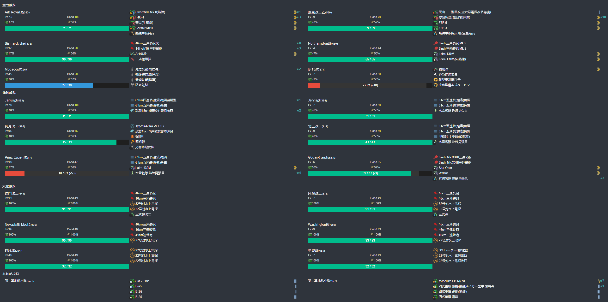

- 推图情况
- K 第三阵 --> O 第二阵 --> P 无战斗 --> Q 第二阵 --> T 第一阵 --> V 第二阵（拉烟） --> Y 第四阵
```
陆航1队 04 Y点 1航程
陆航2队 04 Y点 1航程
```

1. K-SS | O-A 哥特兰大破撤退
2. K-A  | O-A | P | Q-S 贾努斯大破撤退
3. K-A  | O-S 白露大破撤退
4. K-A  | O-A 塔斯特大破撤退
5. K-SS | O-S  贾努斯大破撤退
6. K-SS | O-S | P | Q-S | T-S 白露大破撤退
7. K-A  | O-S | P | Q-S  贾努斯大破撤退
8. K-SS | O-S | P | Q-S | T-A 贾努斯大破撤退
9. K-SS | O-B | P | Q-S 凉月大破撤退
10. K-A | O-S | P | Q-S 塔斯特大破撤退
11. K-A | O-S | P | Q-S | T-SS | V-B | Y-A
12. K-SS | O-S | P | Q-S | T-A | V-B | Y-A
13. K-A  | O-B | P | Q-S | T-S | V-A | Y-A
14. K-SS | O-B | P | Q-S | T-SS | V-S 最上大破撤退
15. K-SS | O-A | P | Q-S | T-S  | V-A 最上大破撤退
16. K-A  | O-A 白露大破撤退
17. K-A  | O-S | P | Q-S | T-S  | V-A 千岁大破撤退
18. K-A  | O-A | P | Q-A | T-B  | V-S 塔斯特大破撤退
19. K-A  | O-A | P | Q-A  | T-A | V-S | Y-C
20. K-A  | P | Q-S | T-SS |  V-A 白露、弗莱彻大破撤退
21. K-A  | P | Q-S | T-S  | V-A 伊13、塔斯特大破撤退
22. K-A  塔斯特中破撤退
23. K-SS | P | Q-S 哥特兰大破撤退
24. K-SS | P | Q-S | T-SS | V-S | Y-A
25. K-A  | P | Q-S 弗莱彻大破撤退
26. K-A  | P | Q-SS | T-S 白露大破撤退
27. K-SS | P | Q-SS | T-S | V-S | Y-A
28. K-A  | P | Q-S  | T-SS | V-A 塔斯特、弗莱彻大破撤退
29. K-A  | P | Q-S 弗莱彻大破撤退
30. K-SS | P | Q-S 塔斯特大破撤退
31. K-SS | P | Q-SS | T-S | V-A 哥特兰大破撤退
32. K-A  | P | Q-S  | T-SS | V-S | Y-A
33. K-A  | P | Q-S 白露大破撤退
34. K-A  | P | Q-S  | T-S  | V-A 哥特兰、白露大破撤退
35. K-A  | O-A | P | Q-S | T-B | V-S 贾努斯大破撤退
36. K-A  | O-A 贾努斯、初月大破撤退
37. K-A  | O-A | P | Q-S | T-SS | V-SS | Y-A
38. K-A  | O-B 初月大破撤退
39. K-B 皇家方舟大破撤退
40. K-A  | O-A | P | Q-S 哥特兰大破撤退
41. K-A  | O-A | P | Q-S | T-S  | V-C Tuscaloosa 初月大破撤退
42. K-B 伊13、瑞凤中破撤退
43. K-SS | P | Q-S  | T-S | V-A 贾努斯大破撤退
44. K-A  | P | Q-SS | T-S | V-S | Y-A
45. K-A  | P | Q-S  | T-A | V-S 伊13、北上、哥特兰、欧根大破撤退
46. K-A 伊13大破撤退
47. K-SS | P | Q-S  | T-S 贾努斯大破撤退
48. K-A  | P | Q-S  | T-S 贾努斯大破撤退
49. K-SS | P | Q-S  | T-SS | V-S | Y-A
50. K-SS | P | Q-SS | T-B  | V-S 北上大破撤退
51. K-SS | P | Q-S 北上大破撤退
52. K-A 南安普顿大破撤退
53. K-A  | P | Q-SS | T-A | V-A | Y-S Eidsvold

---

## E3-乙

### E3-P1-开路-A2点S胜2次-C2点S胜2次

#### E3-P1-开路-A2点S胜2次

- 当前使用配置(鼠标悬停可看到阵容对应的阶段)

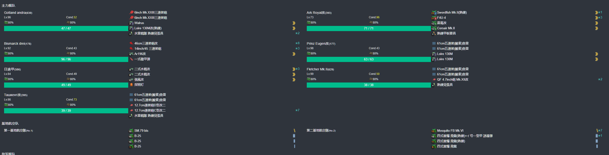

- 推图情况
- A 警戒 --> A1 能动 --> A2 单纵 
```
陆航1队 04 A2点 4航程
陆航2队 04 A2点 4航程
```

1. A-SS | A1 | A2-S
2. A-SS | A1 | A2-SS

#### E3-P1-开路-C2点S胜2次

- 当前使用配置(鼠标悬停可看到阵容对应的阶段)

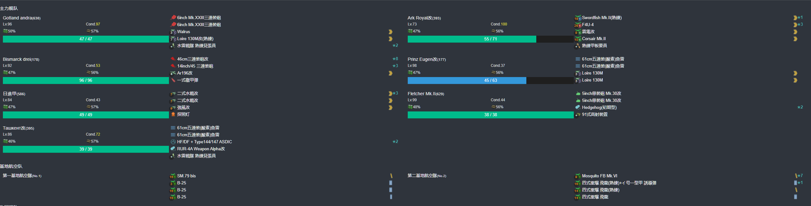

- 推图情况
- A 警戒 --> A1 能动 --> B 警戒 --> C 警戒 --> C1 轮型 --> C2 单纵
```
陆航1队 04 A2点 4航程
陆航2队 04 A2点 4航程
```

1. A-SS | A1 | B-SS | C-S  | C1-A  | C2-SS
2. A-SS | A1 | B-S  | C-SS | C1-SS | C2-SS


### E3-P1-磨血斩杀

- 当前使用配置(鼠标悬停可看到阵容对应的阶段)

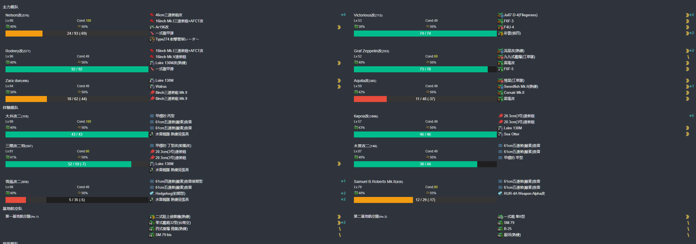

- 推图情况
- E 第一阵 --> F 能动 --> H 第三阵 --> I 第一阵 --> J 第二阵 --> K 第二阵 --> M 第四阵
```
陆航1队 13 M点 6航程
陆航2队 13 M点 6航程
```

1. E-A  | F | H-A  | I-SS | J-SS | K-SS | M-A
2. E-SS | F | H-A  | I-SS | J-SS | K-SS | M-A
3. E-SS | F | H-A  | I-A  | J-S  | K-SS | M-A
4. E-SS | F | H-A  | I-A  | J-S  | K-S  | M-A
5. E-SS | F | H-SS | I-SS | J-SS | K-SS | M-A
6. E-SS | F | H-A  | I-SS | J-S  | K-SS | M-A
7. E-SS | F | H-A 罗伯茨大破撤退
8. E-A  | F | H-A  | I-A 三隈大破撤退
9. E-S 基洛夫大破撤退
10. E-SS | F | H-A | I-A | J-S | K-S | M-C
11. E-S  | F | H-A | I-A | J-SS | K-SS | M-A
12. E-A  | F | H-A | I-S | J-S  | K-SS | M-A
13. E-A  | F | M-A 木曾大破撤退
14. E-A  | F | M-A | I-S | J-S  | K-SS | M-C

切丙

1. E-A | F | H-A | I-S | J-SS | K-SS | M-S
2. E-B | F | H-A | I-B | J-SS | K-SS | M-S

### E3-P2-开路-G2点S胜2次-丙不需要解密

### E3-P2-磨血斩杀

- 当前使用配置(鼠标悬停可看到阵容对应的阶段)


- 推图情况
- A 警戒 --> A1 能动 --> B 单横 --> C 警戒 --> T 警戒 --> W 单纵
```
陆航1队 13 W点 6航程
陆航2队 13 W点 6航程
```

1. A-SS | A1 | B-A  | C-S  | T-S 白露大破撤退 
2. A-S  | A1 | B-A  | C-S  | T-S  | W-S
3. A-SS | A1 | B-A  | C-SS | T-B 日进大破撤退
4. A-SS | A1 | B-B 日进大破撤退
5. A-SS | A1 | B-SS | C-SS | T-S  | W-S
6. A-SS | A1 | B-S  | C-SS | T-S 时雨大破撤退
7. A-SS | A1 | B-SS | C-SS | T-S  | W-SS
8. A-SS | A1 | B-SS | C-SS | T-S  | W-S
9. A-SS | A1 | B-S  | C-SS | T-SS | W-SS
10. A-SS | A1 | B-SS | C-SS | T-SS | W-S

### E3-P3-开路-Q点S胜2次-P点S胜2次-S点S胜2次

#### E3-P3-开路-Q点S胜1次

- 当前使用配置(鼠标悬停可看到阵容对应的阶段)

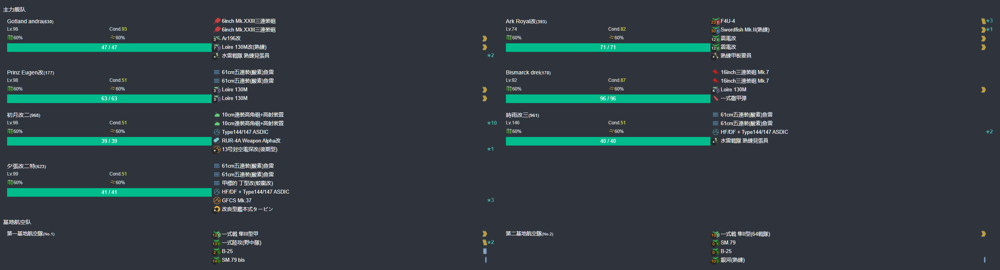

- 推图情况
- A 警戒 --> A1 能动 --> A2 警戒 --> Q 单纵
```
陆航1队 04 A2点 4航程
陆航2队 04 Q点 5航程
```

1. A-SS | A1 | A2-SS | Q-SS

#### E3-P3-开路-P点S胜1次

- 当前使用配置(鼠标悬停可看到阵容对应的阶段)

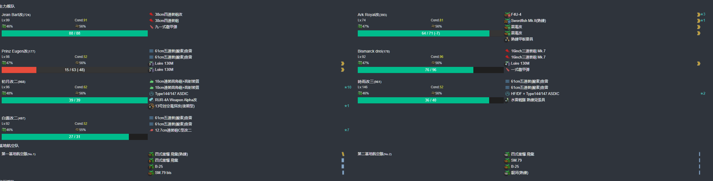

- 推图情况
- A 警戒 --> A1 能动 --> B 单横 --> C 警戒 --> C1 轮型 --> P 单纵
```
陆航1队 04 P点 1航程
陆航2队 04 P点 1航程
```

1. A-S | A1 | B-SS | C-S | C1-A | P-S

#### E3-P3-开路-S点S胜1次

- 当前使用配置(鼠标悬停可看到阵容对应的阶段)

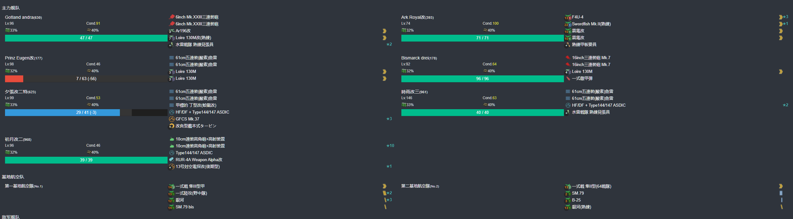

- 推图情况
- E 第一阵 --> F 能动 --> G 第四阵 --> G1 第三阵 --> G2 第四阵 --> S 第二阵
```
陆航1队 退避
陆航2队 退避
```

1. E-SS | F | G-SS | G1-A | G2-SS | S-S

#### E3-P3-磨血斩杀

- 当前使用配置(鼠标悬停可看到阵容对应的阶段)


- 推图情况
- N 第四阵 --> V 第三阵 --> X 第四阵（拉烟） --> O 第一阵 --> Z 第二阵
```
陆航1队 13 X点 5航程（斩杀分一队到N）
陆航2队 04 Z点 5航程
```

1. N-S  | V-SS | X-A  | O-S  | Z-S
2. N-SS | V-SS | X-A  | O-SS | Z-S
3. N-S  | V-SS | X-B 让巴尔大破撤退
4. N-S 莫加多大破撤退
5. N-S  | V-SS | X-A  | O-A 贾维斯大破撤退
6. N-S 贾维斯大破撤退
7. N-S  | V-SS | X-A 赤城大破撤退
8. N-S  | V-A  | X-SS | O-SS | Z-S
9. N-S  | V-SS | X-A  | O-S 北上大破撤退
10. N-S | V-SS | X-S  | O-SS | Z-S
11. N-S | V-A  | X-SS | O-SS | Z-S
12. N-S | V-A  | X-B  | O-S 贾努斯大破撤退
13. N-S 欧根大破撤退
14. N-S 欧根大破撤退
15. N-S | V-A  | X-A  | O-B  | Z-S

## E4-丙

### E4-P1-解密开路-B点S胜2次-E点S胜2次-G点S胜2次-守家空优2次(三队路航只能出击两队，一队守家很容易空优)

#### E4-P1-解密开路-B点S胜2次

- 当前使用配置(鼠标悬停可看到阵容对应的阶段)

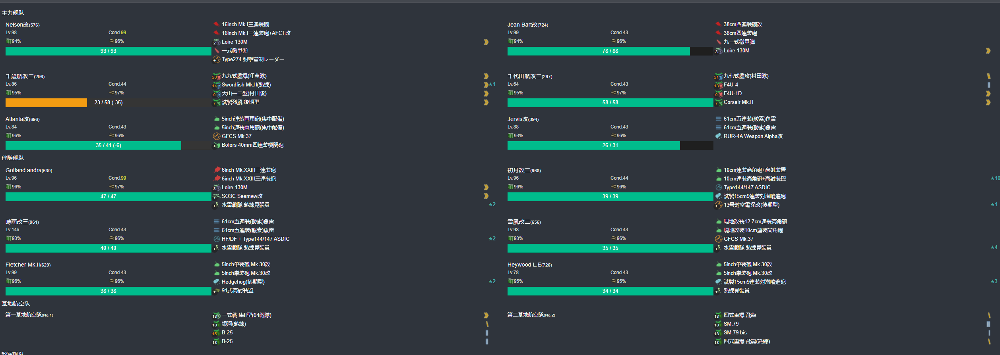

- 推图情况
- A 第三阵 --> B 第四阵
```
陆航1队 随意 B点 7航程
陆航2队 随意 B点 7航程
```

1. A-A  | B-S
2. A-SS | B-S


#### E4-P1-解密开路-E点S胜2次

- 当前使用配置(鼠标悬停可看到阵容对应的阶段)

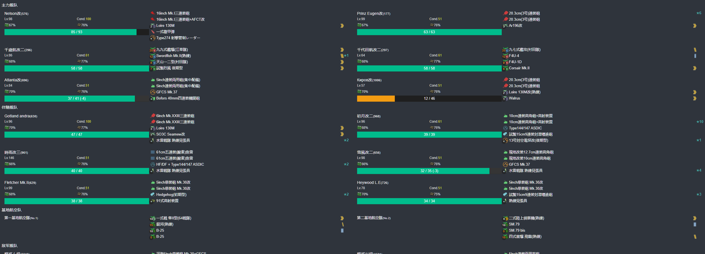

- 推图情况
- B1 第一阵 --> C 能动 --> D 第四阵 --> D2 第三阵 --> E 第四阵
```
陆航1队 04 D点 6航程
陆航2队 04 D点 6航程
```

1. B1-SS | C | D-SS | D2-SS | E-SS
2. B1-SS | C | D-S  | D2-A  | E-S


#### E4-P1-解密开路-G点S胜2次

- 当前使用配置(鼠标悬停可看到阵容对应的阶段)


- 推图情况
- B1 第一阵 --> C 能动 --> F 第四阵 --> F2 第三阵 --> G 第四阵
```
陆航1队 04 F点 3航程
陆航2队 04 F点 3航程
```

1. B1-SS | C | F-SS | F2-A  | G-S
2. B1-SS | C | F-SS | F2-SS | G-S


### E4-P1-运输

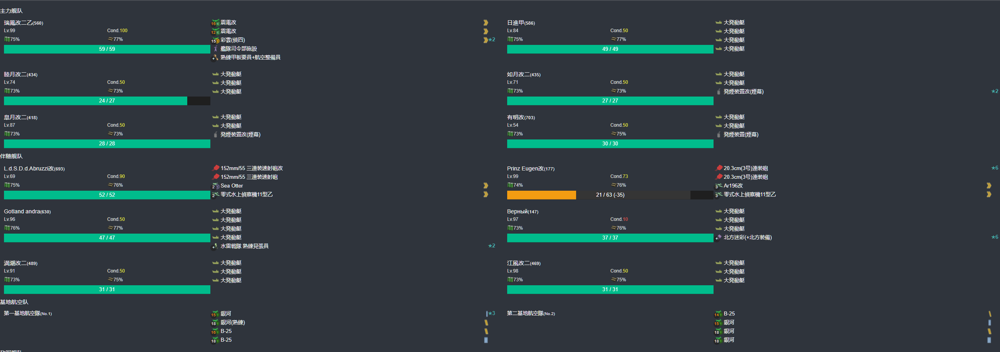

- 推图情况
- A 第三阵 --> B 第四阵（拉烟） --> H 运输点 --> I 第四阵
```
陆航1队 04 B点 6航程
陆航2队 04 I点 6航程
```

1. A-SS | B-A | H | I-S
2. A-SS | B-A | H | I-A
3. A-A  | B-A | H | I-S
4. A-SS | B-A | H | I-S

### E4-P2-磨血斩杀

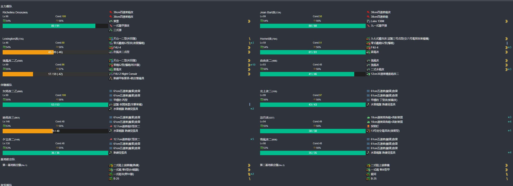

- 推图情况
- F 第四阵 --> F2 第三阵 --> G 第四阵 --> N 第二阵
```
陆航1队 112 N点 6航程
陆航2队 112 N点 6航程
```

1. F-SS | F2-A  | G-S | N-S
2. F-SS | F2-SS | G-S | N-S
3. F-SS | F2-SS | G-S | N-SS
4. F-SS | F2-SS | G-S | N-S
5. F-SS | F2-A  | G-S | N-S

### E4-P3-磨血斩杀

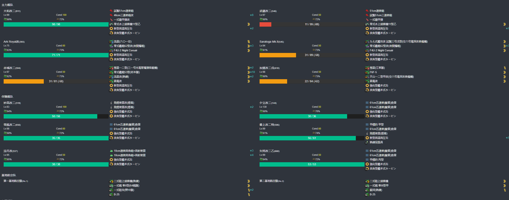

- 推图情况
- O 第一阵 --> P 第三阵 --> Q 第二阵（拉烟） --> S 第三阵 --> T 第四阵
```
陆航1队 112 T点 7航程
陆航2队 112 T点 7航程
```

1. O-B | P-SS | Q-S | S-SS | T-S
2. O-A | P-SS | Q-A | S-SS | T-S
3. O-A | P-A  | Q-A | S-A  | T-S
4. O-A | P-SS | Q-S 矢矧大破撤退
5. O-B 妙高大破撤退
6. O-B | P-A  | Q-S 妙高大破撤退
7. O-B 夕立大破撤退
8. O-B | P-SS | Q-S 凉月大破撤退
9. O-A | P-SS | Q-S 矢矧大破撤退
10. O-B | P-SS | Q-SS | S-SS | T-S
11. O-B | P-SS | Q-S 最上大破撤退
12. O-B | P-SS | Q-S  | S-A  | T-S

### E4-P4-磨血斩杀

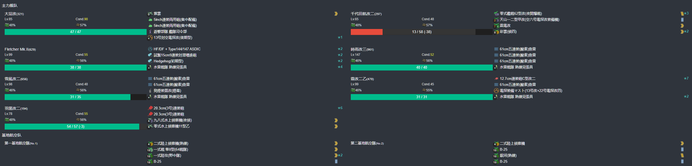

- 推图情况
- B 警戒 --> U 警戒 --> V 轮型（拉烟） --> X 警戒 --> Z 警戒
```
陆航1队 112 Z点 8航程
陆航2队 112 Z点 8航程
```

1. B-A | U-A | V-SS | X-A | Z-S
2. B-A 时雨大破撤退
3. B-A | U-A | V-SS | X-A | Z-S
4. B-A | U-A | V-A  | X-A | Z-S
5. B-A | U-A | V-SS | X-A | Z-SS
6. B-A 千代田大破撤退
7. B-A | U-A | V-SS | X-C | Z-S
8. B-A 千代田大破撤退
9. B-A | U-B | V-A  | X-A | Z-S

## E5-丙

### E5-P1-解密开路-I点S胜2次-H点S胜2次-D点S胜2次-守家空优2次

#### E5-P1-解密开路-I点S胜2次

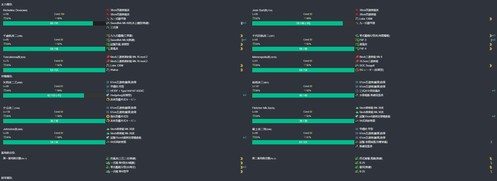

- 推图情况
- A1 第一阵 --> A2 能动 --> E 第三阵 --> I 第二阵（摸）
```
陆航1队 40 A1点 2航程
陆航2队 04 I点 5航程
```

1. A1-SS | A2 | E-SS | I-S
2. A1-SS | A2 | E-A  | I-S

#### E5-P1-解密开路-H点S胜2次

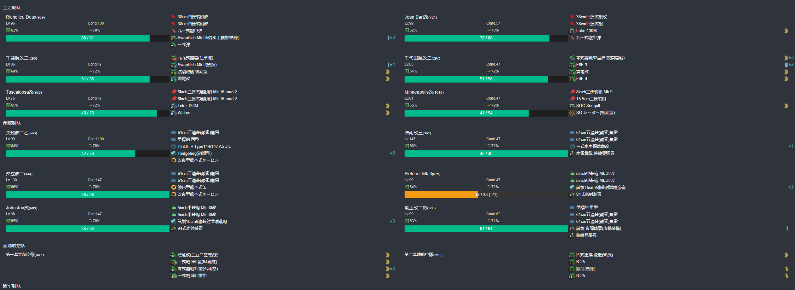

- 推图情况
- A1 第一阵 --> A2 能动 --> B2 第三阵 --> F 第四阵 --> H 第二阵（摸）
```
陆航1队 40 A1点 2航程
陆航2队 04 H点 5航程
```

1. A1-SS | A2 | B2-A | F-S | H-S
2. A1-SS | A2 | B2-A | F-S | H-S

#### E5-P1-解密开路-D点S胜2次

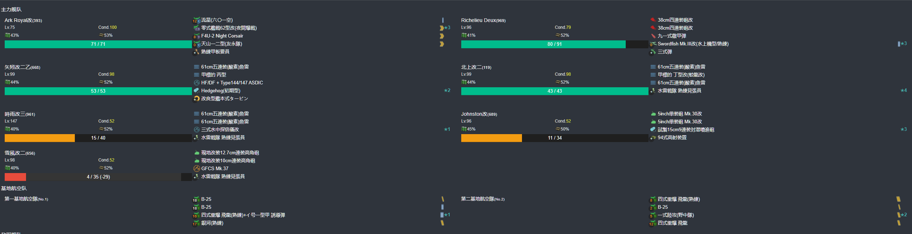

- 推图情况
- A 警戒 --> B 轮型 --> B1 轮型 --> C 警戒 --> C2 警戒 --> D 单纵
```
陆航1队 04 C点 4航程
陆航2队 04 D点 5航程
```

1. A-SS | B-SS | B1-SS | C-SS | C2-SS | D-S 守家空优
2. A-SS | B-A  | B1-A  | C-SS | C2-SS | D-S 守家空优

### E5-P1-磨血斩杀


- 推图情况
- J 轮型 --> M 警戒 --> N 警戒 --> P 单横
```
陆航1队 04 M点 3航程
陆航2队 04 N点 2航程
陆航3队 东海 P点 3航程
```

1. J-SS | M-SS | N-SS | P-S
2. J-SS | M-SS | N-SS | P-A
3. J-SS | M-SS | N-SS | P-A
4. J-SS | M-SS | N-A  | P-A
5. J-SS | M-SS | N-SS | P-A

