# 2026年夏季活动 死鱼打

--- 

#### 进活动时资源


---

## E1-乙

### E1-P1-开路-C2点S胜1次- C3点S胜1次-H点到达1次

#### E1-P1-开路-C2点S胜1次

- 当前使用配置(鼠标悬停可看到阵容对应的阶段)


- 推图情况
- A(单横)-B(能动分歧)-C(能动分歧)-C1(空气索敌)-C2(单横)
```
陆航1队 守家 4航程
```

1. A-SS | B | C | C1 | C2-S

#### E1-P1-开路-C3点S胜1次

- 当前使用配置(鼠标悬停可看到阵容对应的阶段)


- 推图情况
- A(单横)-B(能动分歧)-C(能动分歧)-C3(单横)
```
陆航1队 守家 4航程
```

1. A-SS | B | C | C3-SS

#### E1-P1-开路-H点到达1次

- 当前使用配置(鼠标悬停可看到阵容对应的阶段)


- 推图情况
- A(警戒/单横)-B(能动分歧)-E(警戒/单横)-G(警戒)-H(警戒)
```
陆航1队 40 E点 4航程
```

1. A-S | B | E-A | G-B | H-SS

### E1-P1-磨血斩杀

- 当前使用配置(鼠标悬停可看到阵容对应的阶段)


- 推图情况
- A(警戒)-B(能动分歧)-E(警戒)-G(警戒)-H(警戒/轮形)-I(单纵)

```
陆航1队 13 I点 4航程
```

1. A-SS | B | E-A | G-S  | H-C
2. A-SS | B | E-D | G-SS | H-SS | I-S
3. A-SS | B | E-A | G-S  | H-SS | I-S
4. A-A  | B | E-A | G-S  | H-SS | I-S

### E1-P2-开路-L点到达2次-守家空优1次

#### E1-P2-开路-L点到达2次-守家空优1次

- 当前使用配置(鼠标悬停可看到阵容对应的阶段)


- 推图情况
- A(警戒)-B(能动分歧)-E(警戒)-F(轮形)-G(警戒)-J(警戒)-K(轮形)-L

```
陆航1队 守家
```

1. A-SS | B | E-A | F-SS | G-A | J-S  | K-A | L
2. A-SS | B | E-A | F-SS | G-A | J-SS | K-A | L

### E1-P2-运输

- 当前使用配置(鼠标悬停可看到阵容对应的阶段)


- 推图情况
- M(能动分歧)-N(警戒)-O(警戒)-O2(警戒)-R-T(单纵)

```
陆航1队 04 T点 5航程
```

1. M | N-S  | O-B | O2-S  | R | T-S
2. M | N-SS | O-B | O2-B  | R | T-S
3. M | N-SS | O-B | O2-B  | R | T-S
4. M | N-SS | O-B | O2-A  | R | T-S
5. M | N-A  | O-B | O2-SS | R | T-S

### E1-P3-磨血斩杀

- 当前使用配置(鼠标悬停可看到阵容对应的阶段)


- 推图情况
- M(能动分歧)-P(轮形)-Q(警戒)-Q2(警戒)-V2(空气)-V(警戒)-X(单纵)

```
陆航1队 04 X点 7航程
```

1. M | P-SS | Q-S  | Q2-B | V2 | V-B  | X-A
2. M | P-A  | Q-S  浦波大破撤退
3. M | P-B  | Q-A  | Q2-B 白雪大破撤退
4. M | P-SS | Q-S  | Q2-B | V2 | V-S 早潮大破撤退
5. M | P-SS | Q-SS | Q2-B | V2 | V-A  | X-SS
6. M | P-C 皋月、早朝大破撤退
7. M | P-A  | Q-A  | Q2-B | V2 | V-SS | X-S
8. M | P-A  | Q-S 早朝大破撤退
9. M | P-SS | Q-A  | Q2-C | V2 | V-A | X-A
10. M | P-SS | Q-A | Q2-B | V2 | V-B | X-S 花月
11. M | P-SS | Q-S | Q2-B | V2 | V-S | X-A
12. M | P-A  | Q-B | Q2-B | V2 | V-A | X-A
13. M | P-A  | Q-A | Q2-B | V2 | V-A | X-SS

---

## E2-乙

### E2-P1-开路第一阶段-C2点S胜2次-D点空优2次

#### E2-P1-开路第一阶段-C2点S胜2次

- 当前使用配置(鼠标悬停可看到阵容对应的阶段)

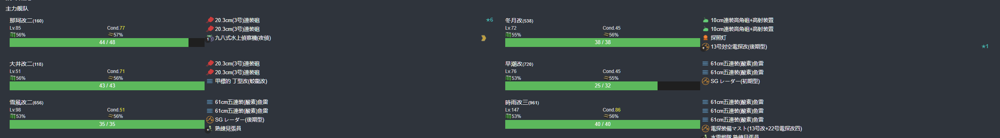

- 推图情况
- A-A1（能动分歧）-A2（警戒）-A3（警戒）-C（警戒/轮形）-C2（警戒/单纵）
```
陆航1队 守家
路航2队 04 C2点 6航程
```

1. A | A1 | A2-SS | A3-B  | C-B  初霜大破撤退
2. A | A1 | A2-A  | A3-B  | C-A  | C2-沟C1了
3. A | A1 | A2-A  | A3-S  | C-B  | C2-A
4. A | A1 | A2-A  | A3-A  浦波大破撤退
5. A | A1 | A2-A  | A3-A  | C-SS | C2-A
6. A | A1 | A2-S  | A3-A  冬月大破撤退
7. A | A1 | A2-A  | A3-A  | C-SS | C2-S
8. A | A1 | A2-S  | A3-SS | C-A  | C2-SS

#### E2-P1-开路第一阶段-D点空优2次

- 当前使用配置(鼠标悬停可看到阵容对应的阶段)

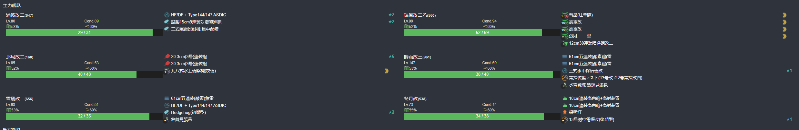

- 推图情况
- A-A1（能动分歧）-A2（警戒）-A3（警戒）-B2（警戒）-D（轮形）
```
陆航1队 守家
路航2队 退避
```

1. A | A1 | A2-A | A3-A | B2-SS | D-SS 空确
2. A | A1 | A2-A | A3-S | B2-SS | D-SS 空确

### E2-P1-开路第二阶段-H点S胜2次-G2点S胜2次-守家空优2次

#### E2-P1-开路第二阶段-H点S胜2次

- 当前使用配置(鼠标悬停可看到阵容对应的阶段)

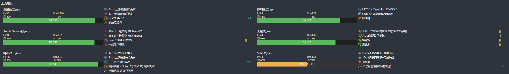

- 推图情况
- A-A1（能动分歧）-A3（警戒）-B1（轮形）-B2（警戒）-F（轮形）-G（警戒）-H（单纵）
```
陆航1队 守家
路航2队 13 H点
```

1. A | A1 | A3-SS | B1-A | B2-SS | F-A | G-SS | H-S
2. A | A1 | A3-S  | B1-A | B2-SS | F-A | G-SS | H-S

#### E2-P1-开路第二阶段-G2点S胜2次

- 当前使用配置(鼠标悬停可看到阵容对应的阶段)

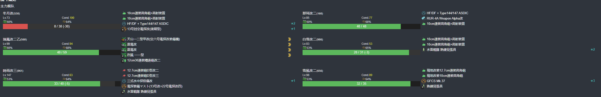

- 推图情况
- A-A1（能动分歧）-A3（警戒）-B1（轮形）-F（轮形）-G（警戒）-G1（警戒）-G2（单纵）
```
陆航1队 守家
路航2队 退避
```

1. A | A1 | A3-SS | B1-SS | F-SS | G-S  | G1-A  | G2-S
2. A | A1 | A3-A  | B1-SS | F-SS | G-SS | G1-SS | G2-S

#### E2-P1-运输

- 当前使用配置(鼠标悬停可看到阵容对应的阶段)

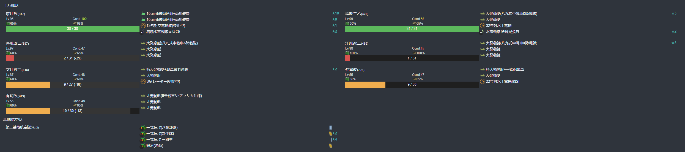

- 推图情况
- I-J（轮型）-K（轮型）-L（警戒）-M（轮型）-O-P（单纵）
```
陆航1队 守家
路航2队 04 P点 6航程
```

1. I | J-A  | K-SS | L-A | M-A  | O | P-A
2. I | J-A  | K-A  | L-A | M-A  | O | P-A
3. I | J-A  | K-SS | L-A | M-SS | O | P-A
4. I | J-SS | K-SS | L-A | M-A  | O | P-A
5. I | J-SS | K-SS | L-A | M-SS | O | P-D
6. I | J-A  | K-SS | L-A | M-A  | O | P-A
7. I | J-B  | K-SS | L-A | M-B  | O | P-A

### E2-P2-磨血斩杀

- 当前使用配置(鼠标悬停可看到阵容对应的阶段)

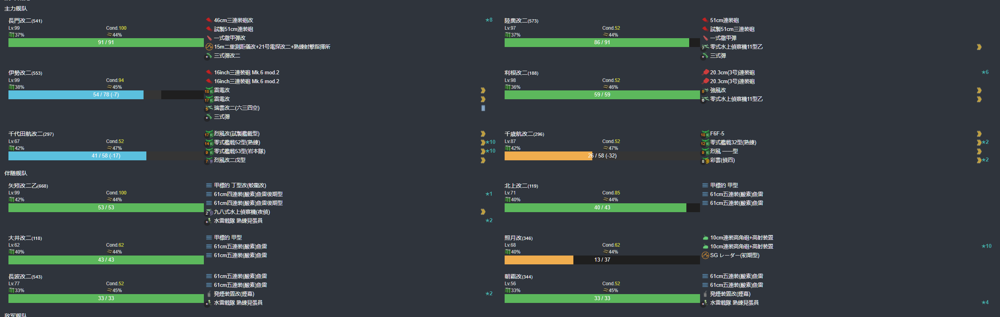

- 推图情况
-  Q（空气）-D（三阵）-G（一阵）-G1（四阵）-K（三阵）-L（四阵 拉烟）-S（空气）-T（四阵）-V（二阵）
```
陆航1队 13 V点 5航程
路航2队 112 V点 5航程
```

1. Q | D-SS | G-SS | G1-S  | K-SS | L-S | S | T-SS | V-S
2. Q | D-SS | G-SS | G1-S  | K-SS | L-S 伊势大破撤退
3. Q | D-SS | G-A  | G1-S  | K-SS | L-A 千代田，北上大破撤退
4. Q | D-A  | G-S  | G1-S  | K-SS | L-S | S | T-S  | V-S
5. Q | D-SS | G-A  | G1-S  | K-SS | L-A | S | T-S  | V-S
6. Q | D-SS | G-B  | G1-A  | K-SS | L-A | S | T-SS | V-SS
7. Q | D-SS | G-S  | G1-S  | K-SS | L-B | S | T-S  | V-A
8. Q | D-A  | G-B  | G1-A  | K-SS | L-A | S | T-S  | V-A
9. Q | D-SS | G-A  | G1-SS | K-A  | L-A | S | T-S  | V-S

### E2-P3-磨血

- 当前使用配置(鼠标悬停可看到阵容对应的阶段)

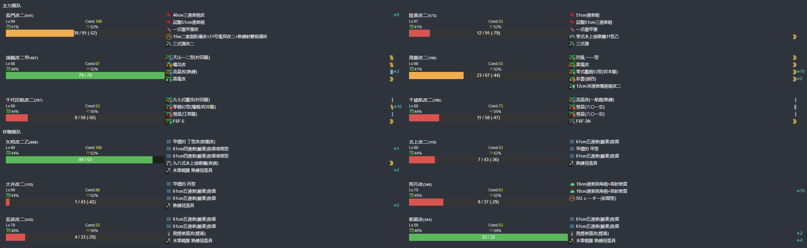

- 推图情况
- T（四阵）-W（一阵）-W2（三阵）-X1（三阵）-X（四阵）-Y(二阵) 
```
陆航1队 112/13 Y点 7航程
路航2队 13/103 Y点 7航程
```

1. T-S  | W-S  | W2-A  | X1-SS | X-SS | Y-A
2. T-S  | W-S  | W2-A  | X1-SS | X-SS | Y-S
3. T-SS | W-S 北上大破撤退
4. T-SS | W-A  | W2-SS | X1-A  | X-SS | Y-A
5. T-SS | W-A  | W2-A  | X1-SS | X-S  | Y-A
6. T-SS | W-S 照月大破撤退
7. T-S  | W-A  | W2-SS | X1-A  | X-SS | Y-A
8. T-S  | W-SS | W2-A  | X1-A  | X-S  | Y-A
9. T-SS | W-SS | W2-A  | X1-A  | X-S  | Y-A
10. T-SS | W-S | W2-A  | X1-A  | X-SS | Y-A
11. T-SS | W-A | W2-SS | X1-A  | X-SS | Y-C

### E2-P3-削甲-P点A胜2次-V点A胜2次-守家空优2次-W2空优2次

#### E2-P3-削甲-P点A胜2次

- 当前使用配置(鼠标悬停可看到阵容对应的阶段)

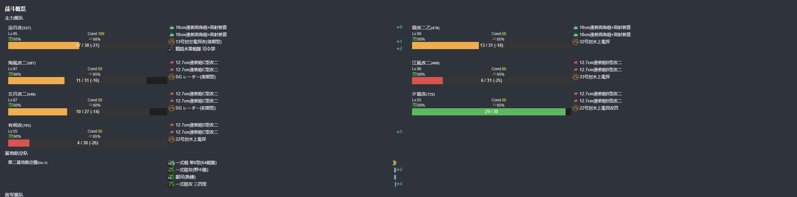

- 推图情况
- I（空气）-J（轮型）-K（轮型）-L（警戒）-M（轮型）-O-P（单纵）
```
陆航1队 守家
路航2队 04 P点 6航程
```

1. I | J-A  | K-A | L-A | M-SS | O | P-A
2. I | J-SS | K-A | L-A | M-A  | O | P-A

#### E2-P3-削甲-V点A胜2次

- 当前使用配置(鼠标悬停可看到阵容对应的阶段)


- 推图情况
-  Q（空气）-D（三阵）-G（一阵）-G1（四阵）-K（三阵）-L（四阵 拉烟）-S（空气）-T（四阵）-V（二阵）
```
陆航1队 13 V点 5航程
路航2队 112 V点 5航程
```

1. Q | D-SS | G-A  | G1-A  | K-SS | L-A 照月大破撤退
2. Q | D-SS | G-A  长波大破撤退
3. Q | D-A  | G-S  | G1-SS | K-SS | L-A | S | T-S  长波大破撤退
4. Q | D-SS | G-A  | G1-A  | K-SS | L-A | S | T-SS | V-S
5. Q | D-SS | G-S  | G1-S  | K-SS | L-S | S | T-S  千代田大破撤退
6. Q | D-SS | G-SS | G1-SS | K-SS | L-A | S | T-S  | V-S

### E2-P3-斩杀

- 当前使用配置(鼠标悬停可看到阵容对应的阶段)


- 推图情况
- T（四阵）-W（一阵）-W2（三阵）-X1（三阵）-X（四阵）-Y(二阵) 
```
陆航1队 112/13 Y点 7航程
路航2队 13/103 Y点 7航程
```
1. T-SS | W-B | W2-A  | X1-A  | X-S  | Y-C W2空优第2次触发，削甲完成。第一次在进斩第一次尝试时触发。
2. T-SS | W-B | W2-A  | X1-A  | X-SS | Y-A
3. T-SS | W-A | W2-SS | X1-SS | X-SS | Y-A

---

## E3-乙

### E3-P1-开路-B2点A胜1次-D2点A胜1次-E2点S胜1次-C2点S胜1次

#### E3-P1-开路-B2点A胜1次

- 当前使用配置(鼠标悬停可看到阵容对应的阶段)

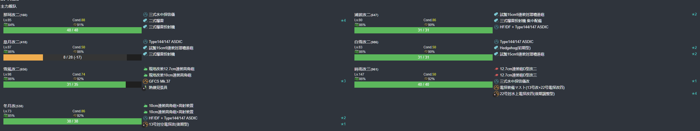

- 推图情况
- A（空气）-A2（警戒）-B（能动分歧）-B1（警戒）-B2（单横）
```
陆航1队 守家
路航2队 13 守家/退避
```

1. A | A2-A | B | B1-SS | B2-S

#### E3-P1-开路-D2点A胜1次

- 当前使用配置(鼠标悬停可看到阵容对应的阶段)

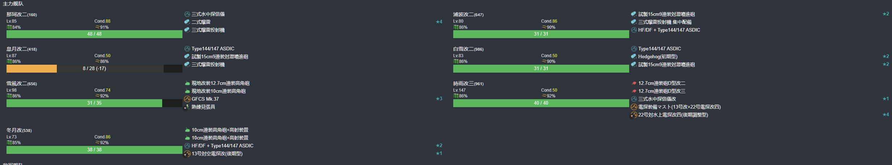

- 推图情况
- A（空气）-A2（轮形）-D（能动分歧）-D1（警戒）-D2（单横）
```
陆航1队 守家
路航2队 13 守家/退避
```

1. A | A2-A | D | D1-A | D2-A

#### E3-P1-开路-E2点S胜1次

- 当前使用配置(鼠标悬停可看到阵容对应的阶段)


- 推图情况
- A（空气）-A2（轮形）-D（能动分歧）-E（警戒）-E1（轮形）-E2（单纵）
```
陆航1队 守家
路航2队 13 E2点 5航程
```

1. A | A2-A | D | E-A | E1-SS | E2-SS


#### E3-P1-开路-C2点S胜1次

- 当前使用配置(鼠标悬停可看到阵容对应的阶段)


- 推图情况
- A（空气）-A2（警戒）-B（能动分歧）-C（警戒）-C1（警戒）-C2（单纵）
```
陆航1队 守家
路航2队 103 C2点 8航程
```

1. A | A2-SS | B | C-SS | C1-SS | C2-S

### E3-P1-磨血斩杀

- 当前使用配置(鼠标悬停可看到阵容对应的阶段)

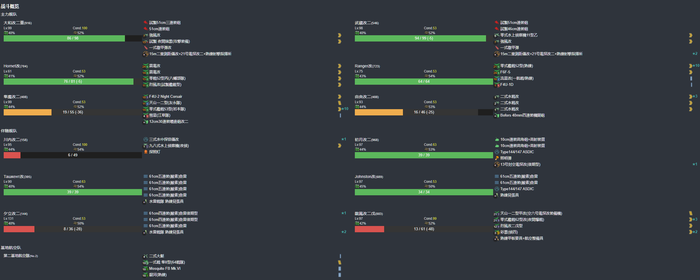

- 推图情况
- F（空气）-A2（三阵）-G（一阵）-H（能动分歧）-I（二阵）-J（三阵）-L（二阵）-O （四阵）
```
陆航1队 守家
路航2队 121/112 O点 9航程
```

1. F | A2-A  | G-SS | H | I-S  | J-A  | L-SS | O-S
2. F | A2-A  | G-A  | H | I-SS | J-SS | L-S  | O-S
3. F | A2-A  | G-SS | H | I-SS | J-A  | L-SS | O-A
4. F | A2-A  | G-S  | H | I-S  | J-SS | L-S  | O-A
5. F | A2-A  | G-SS | H | I-SS | J-A  | L-S  | O-A
6. F | A2-A  | G-SS | H | I-S  | J-A  | L-SS | O-B
7. F | A2-A  | G-SS | H | I-SS | J-SS | L-S  | O-A
8. F | A2-A  | G-SS | H | I-S  | J-A  | L-SS | O-A
9. F | A2-SS | G-SS | H | I-S  | J-A  | L-SS | O-A
10. F | A2-SS | G-SS | H | I-SS | J-A | L-SS | O-A
11. F | A2-SS | G-S  | H | I-S  | J-A | L-SS | O-A
12. F | A2-A  | G-SS | H | I-S  | J-A | L-S  | O-A
13. F | A2-A  | G-S  | H | I-SS | J-A | L-S  | O-A
14. F | A2-A  | G-S Ranger大破撤退
15. F | A2-A  | G-SS | H | I-S  | J-A | L-S  | O-C
16. F | A2-A  | G-A  | H | I-S  | J-A | L-S  | O-A
17. F | A2-SS | G-SS | H | I-SS | J-A | L-S  | O-A

### E3-P2-运输

- 当前使用配置(鼠标悬停可看到阵容对应的阶段)

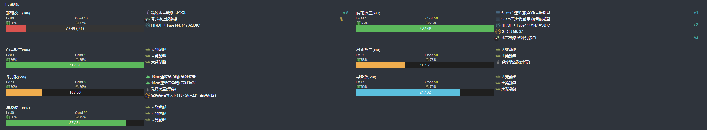

- 推图情况
- A（空气）-A2（轮型拉烟）-B（能动）-C（警戒）-C2（警戒）-P（运输）-Q（单纵） 
```
陆航1队 守家
路航2队 04 Q点 8航程
```

1. A | A2-SS | B | C-A 皋月大破撤退
2. A | A2-C 冬月大破撤退
3. A | A2-A  | B | C-A | C2-A 蒲波大破撤退
4. A | A2-SS | B | C-A | C2-B | P | Q-A
5. A | A2-A  | B | C-A | C2-A | P | Q-S
6. A | A2-A  | B | C-A | C2-A 村雨、蒲波大破撤退
7. A | A2-SS | B | C-A | C2-A | P | Q-S
8. A | A2-A  | B | C-A | C2-A 時雨大破撤退
9. A | A2-A  | B | C-A | C2-A | P | Q-S
10. A | A2-B | B | C-A | C2-A | P | Q-A
11. A | A2-SS | B | C-SS | C2-A 早潮大破撤退
12. A | A2-A  | B | C-A  | C2-A | P | O-A
13. A | A2-SS | B | C-A  | C2-A | P | O-S
14. A | A2-A  | B | C-A  | C2-A | P | O-S

### E3-P3-磨血斩杀

- 当前使用配置(鼠标悬停可看到阵容对应的阶段)

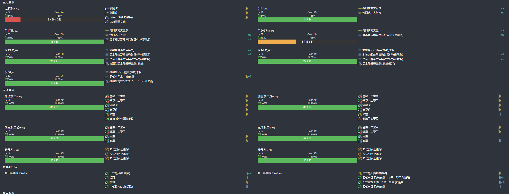

- 推图情况
- 路线：R（空气）-S（单纵/梯形-消耗潜水补给的金币弹）-T（轮型）-V（单纵/梯形）-X（单纵/梯形）
```
陆航1队 守家
路航2队 13 X点 7航程
路航3队 04 X点 7航程
```

1. R | S-S | T-SS | V-A  | X-S
2. R | S-A | T-SS | V-SS | X-S
3. R | S-S | T-B  | V-A 伊36大破撤退
4. R | S-A 迅鲸、伊13大破撤退
5. R | S-S | T-SS | V-SS | X-A
6. R | S-S | T-SS | V-A 迅鲸大破撤退
7. R | S-S | T-A  | V-A  | X-A
8. R | S-A | T-B  | V-SS | X-A
9. R | S-S | T-B  | V-S 迅鲸大破撤退
10. R | S-S  | T-A 迅鲸大破撤退
11. R | S-S  | T-B | V-S  迅鲸大破撤退
12. R | S-SS | T-A | V-S | X-A
13. R | S-S  | T-B | V-A | X-A
14. R | S-S 伊14大破撤退
15. R | S-SS | T-B | V-SS | X-D
16. R | S-S 伊41、伊47、迅鲸中破撤退
17. R | S-S 伊36、伊47中破撤退
18. R | S-S  | T-SS | V-S | X-A
19. R | S-S 伊13大破撤退
20. R | S-S 伊13大破撤退
21. R | S-S  | T-SS | V-S | X-A
22. R | S-S  | T-SS | V-C | X-A
23. R | S-S  | T-SS | V-S | X-A
24. R | S-S 迅鲸、伊41、伊47中破撤退
25. R | S-S | T-B 迅鲸、伊41、伊13、伊14中破撤退
26. R | S-SS | T-SS | V-SS | X-S

