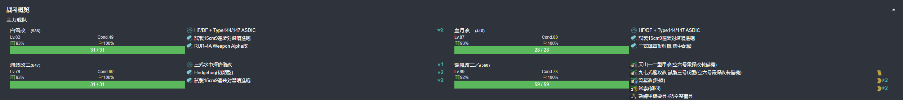
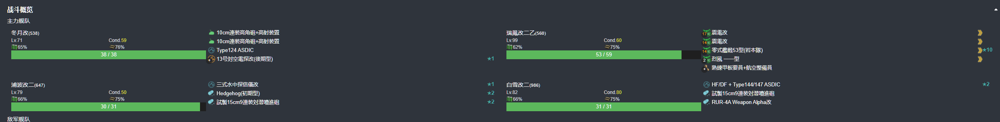
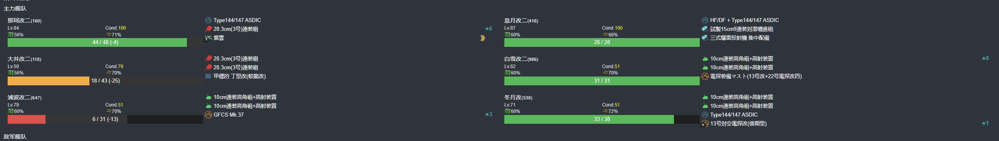
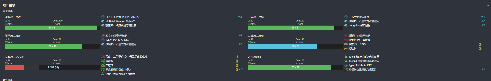
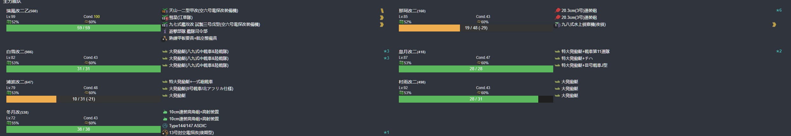
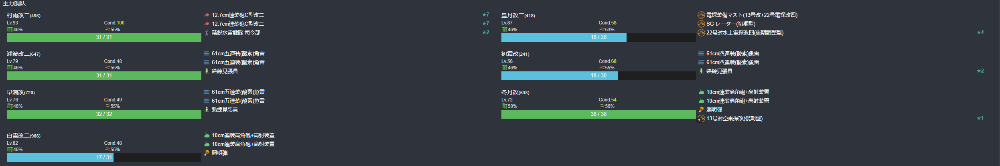

# 2026年夏季活动 死鱼打

--- 

#### 进活动时资源


---

## E1-乙

### E1-P1-开路-C2点S胜1次- C3点S胜1次-H点到达1次

#### E1-P1-开路-C2点S胜1次

- 当前使用配置(鼠标悬停可看到阵容对应的阶段)



- 推图情况
- A(单横)-B(能动分歧)-C(能动分歧)-C1(空气索敌)-C2(单横)
```
陆航1队 40 守家 4航程
```

1. A-SS | B | C | C1 | C2-S

#### E1-P1-开路-C3点S胜1次

- 当前使用配置(鼠标悬停可看到阵容对应的阶段)


- 推图情况
- A(单横)-B(能动分歧)-C(能动分歧)-C3(单横)
```
陆航1队 40 守家 4航程
```

1. A-SS | B | C | C3-SS

#### E1-P1-开路-H点到达1次

- 当前使用配置(鼠标悬停可看到阵容对应的阶段)



- 推图情况
- A(警戒/单横)-B(能动分歧)-E(警戒/单横)-G(警戒)-H(警戒)
```
陆航1队 40 E点 4航程
```

1. A-S | B | E-A | G-B | H-SS

### E1-P1-磨血斩杀

- 当前使用配置(鼠标悬停可看到阵容对应的阶段)



- 推图情况
- A(警戒)-B(能动分歧)-E(警戒)-G(警戒)-H(警戒/轮形)-I(单纵)

```
陆航1队 13 I点 4航程
```

1. A-SS | B | E-A | G-S  | H-C
2. A-SS | B | E-D | G-SS | H-SS | I-S
3. A-SS | B | E-A | G-S  | H-SS | I-S
4. A-A  | B | E-A | G-S  | H-SS | I-S

### E1-P2-开路-L点到达2次-守家空优1次

#### E1-P2-开路-L点到达2次-守家空优1次

- 当前使用配置(鼠标悬停可看到阵容对应的阶段)



- 推图情况
- A(警戒)-B(能动分歧)-E(警戒)-F(轮形)-G(警戒)-J(警戒)-K(轮形)-L

```
陆航1队 40 守家
```

1. A-SS | B | E-A | F-SS | G-A | J-S  | K-A | L
2. A-SS | B | E-A | F-SS | G-A | J-SS | K-A | L

### E1-P2-运输

- 当前使用配置(鼠标悬停可看到阵容对应的阶段)



- 推图情况
- M(能动分歧)-N(警戒)-O(警戒)-O2(警戒)-R-T(单纵)

```
陆航1队 04 T点 5航程
```

1. M | N-S  | O-B | O2-S  | R | T-S
2. M | N-SS | O-B | O2-B  | R | T-S
3. M | N-SS | O-B | O2-B  | R | T-S
4. M | N-SS | O-B | O2-A  | R | T-S
5. M | N-A  | O-B | O2-SS | R | T-S

### E1-P3-磨血斩杀

- 当前使用配置(鼠标悬停可看到阵容对应的阶段)



- 推图情况
- M(能动分歧)-P(轮形)-Q(警戒)-Q2(警戒)-V2(空气)-V(警戒)-X(单纵)

```
陆航1队 04 X点 7航程
```

1. M | P-SS | Q-S  | Q2-B | V2 | V-B  | X-A
2. M | P-A  | Q-S  浦波大破撤退
3. M | P-B  | Q-A  | Q2-B 白雪大破撤退
4. M | P-SS | Q-S  | Q2-B | V2 | V-S 早潮大破撤退
5. M | P-SS | Q-SS | Q2-B | V2 | V-A  | X-SS
6. M | P-C 皋月、早朝大破撤退
7. M | P-A  | Q-A  | Q2-B | V2 | V-SS | X-S
8. M | P-A  | Q-S 早朝大破撤退
9. M | P-SS | Q-A  | Q2-C | V2 | V-A | X-A
10. M | P-SS | Q-A | Q2-B | V2 | V-B | X-S 花月
11. M | P-SS | Q-S | Q2-B | V2 | V-S | X-A
12. M | P-A  | Q-B | Q2-B | V2 | V-A | X-A
13. M | P-A  | Q-A | Q2-B | V2 | V-A | X-SS

